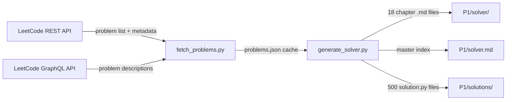

# 500 LeetCode Problem Solver -- Implementation Plan

## Architecture

The project uses a **two-stage pipeline**: (1) a Python script fetches problem metadata and descriptions from LeetCode's public APIs, then (2) generates chapter markdown files organized by topic/pattern, each containing problem descriptions, optimal solutions, mermaid flowcharts, and multi-frame state-transition diagrams for complex problems.

### Data Flow




## File Structure

```
P1/
  plan.md                          -- Existing agent instructions
  solver.md                        -- Master index (TOC linking all chapters)
  solver/
    01_arrays_and_hashing.md       -- Chapter files by topic
    02_two_pointers.md
    03_sliding_window.md
    04_linked_list.md
    05_stack_and_queue.md
    06_binary_search.md
    07_trees_and_bst.md
    08_tries.md
    09_heap_and_priority_queue.md
    10_backtracking.md
    11_graphs.md
    12_dynamic_programming.md
    13_greedy.md
    14_intervals.md
    15_math_and_bit_manipulation.md
    16_string.md
    17_sorting_and_searching.md
    18_design.md
  solutions/
    problem_001_two_sum/solution.py
    problem_002_add_two_numbers/solution.py
    ...  (500 directories)
  scripts/
    fetch_problems.py              -- Fetches from LeetCode APIs
    generate_solver.py             -- Generates all markdown + solutions
    problems.json                  -- Cached problem data
```

## Stage 1: Data Fetching (`scripts/fetch_problems.py`)

- **Step 1:** Hit `https://leetcode.com/api/problems/algorithms/` to get the full problem list with `stat_status_pairs` (gives us `frontend_question_id`, `question__title_slug`, `difficulty.level`, `paid_only`)
- **Step 2:** Filter to first 500 free problems (skip `paid_only: true`)
- **Step 3:** For each problem, call GraphQL at `https://leetcode.com/graphql` with:
  - `operationName: "questionData"`, `variables: {"titleSlug": slug}`
  - Fetch: `content`, `title`, `difficulty`, `topicTags`, `exampleTestcases`, `codeSnippets`
- **Step 4:** Rate-limit to ~1 request/second, save all to `scripts/problems.json`
- Uses only `requests` (no authentication needed for public problem data)

## Stage 2: Solution Generation (`scripts/generate_solver.py`)

For each of the 500 problems, the script will:

- **Classify** the problem into one of the 18 topic chapters based on `topicTags`
- **Generate `solution.py**` with:
  - Docstring (problem description, complexity, pattern)
  - Optimal Python solution (using my knowledge of each problem)
  - The solutions are generated from a built-in knowledge base within the script (mapping problem slug to solution code), not from an LLM API
- **Generate chapter markdown** with:
  - Problem description, examples, constraints
  - Pattern identification and approach explanation
  - Pseudo-code
  - Mermaid flowchart (algorithm flow)
  - Dry-run walkthrough table
  - Complexity analysis table
  - Solution code block

## Animations: Multi-Frame Mermaid State Transitions

For complex problems involving trees, graphs, DP tables, and linked lists (~50-80 problems), generate **step-by-step mermaid frames** showing state evolution. Examples:

- **Trees (e.g., #98 Validate BST, #102 Level Order Traversal):**
  - Frame 1: Initial tree with all nodes unmarked
  - Frame 2: Current node highlighted, left subtree visited
  - Frame 3: Current node validated, moving to right subtree
  - Each frame is a separate `mermaid` code block with a "Step N" header
- **DP (e.g., #5 Longest Palindromic Substring, #70 Climbing Stairs):**
  - Show the DP table filling step by step as a mermaid graph or table
  - Each frame shows which cell is being computed and its dependencies
- **Graphs (e.g., #200 Number of Islands, #207 Course Schedule):**
  - Show BFS/DFS traversal frame by frame
  - Visited vs unvisited nodes in different node shapes
- **Linked Lists (e.g., #19 Remove Nth from End, #141 Linked List Cycle):**
  - Show fast/slow pointer positions at each step

All mermaid content uses **ASCII-only** characters (no Unicode bullets, dashes, or special symbols) to avoid the rendering issue seen previously.

## Execution Strategy (Batching)

Since generating 500 problems inline would be impractical in a single pass, the implementation will:

1. **Build the fetcher script first** -- fetch and cache all 500 problem metadata
2. **Build the generator script** -- contains a knowledge base of solutions and generates all files
3. **Execute in batches** -- run the generator, verify output, fix any issues
4. **The generator is the core deliverable** -- it is a reusable Python script that can regenerate all markdown at any time

## Key Design Decisions

- **No browser automation / Playwright needed:** LeetCode's REST + GraphQL APIs are public and return all problem descriptions without authentication
- **No LLM API dependency:** Solutions are generated from the script's built-in knowledge base (hand-written optimal solutions per problem)
- **Mermaid-only animations:** Multiple static mermaid frames with step headers (no HTML/JS), as requested
- **Topic classification** uses LeetCode's own `topicTags` from the API, with a primary-tag selection heuristic (pick the most specific tag)
- **Existing 3 solutions preserved:** The current `solutions/problem_1_*`, `problem_2_*`, `problem_3_*` directories remain; the generator will skip or overwrite them consistently

## Estimated Scale

- ~18 chapter markdown files, each ~1500-4000 lines
- ~500 `solution.py` files
- ~50-80 problems get enhanced multi-frame mermaid animations
- Master `solver.md` index: ~600 lines (TOC table linking to all chapters)

