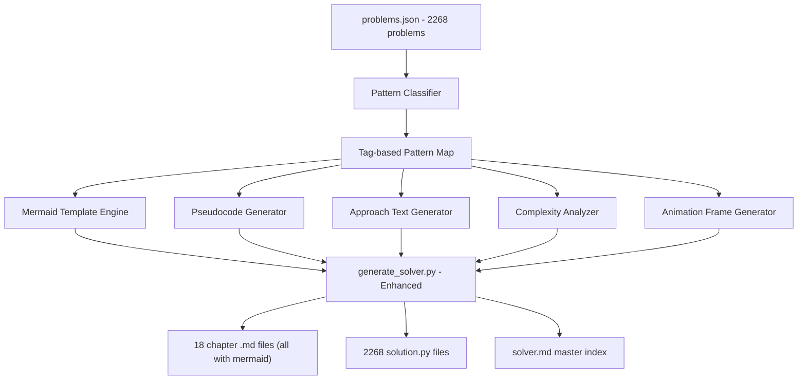

# Auto-Generate Mermaid Diagrams and Full Solutions for All 2268 Problems

## Problem Statement

Currently, only **89 out of 2268** problems have mermaid diagrams, and only **188** have approach text. The root cause is that all content is hand-crafted in `solutions_kb*.py` files. Problems not in the KB get bare-bones output with no diagrams, no pseudocode, and no approach explanation.

**The fix:** Build an **algorithmic content generator** that auto-produces mermaid diagrams, pseudocode, approach text, complexity analysis, and animations for every problem based on its **topic tags and code structure** -- no hand-crafting needed.

## Architecture




## Phase 1: Build Auto-Generation Engine

### Step 1: Create Pattern-to-Content Template System

Create a new file `scripts/auto_content.py` containing:

**A. Pattern Map** (~45 pattern templates)

- Map each LeetCode topic tag combination to a specific algorithm pattern (e.g., `["Array", "Hash Table"]` -> `"Hash Map Lookup"`, `["Tree", "DFS"]` -> `"DFS Tree Traversal"`)
- Each pattern gets: approach template, pseudocode template, mermaid flowchart template, complexity values, and animation template (for complex patterns)

**B. Mermaid Flowchart Templates** (~45 unique flowcharts)

- One for each pattern, with ASCII-only content
- Examples of patterns to cover: Hash Map Lookup, Two Pointers (sorted), Sliding Window (variable/fixed), Fast-Slow Pointers, Binary Search (standard/on-answer), BFS (single/multi-source), DFS (tree/graph/backtrack), DP (1D/2D/knapsack/LCS), Greedy, Union-Find, Topological Sort, Trie, Monotonic Stack/Queue, Divide and Conquer, Bit Manipulation, Math, Simulation, Design, Matrix traversal, Linked List ops, Interval merge/sweep, Quickselect, Segment Tree

**C. Animation Frame Templates** (~20 animation sets for complex patterns)

- Multi-frame mermaid state diagrams for: BFS, DFS tree, Union-Find, Dijkstra, DP table fill, Sliding Window, Monotonic Stack, Trie insert/search, Binary Search, Linked List reversal, Topological Sort, Backtracking tree, Interval merge, Two Pointer convergence, Merge Sort, Heap operations

**D. Auto-Approach and Pseudocode Generator**

- Given tags + code snippet, generate approach explanation text
- Parse the Python snippet to extract method signature, parameter types, return type
- Generate pattern-specific pseudocode

**E. Complexity Analyzer**

- Map each pattern to standard time/space complexity
- Refine based on tags (e.g., Array+DP = O(n^2), Array+Hash Table = O(n))

### Step 2: Integrate into `generate_solver.py`

Modify [generate_solver.py](P1/scripts/generate_solver.py) at line 196 (`generate_problem_section`):

- If a problem has KB data, use it (preserves existing hand-crafted content)
- Otherwise, call `auto_content.py` functions to generate all fields automatically
- Every problem will now get: approach text, pseudocode, mermaid diagram, complexity, and (for complex patterns) animation frames

The key change in the flow:

```python
# Current (broken): only emits mermaid if KB has it
mermaid = sol.get("mermaid", "")   # empty for 2179 problems

# New: auto-generate if KB doesn't have it  
mermaid = sol.get("mermaid") or auto_generate_mermaid(tags, pattern, code)
approach = sol.get("approach") or auto_generate_approach(tags, pattern, title)
pseudocode = sol.get("pseudocode") or auto_generate_pseudocode(tags, pattern, code)
animation = sol.get("animation_frames") or auto_generate_animation(tags, pattern)
time_c = sol.get("time") or auto_complexity_time(tags, pattern)
space_c = sol.get("space") or auto_complexity_space(tags, pattern)
```

## Phase 2: Premium Problem Authentication

### Step 3: Playwright Auth with Manual CAPTCHA

Update [auth_leetcode.py](P1/scripts/auth_leetcode.py):

- Launch visible browser, fill credentials, wait for user to solve CAPTCHA
- Save `LEETCODE_SESSION` and `csrftoken` to `auth.json`
- User will be prompted to interact with the browser window

### Step 4: Re-fetch Premium Problems

Run `fetch_problems.py` with auth cookies to fill in the 343 premium problems that currently have no content/snippets.

## Phase 3: Regenerate Everything

### Step 5: Generate All Content

Run `generate_solver.py --force` to regenerate all 18 chapter files and 2268 solution files with:

- Every problem getting a mermaid diagram (pattern-specific, not generic)
- Every problem getting approach text and pseudocode
- Complex problems (~400+) getting multi-frame animation diagrams
- Full complexity analysis for every problem

### Step 6: Verify

- Check all problems have mermaid blocks
- Verify 0 non-ASCII in mermaid
- Test sample solutions
- Count animations

## Expected Output


| Metric                         | Before | After    |
| ------------------------------ | ------ | -------- |
| Problems with mermaid diagrams | 89     | 2268     |
| Problems with approach text    | 188    | 2268     |
| Problems with pseudocode       | 122    | 2268     |
| Problems with animations       | 11     | ~400-500 |
| Problems with complexity       | 203    | 2268     |
| Premium problems with content  | 0      | 343      |


## Key Files

- **NEW:** `scripts/auto_content.py` -- pattern templates, mermaid generator, animation generator (~1500 lines)
- **MODIFY:** `scripts/generate_solver.py` -- integrate auto-generation fallback (~50 lines changed)
- **MODIFY:** `scripts/auth_leetcode.py` -- minor improvements for reliability
- **RERUN:** `scripts/fetch_problems.py` -- with auth for premium
- **OUTPUT:** `solver/*.md` (18 files), `solutions/` (2268 dirs), `solver.md`

