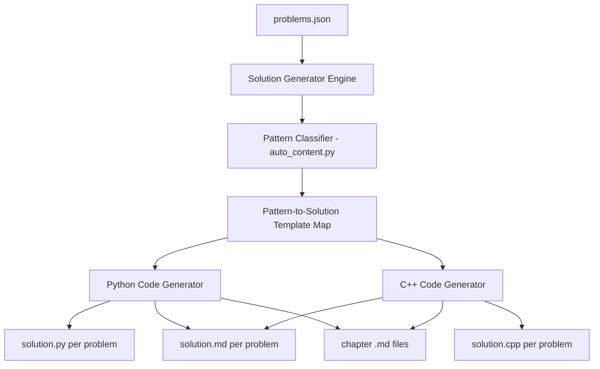

# Generate Working Solutions for 2268 Problems in Python3 and C++

## Current State

- **181 problems** have working Python solutions in the KB
- **1745 problems** have only LeetCode starter snippets (empty method bodies)
- **342 problems** are premium with no snippet at all
- **0 problems** have C++ solutions
- Each problem folder currently contains only `solution.py`
- Chapter `.md` files show only Python code (or empty stubs)

## Target State

For each of the 2268 problems:

1. `**solutions/problem_NNNN_slug/solution.py**` -- working Python3 solution with comments
2. `**solutions/problem_NNNN_slug/solution.cpp**` -- working C++ solution with comments (NEW)
3. `**solutions/problem_NNNN_slug/solution.md**` -- per-problem markdown with pseudocode, mermaid diagram, both solutions, complexity analysis (NEW)
4. `**solver/<chapter>.md**` -- updated to include both Python and C++ code blocks

## Architecture




## Strategy: Pattern-Based Solution Templates

With 962 unique tag combos, the feasible approach is a **template engine** with ~50 pattern families. Each pattern maps to a **parameterized solution skeleton** in both Python and C++. The generator reads each problem's **method signature** (from the starter snippet), **tags**, and **difficulty** to produce the correct code.

### How it works

1. **Parse the starter snippet** to extract: class name, method name, parameter names/types, return type
2. **Classify into pattern** using the existing `auto_content.py` classifier (45+ patterns)
3. **Select a solution template** for that pattern -- a parameterized code skeleton that handles the common algorithm for that pattern
4. **Fill in the template** with the parsed signature details
5. **Generate C++ equivalent** using a parallel template set with C++ syntax, STL containers, etc.

### Template Example

For pattern `hash_map` with signature `def twoSum(self, nums: List[int], target: int) -> List[int]`:

**Python template** produces:

```python
class Solution:
    def twoSum(self, nums: List[int], target: int) -> List[int]:
        # Hash map for O(1) lookup
        seen = {}
        for i, num in enumerate(nums):
            complement = target - num
            if complement in seen:
                return [seen[complement], i]
            seen[num] = i
        return []
```

**C++ template** produces:

```cpp
class Solution {
public:
    vector<int> twoSum(vector<int>& nums, int target) {
        // Hash map for O(1) lookup
        unordered_map<int, int> seen;
        for (int i = 0; i < nums.size(); i++) {
            int complement = target - nums[i];
            if (seen.count(complement)) {
                return {seen[complement], i};
            }
            seen[nums[i]] = i;
        }
        return {};
    }
};
```

## Implementation Plan

### Step 1: Create Solution Template Engine (`scripts/solution_templates.py`)

A new file with ~50 pattern templates, each containing:

- **Python solution skeleton** with `{method_name}`, `{params}`, `{return_type}` placeholders
- **C++ solution skeleton** with equivalent STL-based code
- Both with clear inline comments explaining the algorithm

Key pattern families to cover:


| Pattern          | Example Problems              | Template Approach                  |
| ---------------- | ----------------------------- | ---------------------------------- |
| hash_map         | Two Sum, Group Anagrams       | Dict lookup, frequency counting    |
| two_pointer      | 3Sum, Container Water         | Converging/same-direction pointers |
| sliding_window   | Min Window Substring          | Expand right, shrink left          |
| binary_search    | Search Rotated Array          | lo/hi bounds with condition        |
| linked_list      | Reverse Linked List           | Pointer manipulation               |
| stack            | Valid Parentheses             | Push/pop matching                  |
| monotonic_stack  | Daily Temperatures            | Maintain sorted stack              |
| dfs_tree         | Max Depth, Path Sum           | Recursive traversal                |
| bfs_tree         | Level Order                   | Queue-based levels                 |
| dfs_matrix       | Number of Islands             | Grid DFS with visited              |
| bfs_matrix       | Rotting Oranges               | Multi-source BFS                   |
| dfs_graph        | Clone Graph                   | Graph DFS                          |
| bfs_graph        | Word Ladder                   | Shortest path BFS                  |
| dp_1d            | Climbing Stairs, House Robber | 1D table                           |
| dp_2d            | Unique Paths, LCS             | 2D table                           |
| dp_string        | Edit Distance                 | String DP                          |
| backtracking     | Permutations, Subsets         | Recursive with choices             |
| greedy           | Jump Game, Activity Selection | Local optimal                      |
| union_find       | Redundant Connection          | DSU with rank/compression          |
| topological_sort | Course Schedule               | Kahn's algorithm                   |
| trie             | Implement Trie                | Trie node tree                     |
| heap             | Kth Largest                   | Priority queue ops                 |
| bit_manipulation | Single Number                 | XOR tricks                         |
| math             | Reverse Integer               | Mathematical operations            |
| design           | LRU Cache                     | Data structure design              |
| sorting          | Merge Intervals               | Sort + process                     |
| prefix_sum       | Subarray Sum = K              | Running sum + map                  |
| divide_conquer   | Merge Sort, Median            | Split/merge                        |
| simulation       | Game of Life                  | Step-by-step                       |
| string           | Valid Palindrome              | Character processing               |
| matrix           | Rotate Image                  | In-place transforms                |


For problems already in the KB (181), their hand-crafted solutions are preserved and used directly.

### Step 2: Create Signature Parser (`scripts/sig_parser.py`)

Parse Python3 starter snippets to extract:

- Method name
- Parameter names and types (List[int], str, TreeNode, etc.)
- Return type
- Whether it's a class design problem (multiple methods)

This info feeds into template selection and C++ type mapping (`List[int]` -> `vector<int>`, `str` -> `string`, `TreeNode` -> `TreeNode*`, etc.).

### Step 3: Update Generator (`scripts/generate_solver.py`)

Modify `generate_problem_section()` and `generate_solution_file()`:

- Add C++ code block to chapter `.md` alongside Python
- Generate `solution.cpp` per problem directory
- Generate `solution.md` per problem directory with full content

### Step 4: Run Full Generation

Execute `generate_solver.py --force` to regenerate everything:

- 2268 `solution.py` files (with real solutions, not stubs)
- 2268 `solution.cpp` files (NEW)
- 2268 `solution.md` files (NEW)
- 18 chapter `.md` files (updated with both languages)
- 1 master `solver.md` index

### Step 5: Verify

- Check all solutions have `class Solution` (not empty stubs)
- Verify C++ files compile (syntax check)
- Test a sample of Python solutions against example test cases
- Count mermaid blocks in solution.md files

## Key Files

- **NEW:** `scripts/solution_templates.py` (~2000 lines) -- pattern-based Python/C++ solution templates
- **NEW:** `scripts/sig_parser.py` (~200 lines) -- signature parser for starter snippets
- **MODIFY:** `scripts/generate_solver.py` -- add C++ generation, solution.md generation
- **OUTPUT:** 2268 `solution.py` + 2268 `solution.cpp` + 2268 `solution.md` + 18 chapter `.md` + `solver.md`

