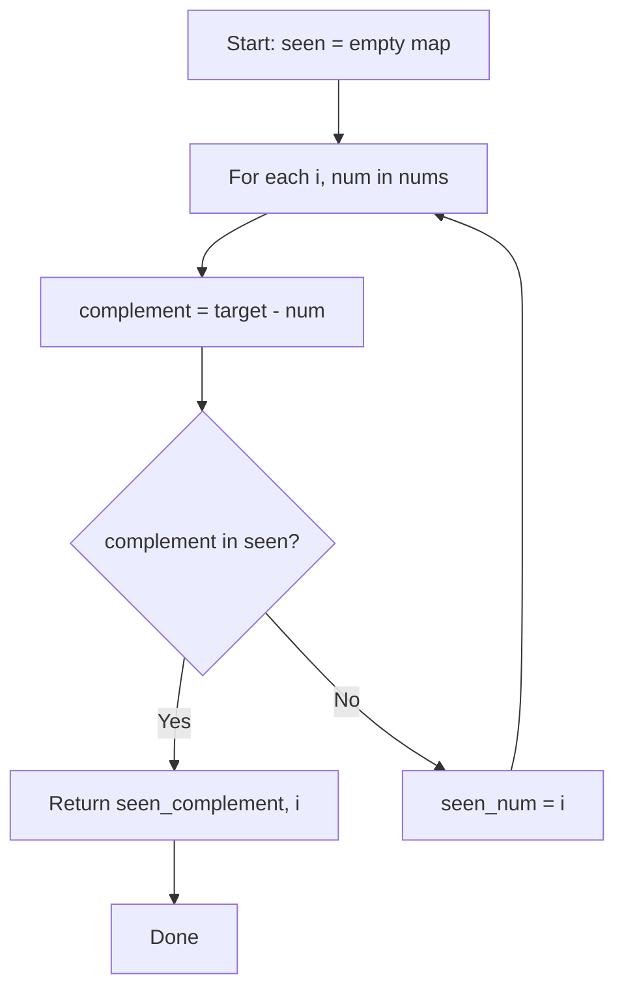

# Problem 1: Two Sum

**Difficulty:** Easy  
**Tags:** Array, Hash Table  
**Pattern:** Hash Map Lookup  
**Link:** [leetcode.com/problems/two-sum](https://leetcode.com/problems/two-sum/)

## Description

Given an array of integers `nums` and an integer `target`, return *indices of the two numbers such that they add up to `target`*.

You may assume that each input would have ***exactly* one solution**, and you may not use the *same* element twice.

You can return the answer in any order.

 

Example 1:

```

**Input:** nums = [2,7,11,15], target = 9
**Output:** [0,1]
**Explanation:** Because nums[0] + nums[1] == 9, we return [0, 1].

```

Example 2:

```

**Input:** nums = [3,2,4], target = 6
**Output:** [1,2]

```

Example 3:

```

**Input:** nums = [3,3], target = 6
**Output:** [0,1]

```

 

**Constraints:**

	- `2 <= nums.length <= 10^4`
	- `-10^9 <= nums[i] <= 10^9`
	- `-10^9 <= target <= 10^9`
	- **Only one valid answer exists.**

 

**Follow-up: **Can you come up with an algorithm that is less than `O(n^2)` time complexity?

## Approach: Hash Map Lookup

**Key Insight:** For each element, check if `target - num` exists in a hash map. One-pass solution.

Store each number's index as we iterate. For every element, compute its complement and check the map.

## Pseudocode

```
1. Create empty hash map seen = {}
2. For each (i, num) in nums:
   a. complement = target - num
   b. If complement in seen: return [seen[complement], i]
   c. seen[num] = i
```

## Algorithm Flow



## Complexity Analysis

- **Time:** O(n)
- **Space:** O(n)

## Solution (Python3)

```python
class Solution:
    def twoSum(self, nums: list[int], target: int) -> list[int]:
        seen = {}
        for i, num in enumerate(nums):
            complement = target - num
            if complement in seen:
                return [seen[complement], i]
            seen[num] = i
        return []
```

## Solution (C++)

```cpp
#include <string>
#include <unordered_map>
#include <vector>
using namespace std;

class Solution {
public:
    vector<int> twoSum(vector<int>& nums, int target) {
        // Hash map approach - O(n) time, O(n) space
        unordered_map<int, int> seen;
        for (int i = 0; i < nums.size(); i++) {
            int complement = target - nums[i];
            if (seen.count(complement)) {
                return {seen[complement], i};
            }
            seen[nums[i]] = i;
        }
        return {};
    }
};
```
