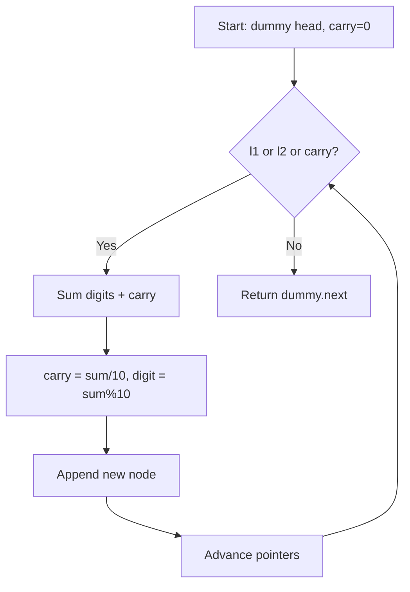
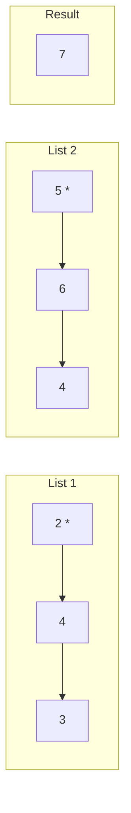
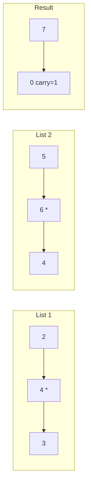
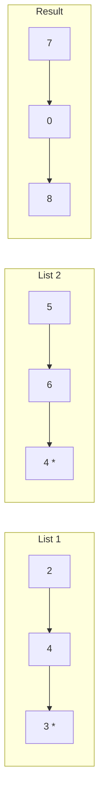

# Problem 2: Add Two Numbers

**Difficulty:** Medium  
**Tags:** Linked List, Math, Recursion  
**Pattern:** Linked List Math  
**Link:** [leetcode.com/problems/add-two-numbers](https://leetcode.com/problems/add-two-numbers/)

## Description

You are given two **non-empty** linked lists representing two non-negative integers. The digits are stored in **reverse order**, and each of their nodes contains a single digit. Add the two numbers and return the sum as a linked list.

You may assume the two numbers do not contain any leading zero, except the number 0 itself.

 

Example 1:

```

**Input:** l1 = [2,4,3], l2 = [5,6,4]
**Output:** [7,0,8]
**Explanation:** 342 + 465 = 807.

```

Example 2:

```

**Input:** l1 = [0], l2 = [0]
**Output:** [0]

```

Example 3:

```

**Input:** l1 = [9,9,9,9,9,9,9], l2 = [9,9,9,9]
**Output:** [8,9,9,9,0,0,0,1]

```

 

**Constraints:**

	- The number of nodes in each linked list is in the range `[1, 100]`.
	- `0 <= Node.val <= 9`
	- It is guaranteed that the list represents a number that does not have leading zeros.

## Approach: Linked List Math

**Key Insight:** Digits are in reverse order, so add digit-by-digit from head with a carry variable.

Use a dummy head node. Iterate both lists simultaneously, computing sum + carry at each position.

## Pseudocode

```
1. dummy = ListNode(0), curr = dummy, carry = 0
2. While l1 or l2 or carry:
   a. v1 = l1.val or 0, v2 = l2.val or 0
   b. total = v1 + v2 + carry
   c. carry = total // 10
   d. curr.next = ListNode(total % 10)
   e. Advance pointers
3. Return dummy.next
```

## Algorithm Flow



## Visual State Transitions

**Linked List Addition Step-by-Step:**

**Step 1:** Process first digits (carry=0)



**Step 2:** Process second digits (carry=0)



**Step 3:** Process third digits (carry=1)



## Complexity Analysis

- **Time:** O(max(m,n))
- **Space:** O(max(m,n))

## Solution (Python3)

```python
class Solution:
    def addTwoNumbers(self, l1, l2):
        dummy = ListNode(0)
        curr = dummy
        carry = 0
        while l1 or l2 or carry:
            v1 = l1.val if l1 else 0
            v2 = l2.val if l2 else 0
            total = v1 + v2 + carry
            carry = total // 10
            curr.next = ListNode(total % 10)
            curr = curr.next
            l1 = l1.next if l1 else None
            l2 = l2.next if l2 else None
        return dummy.next
```

## Solution (C++)

```cpp
#include <string>
#include <vector>
using namespace std;

class Solution {
public:
    ListNode* addTwoNumbers(ListNode* l1, ListNode* l2) {
        // Linked list traversal/manipulation
        ListNode dummy(0);
        dummy.next = l1;
        ListNode* prev = &dummy;
        ListNode* curr = l1;
        while (curr) {
            ListNode* nxt = curr->next;
            // Process current node
            prev = curr;
            curr = nxt;
        }
        return dummy.next;
    }
};
```
