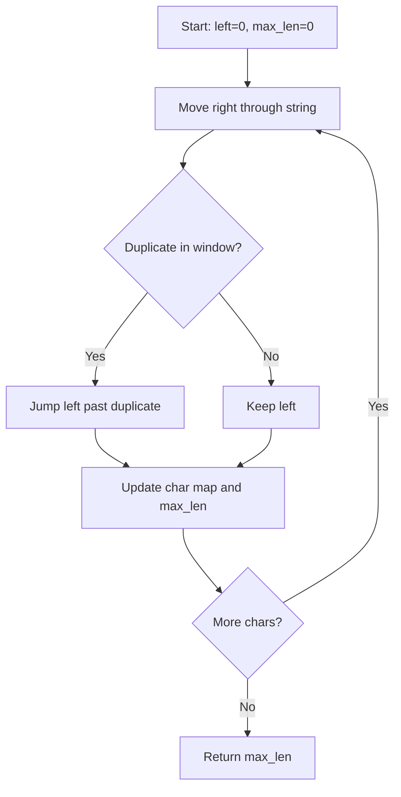
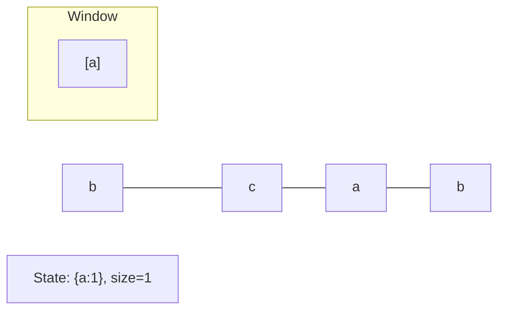
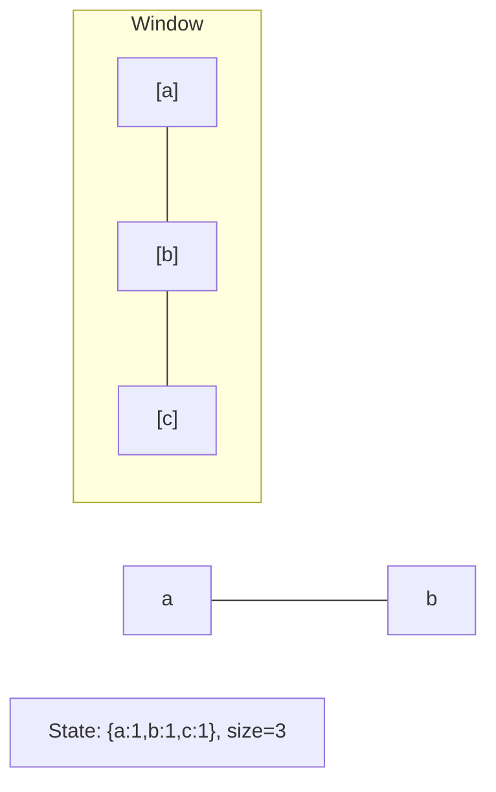
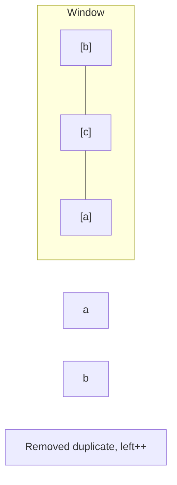
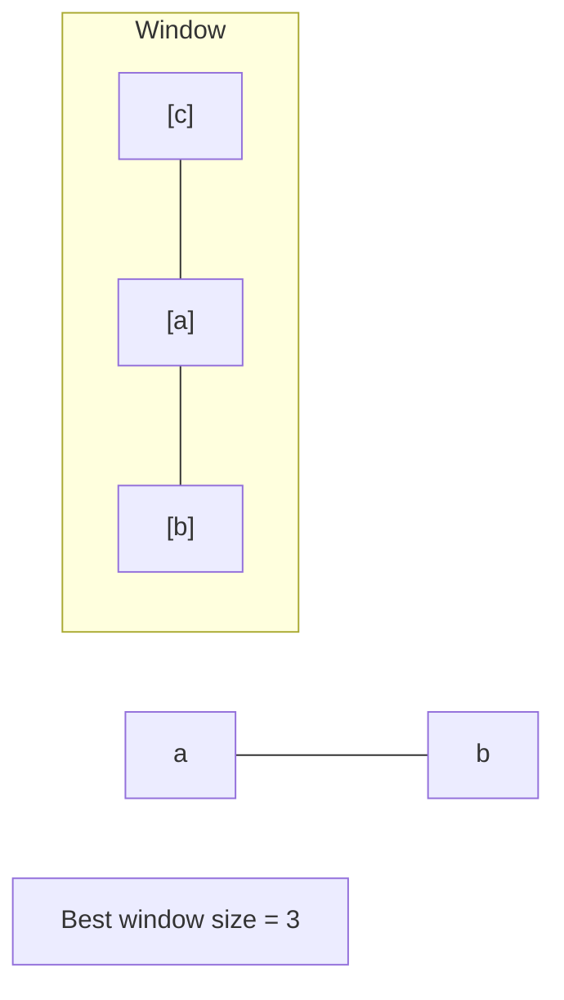

# Problem 3: Longest Substring Without Repeating Characters

**Difficulty:** Medium  
**Tags:** Hash Table, String, Sliding Window  
**Pattern:** Sliding Window  
**Link:** [leetcode.com/problems/longest-substring-without-repeating-characters](https://leetcode.com/problems/longest-substring-without-repeating-characters/)

## Description

Given a string `s`, find the length of the **longest** **substring** without duplicate characters.

 

Example 1:

```

**Input:** s = "abcabcbb"
**Output:** 3
**Explanation:** The answer is "abc", with the length of 3. Note that `"bca"` and `"cab"` are also correct answers.

```

Example 2:

```

**Input:** s = "bbbbb"
**Output:** 1
**Explanation:** The answer is "b", with the length of 1.

```

Example 3:

```

**Input:** s = "pwwkew"
**Output:** 3
**Explanation:** The answer is "wke", with the length of 3.
Notice that the answer must be a substring, "pwke" is a subsequence and not a substring.

```

 

**Constraints:**

	- `0 <= s.length <= 5 * 10^4`
	- `s` consists of English letters, digits, symbols and spaces.

## Approach: Sliding Window

**Key Insight:** Maintain a window [left, right] with unique characters. When a duplicate is found, jump left past the previous occurrence.

Use a hash map to track last-seen index of each character.

## Pseudocode

```
1. char_index = {}, left = 0, max_len = 0
2. For right, ch in enumerate(s):
   a. If ch in map and map[ch] >= left: left = map[ch] + 1
   b. map[ch] = right
   c. max_len = max(max_len, right - left + 1)
3. Return max_len
```

## Algorithm Flow



## Visual State Transitions

**Sliding Window Step-by-Step:**

**Frame 1: Initial window (left=0, right=0)**


**Frame 2: Expand right (right=2)**


**Frame 3: Violation - shrink left**


**Frame 4: Continue expanding**



## Complexity Analysis

- **Time:** O(n)
- **Space:** O(min(n,m))

## Solution (Python3)

```python
class Solution:
    def lengthOfLongestSubstring(self, s: str) -> int:
        char_index = {}
        left = 0
        max_len = 0
        for right, ch in enumerate(s):
            if ch in char_index and char_index[ch] >= left:
                left = char_index[ch] + 1
            char_index[ch] = right
            max_len = max(max_len, right - left + 1)
        return max_len
```

## Solution (C++)

```cpp
#include <algorithm>
#include <string>
#include <unordered_map>
#include <vector>
using namespace std;

class Solution {
public:
    int lengthOfLongestSubstring(string& s) {
        // Sliding window approach - O(n) time, O(k) space
        unordered_map<char, int> window;
        int left = 0, result = 0;
        for (int right = 0; right < s.size(); right++) {
            window[s[right]]++;
            while ((int)window.size() > s) {
                window[s[left]]--;
                if (window[s[left]] == 0)
                    window.erase(s[left]);
                left++;
            }
            result = max(result, right - left + 1);
        }
        return result;
    }
};
```
