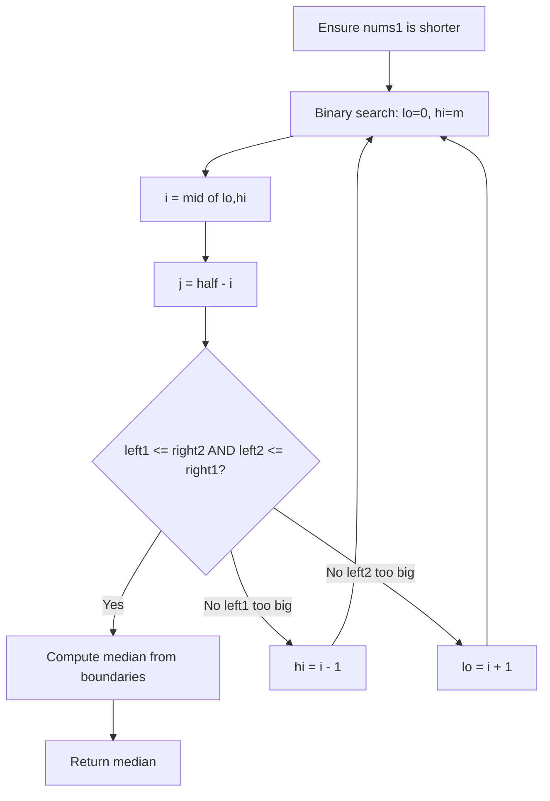
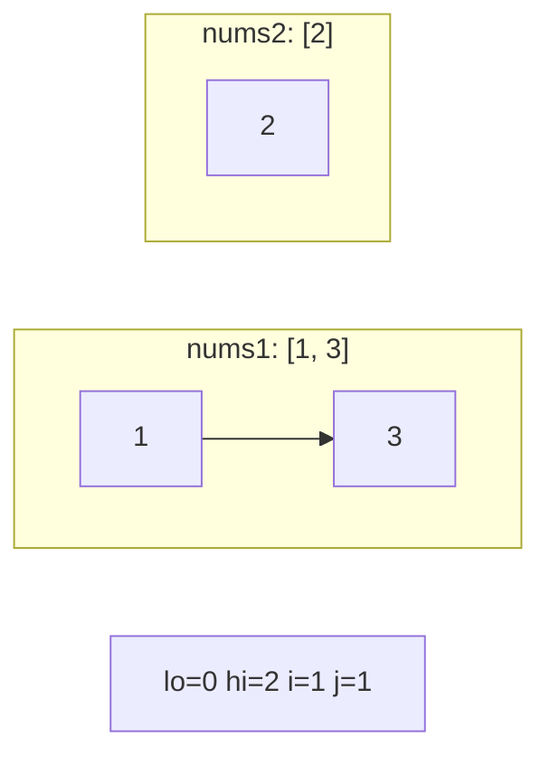
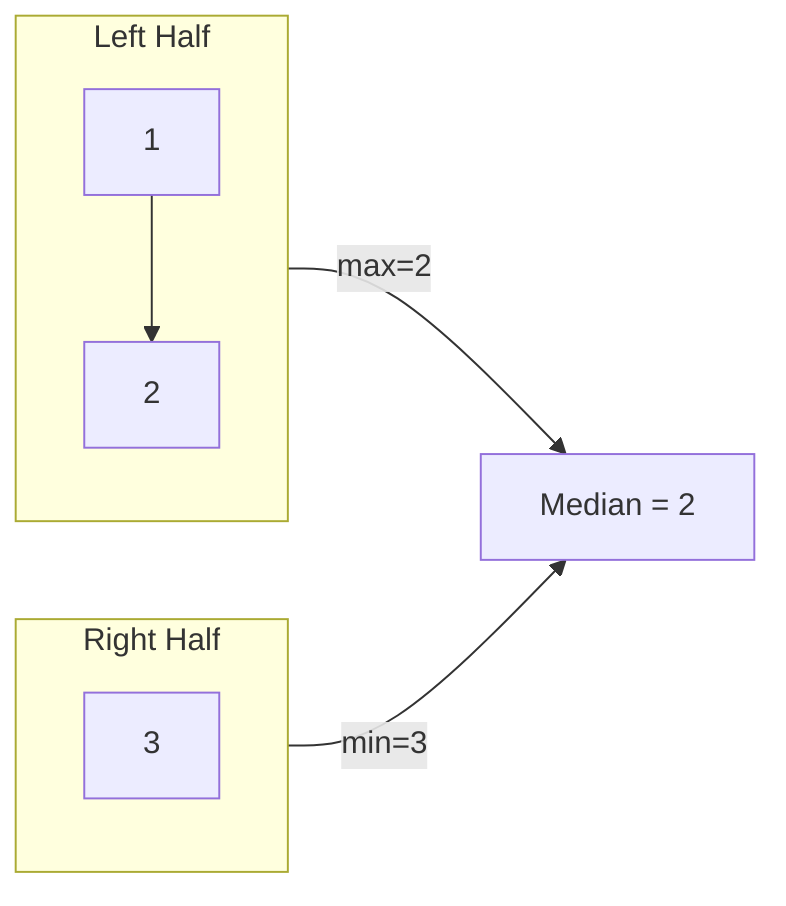

# Problem 4: Median of Two Sorted Arrays

**Difficulty:** Hard  
**Tags:** Array, Binary Search, Divide and Conquer  
**Pattern:** Binary Search  
**Link:** [leetcode.com/problems/median-of-two-sorted-arrays](https://leetcode.com/problems/median-of-two-sorted-arrays/)

## Description

Given two sorted arrays `nums1` and `nums2` of size `m` and `n` respectively, return **the median** of the two sorted arrays.

The overall run time complexity should be `O(log (m+n))`.

 

Example 1:

```

**Input:** nums1 = [1,3], nums2 = [2]
**Output:** 2.00000
**Explanation:** merged array = [1,2,3] and median is 2.

```

Example 2:

```

**Input:** nums1 = [1,2], nums2 = [3,4]
**Output:** 2.50000
**Explanation:** merged array = [1,2,3,4] and median is (2 + 3) / 2 = 2.5.

```

 

**Constraints:**

	- `nums1.length == m`
	- `nums2.length == n`
	- `0 <= m <= 1000`
	- `0 <= n <= 1000`
	- `1 <= m + n <= 2000`
	- `-10^6 <= nums1[i], nums2[i] <= 10^6`

## Approach: Binary Search

**Key Insight:** Binary search on the shorter array to find the correct partition. At the correct partition, all left elements <= all right elements.

Binary search the partition index `i` in the shorter array. Compute `j` for the other array such that left half has `(m+n+1)//2` elements total.

## Pseudocode

```
1. Ensure nums1 is shorter
2. Binary search i in [0, m]
3. j = (m+n+1)//2 - i
4. Check left1<=right2 and left2<=right1
5. If valid: compute median from boundary elements
6. Else adjust lo/hi
```

## Algorithm Flow



## Visual State Transitions

**Binary Search Partition Animation:**

**Step 1:** Initial state - search full range of shorter array



**Step 2:** Check partition i=1, j=1: left=[1,2] right=[3] -- Valid!



## Complexity Analysis

- **Time:** O(log(min(m,n)))
- **Space:** O(1)

## Solution (Python3)

```python
class Solution:
    def findMedianSortedArrays(self, nums1: list[int], nums2: list[int]) -> float:
        if len(nums1) > len(nums2):
            nums1, nums2 = nums2, nums1
        m, n = len(nums1), len(nums2)
        lo, hi = 0, m
        while lo <= hi:
            i = (lo + hi) // 2
            j = (m + n + 1) // 2 - i
            left1 = nums1[i - 1] if i > 0 else float('-inf')
            right1 = nums1[i] if i < m else float('inf')
            left2 = nums2[j - 1] if j > 0 else float('-inf')
            right2 = nums2[j] if j < n else float('inf')
            if left1 <= right2 and left2 <= right1:
                if (m + n) % 2 == 0:
                    return (max(left1, left2) + min(right1, right2)) / 2
                return max(left1, left2)
            elif left1 > right2:
                hi = i - 1
            else:
                lo = i + 1
        return 0.0
```

## Solution (C++)

```cpp
#include <string>
#include <vector>
using namespace std;

class Solution {
public:
    double findMedianSortedArrays(vector<int>& nums1, vector<int>& nums2) {
        // Binary search - O(log n) time, O(1) space
        int lo = 0, hi = nums1.size() - 1;
        while (lo <= hi) {
            int mid = lo + (hi - lo) / 2;
            if (nums1[mid] == nums2) {
                return mid;
            } else if (nums1[mid] < nums2) {
                lo = mid + 1;
            } else {
                hi = mid - 1;
            }
        }
        return 0.0;
    }
};
```
