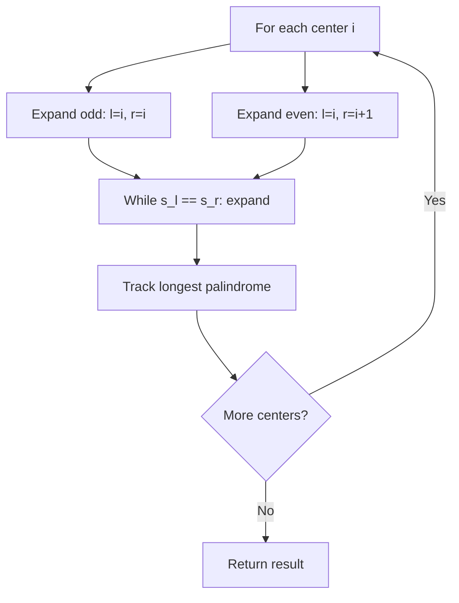
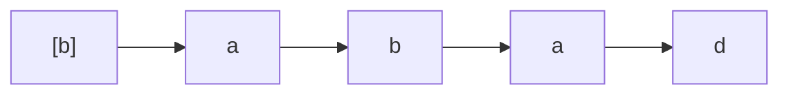
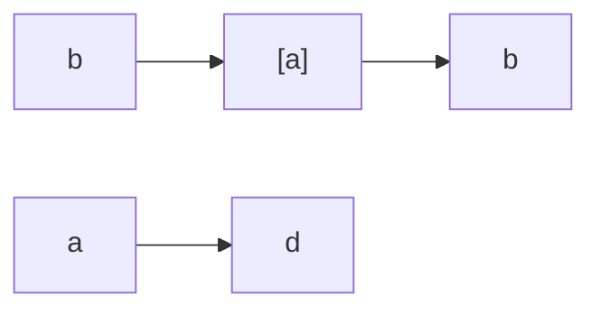
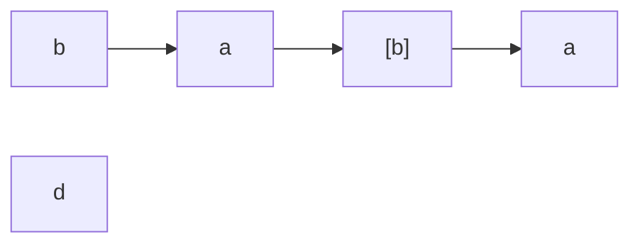

# Problem 5: Longest Palindromic Substring

**Difficulty:** Medium  
**Tags:** Two Pointers, String, Dynamic Programming  
**Pattern:** Expand Around Center  
**Link:** [leetcode.com/problems/longest-palindromic-substring](https://leetcode.com/problems/longest-palindromic-substring/)

## Description

Given a string `s`, return *the longest* *palindromic* *substring* in `s`.

 

Example 1:

```

**Input:** s = "babad"
**Output:** "bab"
**Explanation:** "aba" is also a valid answer.

```

Example 2:

```

**Input:** s = "cbbd"
**Output:** "bb"

```

 

**Constraints:**

	- `1 <= s.length <= 1000`
	- `s` consist of only digits and English letters.

## Approach: Expand Around Center

**Key Insight:** A palindrome expands symmetrically from its center. Try each index (and each pair) as a center and expand outward.

For each position, expand for both odd-length and even-length palindromes. Track the longest found.

## Pseudocode

```
1. For each index i in s:
   a. Expand around (i, i) for odd palindromes
   b. Expand around (i, i+1) for even palindromes
   c. Update result if longer found
2. Return longest palindrome
```

## Algorithm Flow



## Visual State Transitions

**Expand Around Center Animation for s = "babad":**

**Step 1:** Center at index 0 ("b")



Result so far: "b" (length 1)

**Step 2:** Center at index 1 ("a"), expand to check s[0]==s[2]?  b==b? Yes!



Palindrome found: "bab" (length 3)

**Step 3:** Center at index 2 ("b"), expand to check s[1]==s[3]? a==a? Yes!



Palindrome found: "aba" (length 3, same as "bab")

## Complexity Analysis

- **Time:** O(n^2)
- **Space:** O(1)

## Solution (Python3)

```python
class Solution:
    def longestPalindrome(self, s: str) -> str:
        def expand(l, r):
            while l >= 0 and r < len(s) and s[l] == s[r]:
                l -= 1
                r += 1
            return s[l + 1:r]

        result = ""
        for i in range(len(s)):
            odd = expand(i, i)
            even = expand(i, i + 1)
            result = max(result, odd, even, key=len)
        return result
```

## Solution (C++)

```cpp
#include <algorithm>
#include <string>
#include <vector>
using namespace std;

class Solution {
public:
    string longestPalindrome(string& s) {
        // String DP - O(m*n) time and space
        int m = s.size(), n = s.size();
        vector<vector<int>> dp(m + 1, vector<int>(n + 1, 0));
        for (int i = 1; i <= m; i++) {
            for (int j = 1; j <= n; j++) {
                if (s[i-1] == s[j-1])
                    dp[i][j] = dp[i-1][j-1] + 1;
                else
                    dp[i][j] = max(dp[i-1][j], dp[i][j-1]);
            }
        }
        return dp[m][n];
    }
};
```
