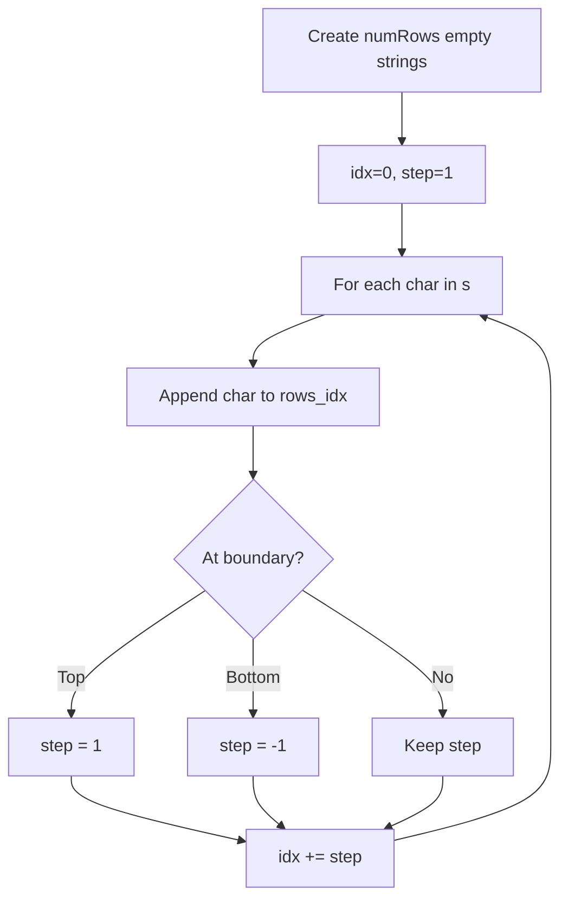

# Problem 6: Zigzag Conversion

**Difficulty:** Medium  
**Tags:** String  
**Pattern:** String Simulation  
**Link:** [leetcode.com/problems/zigzag-conversion](https://leetcode.com/problems/zigzag-conversion/)

## Description

The string `"PAYPALISHIRING"` is written in a zigzag pattern on a given number of rows like this: (you may want to display this pattern in a fixed font for better legibility)

```

P   A   H   N
A P L S I I G
Y   I   R

```

And then read line by line: `"PAHNAPLSIIGYIR"`

Write the code that will take a string and make this conversion given a number of rows:

```

string convert(string s, int numRows);

```

 

Example 1:

```

**Input:** s = "PAYPALISHIRING", numRows = 3
**Output:** "PAHNAPLSIIGYIR"

```

Example 2:

```

**Input:** s = "PAYPALISHIRING", numRows = 4
**Output:** "PINALSIGYAHRPI"
**Explanation:**
P     I    N
A   L S  I G
Y A   H R
P     I

```

Example 3:

```

**Input:** s = "A", numRows = 1
**Output:** "A"

```

 

**Constraints:**

	- `1 <= s.length <= 1000`
	- `s` consists of English letters (lower-case and upper-case), `','` and `'.'`.
	- `1 <= numRows <= 1000`

## Approach: String Simulation

**Key Insight:** Simulate the zigzag pattern by maintaining row buckets and bouncing the row index up and down.

Create `numRows` string builders. Iterate through characters, appending to the current row and reversing direction at boundaries.

## Pseudocode

```
1. rows = [''] * numRows, idx=0, step=1
2. For each char in s:
   a. rows[idx] += char
   b. If idx==0: step=1; if idx==numRows-1: step=-1
   c. idx += step
3. Return ''.join(rows)
```

## Algorithm Flow



## Complexity Analysis

- **Time:** O(n)
- **Space:** O(n)

## Solution (Python3)

```python
class Solution:
    def convert(self, s: str, numRows: int) -> str:
        if numRows == 1 or numRows >= len(s):
            return s
        rows = [''] * numRows
        idx, step = 0, 1
        for ch in s:
            rows[idx] += ch
            if idx == 0:
                step = 1
            elif idx == numRows - 1:
                step = -1
            idx += step
        return ''.join(rows)
```

## Solution (C++)

```cpp
#include <algorithm>
#include <cctype>
#include <string>
#include <vector>
using namespace std;

class Solution {
public:
    string convert(string& s, int numRows) {
        // String processing approach - O(n) time
        string processed;
        for (char ch : s) {
            if (isalnum(ch)) {
                processed += tolower(ch);
            }
        }
        string rev = processed;
        reverse(rev.begin(), rev.end());
        return processed == rev;
    }
};
```
