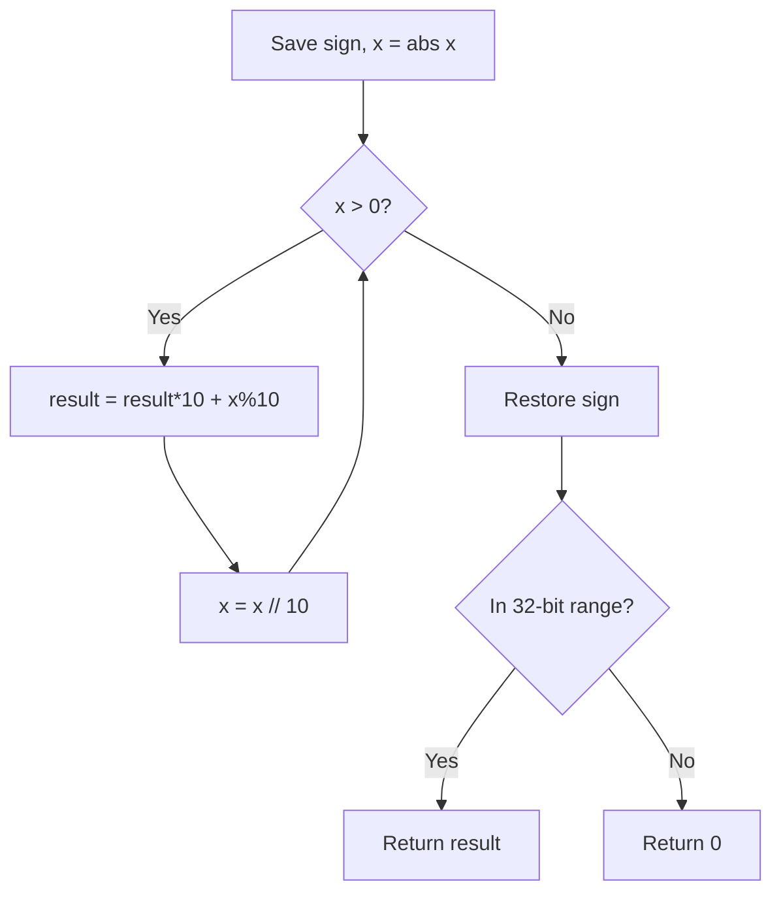

# Problem 7: Reverse Integer

**Difficulty:** Medium  
**Tags:** Math  
**Pattern:** Math  
**Link:** [leetcode.com/problems/reverse-integer](https://leetcode.com/problems/reverse-integer/)

## Description

Given a signed 32-bit integer `x`, return `x`* with its digits reversed*. If reversing `x` causes the value to go outside the signed 32-bit integer range `[-2^31, 2^31 - 1]`, then return `0`.

**Assume the environment does not allow you to store 64-bit integers (signed or unsigned).**

 

Example 1:

```

**Input:** x = 123
**Output:** 321

```

Example 2:

```

**Input:** x = -123
**Output:** -321

```

Example 3:

```

**Input:** x = 120
**Output:** 21

```

 

**Constraints:**

	- `-2^31 <= x <= 2^31 - 1`

## Approach: Math

Extract digits from the end using modulo, build the reversed number. Check 32-bit overflow before returning.

## Pseudocode

```
1. Handle sign, work with abs(x)
2. While x > 0: result = result*10 + x%10, x //= 10
3. Restore sign, check [-2^31, 2^31-1]
```

## Algorithm Flow



## Complexity Analysis

- **Time:** O(log x)
- **Space:** O(1)

## Solution (Python3)

```python
class Solution:
    def reverse(self, x: int) -> int:
        sign = -1 if x < 0 else 1
        x = abs(x)
        result = 0
        while x:
            result = result * 10 + x % 10
            x //= 10
        result *= sign
        return result if -2**31 <= result <= 2**31 - 1 else 0
```

## Solution (C++)

```cpp
#include <string>
#include <vector>
using namespace std;

class Solution {
public:
    int reverse(int x) {
        // Mathematical approach
        long long result = 0;
        int x = x;
        while (x != 0) {
            result = result * 10 + x % 10;
            x /= 10;
        }
        return (int)result;
    }
};
```
