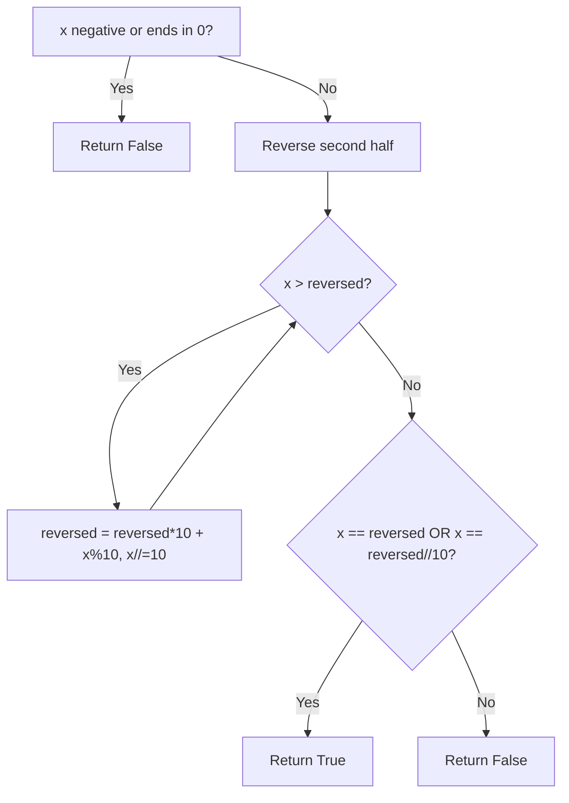

# Problem 9: Palindrome Number

**Difficulty:** Easy  
**Tags:** Math  
**Pattern:** Math  
**Link:** [leetcode.com/problems/palindrome-number](https://leetcode.com/problems/palindrome-number/)

## Description

Given an integer `x`, return `true`* if *`x`* is a ****palindrome****, and *`false`* otherwise*.

 

Example 1:

```

**Input:** x = 121
**Output:** true
**Explanation:** 121 reads as 121 from left to right and from right to left.

```

Example 2:

```

**Input:** x = -121
**Output:** false
**Explanation:** From left to right, it reads -121. From right to left, it becomes 121-. Therefore it is not a palindrome.

```

Example 3:

```

**Input:** x = 10
**Output:** false
**Explanation:** Reads 01 from right to left. Therefore it is not a palindrome.

```

 

**Constraints:**

	- `-2^31 <= x <= 2^31 - 1`

 

**Follow up:** Could you solve it without converting the integer to a string?

## Approach: Math

**Key Insight:** Reverse only the second half of the number and compare with the first half. No string conversion needed.

Negatives and multiples of 10 (except 0) are not palindromes.

## Pseudocode

```
1. If x < 0 or (x%10==0 and x!=0): return False
2. Reverse second half until reversed >= x
3. Return x == reversed or x == reversed//10
```

## Algorithm Flow



## Complexity Analysis

- **Time:** O(log n)
- **Space:** O(1)

## Solution (Python3)

```python
class Solution:
    def isPalindrome(self, x: int) -> bool:
        if x < 0 or (x % 10 == 0 and x != 0):
            return False
        reversed_half = 0
        while x > reversed_half:
            reversed_half = reversed_half * 10 + x % 10
            x //= 10
        return x == reversed_half or x == reversed_half // 10
```

## Solution (C++)

```cpp
#include <string>
#include <vector>
using namespace std;

class Solution {
public:
    bool isPalindrome(int x) {
        // Mathematical approach
        long long result = 0;
        int x = x;
        while (x != 0) {
            result = result * 10 + x % 10;
            x /= 10;
        }
        return (int)result;
    }
};
```
