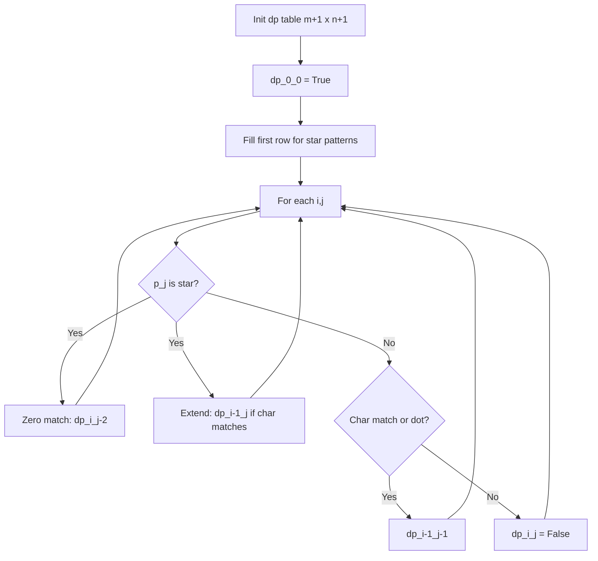
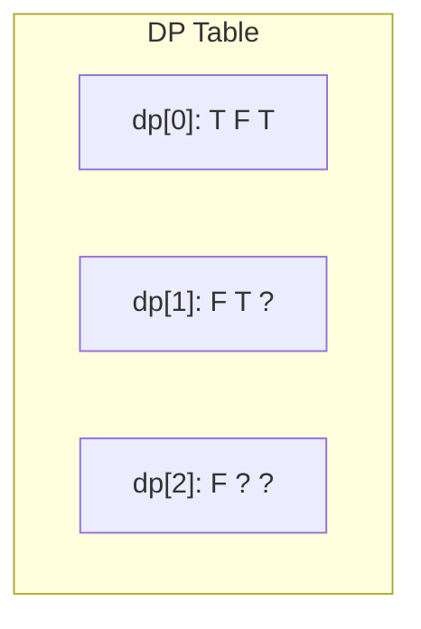
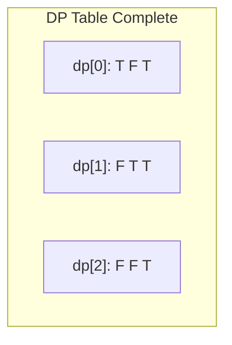

# Problem 10: Regular Expression Matching

**Difficulty:** Hard  
**Tags:** String, Dynamic Programming, Recursion  
**Pattern:** Dynamic Programming  
**Link:** [leetcode.com/problems/regular-expression-matching](https://leetcode.com/problems/regular-expression-matching/)

## Description

Given an input string `s` and a pattern `p`, implement regular expression matching with support for `'.'` and `'*'` where:

	- `'.'` Matches any single character.​​​​
	- `'*'` Matches zero or more of the preceding element.

The matching should cover the **entire** input string (not partial).

 

Example 1:

```

**Input:** s = "aa", p = "a"
**Output:** false
**Explanation:** "a" does not match the entire string "aa".

```

Example 2:

```

**Input:** s = "aa", p = "a*"
**Output:** true
**Explanation:** '*' means zero or more of the preceding element, 'a'. Therefore, by repeating 'a' once, it becomes "aa".

```

Example 3:

```

**Input:** s = "ab", p = ".*"
**Output:** true
**Explanation:** ".*" means "zero or more (*) of any character (.)".

```

 

**Constraints:**

	- `1 <= s.length <= 20`
	- `1 <= p.length <= 20`
	- `s` contains only lowercase English letters.
	- `p` contains only lowercase English letters, `'.'`, and `'*'`.
	- It is guaranteed for each appearance of the character `'*'`, there will be a previous valid character to match.

## Approach: Dynamic Programming

**Key Insight:** Use 2D DP where `dp[i][j]` = whether `s[0..i-1]` matches `p[0..j-1]`.

Handle three cases: (1) exact char match or '.', (2) '*' with zero occurrences, (3) '*' with one+ occurrences.

## Pseudocode

```
1. dp[0][0] = True
2. Fill first row: p[j-1]=='*' means dp[0][j] = dp[0][j-2]
3. For each (i,j):
   - If p[j-1]=='*': zero match or extend
   - If p[j-1]=='.' or match: dp[i-1][j-1]
4. Return dp[m][n]
```

## Algorithm Flow



## Visual State Transitions

**DP Table Fill for s="aa", p="a*":**

**Step 1:** Initialize dp table


**Step 2:** Fill dp[1][1]: p[0]='a' matches s[0]='a', dp[0][0]=T



**Step 3:** Fill dp[1][2]: p[1]='*', zero match dp[1][0]=F, extend dp[0][2]=T


**Step 4:** Fill dp[2][2]: p[1]='*', extend dp[1][2]=T. Result: True



## Complexity Analysis

- **Time:** O(m*n)
- **Space:** O(m*n)

## Solution (Python3)

```python
class Solution:
    def isMatch(self, s: str, p: str) -> bool:
        m, n = len(s), len(p)
        dp = [[False] * (n + 1) for _ in range(m + 1)]
        dp[0][0] = True
        for j in range(1, n + 1):
            if p[j - 1] == '*':
                dp[0][j] = dp[0][j - 2]
        for i in range(1, m + 1):
            for j in range(1, n + 1):
                if p[j - 1] == '*':
                    dp[i][j] = dp[i][j - 2]  # zero occurrences
                    if p[j - 2] == '.' or p[j - 2] == s[i - 1]:
                        dp[i][j] = dp[i][j] or dp[i - 1][j]
                elif p[j - 1] == '.' or p[j - 1] == s[i - 1]:
                    dp[i][j] = dp[i - 1][j - 1]
        return dp[m][n]
```

## Solution (C++)

```cpp
#include <algorithm>
#include <string>
#include <vector>
using namespace std;

class Solution {
public:
    bool isMatch(string& s, string& p) {
        // String DP - O(m*n) time and space
        int m = s.size(), n = p.size();
        vector<vector<int>> dp(m + 1, vector<int>(n + 1, 0));
        for (int i = 1; i <= m; i++) {
            for (int j = 1; j <= n; j++) {
                if (s[i-1] == p[j-1])
                    dp[i][j] = dp[i-1][j-1] + 1;
                else
                    dp[i][j] = max(dp[i-1][j], dp[i][j-1]);
            }
        }
        return dp[m][n];
    }
};
```
