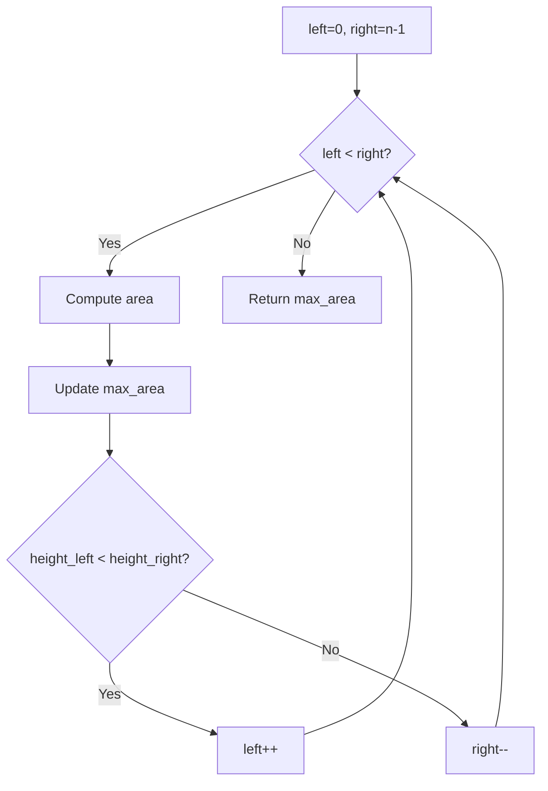

# Problem 11: Container With Most Water

**Difficulty:** Medium  
**Tags:** Array, Two Pointers, Greedy  
**Pattern:** Two Pointers  
**Link:** [leetcode.com/problems/container-with-most-water](https://leetcode.com/problems/container-with-most-water/)

## Description

You are given an integer array `height` of length `n`. There are `n` vertical lines drawn such that the two endpoints of the `i^th` line are `(i, 0)` and `(i, height[i])`.

Find two lines that together with the x-axis form a container, such that the container contains the most water.

Return *the maximum amount of water a container can store*.

**Notice** that you may not slant the container.

 

Example 1:

```

**Input:** height = [1,8,6,2,5,4,8,3,7]
**Output:** 49
**Explanation:** The above vertical lines are represented by array [1,8,6,2,5,4,8,3,7]. In this case, the max area of water (blue section) the container can contain is 49.

```

Example 2:

```

**Input:** height = [1,1]
**Output:** 1

```

 

**Constraints:**

	- `n == height.length`
	- `2 <= n <= 10^5`
	- `0 <= height[i] <= 10^4`

## Approach: Two Pointers

**Key Insight:** Start with widest container (left=0, right=end). Move the shorter pointer inward since moving the taller one can only decrease area.

## Pseudocode

```
1. left=0, right=n-1, max_area=0
2. While left < right:
   a. area = min(h[left], h[right]) * (right-left)
   b. Update max_area
   c. Move shorter pointer inward
3. Return max_area
```

## Algorithm Flow



## Complexity Analysis

- **Time:** O(n)
- **Space:** O(1)

## Solution (Python3)

```python
class Solution:
    def maxArea(self, height: list[int]) -> int:
        left, right = 0, len(height) - 1
        max_area = 0
        while left < right:
            area = min(height[left], height[right]) * (right - left)
            max_area = max(max_area, area)
            if height[left] < height[right]:
                left += 1
            else:
                right -= 1
        return max_area
```

## Solution (C++)

```cpp
#include <algorithm>
#include <string>
#include <vector>
using namespace std;

class Solution {
public:
    int maxArea(vector<int>& height) {
        // Greedy approach - O(n) time
        int result = 0, curr_max = 0;
        for (int i = 0; i < (int)height.size(); i++) {
            curr_max = max(curr_max, height[i]);
            result = max(result, curr_max);
        }
        return result;
    }
};
```
