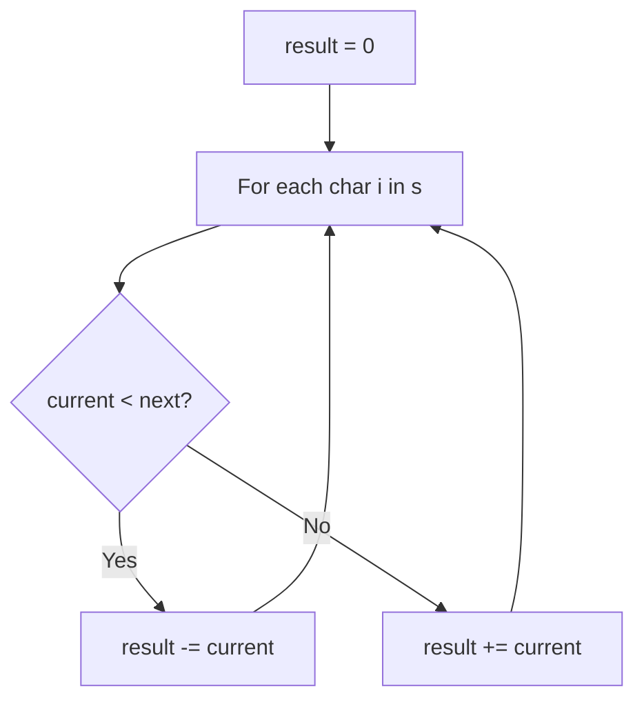

# Problem 13: Roman to Integer

**Difficulty:** Easy  
**Tags:** Hash Table, Math, String  
**Pattern:** String Parsing  
**Link:** [leetcode.com/problems/roman-to-integer](https://leetcode.com/problems/roman-to-integer/)

## Description

Roman numerals are represented by seven different symbols: `I`, `V`, `X`, `L`, `C`, `D` and `M`.

```

**Symbol**       **Value**
I             1
V             5
X             10
L             50
C             100
D             500
M             1000
```

For example, `2` is written as `II` in Roman numeral, just two ones added together. `12` is written as `XII`, which is simply `X + II`. The number `27` is written as `XXVII`, which is `XX + V + II`.

Roman numerals are usually written largest to smallest from left to right. However, the numeral for four is not `IIII`. Instead, the number four is written as `IV`. Because the one is before the five we subtract it making four. The same principle applies to the number nine, which is written as `IX`. There are six instances where subtraction is used:

	- `I` can be placed before `V` (5) and `X` (10) to make 4 and 9. 
	- `X` can be placed before `L` (50) and `C` (100) to make 40 and 90. 
	- `C` can be placed before `D` (500) and `M` (1000) to make 400 and 900.

Given a roman numeral, convert it to an integer.

 

Example 1:

```

**Input:** s = "III"
**Output:** 3
**Explanation:** III = 3.

```

Example 2:

```

**Input:** s = "LVIII"
**Output:** 58
**Explanation:** L = 50, V= 5, III = 3.

```

Example 3:

```

**Input:** s = "MCMXCIV"
**Output:** 1994
**Explanation:** M = 1000, CM = 900, XC = 90 and IV = 4.

```

 

**Constraints:**

	- `1 <= s.length <= 15`
	- `s` contains only the characters `('I', 'V', 'X', 'L', 'C', 'D', 'M')`.
	- It is **guaranteed** that `s` is a valid roman numeral in the range `[1, 3999]`.

## Approach: String Parsing

If a smaller value appears before a larger one, subtract it; otherwise add it.

## Pseudocode

```
1. Map each Roman char to value
2. For each char: if next char is larger, subtract; else add
3. Return total
```

## Algorithm Flow



## Complexity Analysis

- **Time:** O(n)
- **Space:** O(1)

## Solution (Python3)

```python
class Solution:
    def romanToInt(self, s: str) -> int:
        roman = {'I':1,'V':5,'X':10,'L':50,'C':100,'D':500,'M':1000}
        result = 0
        for i in range(len(s)):
            if i + 1 < len(s) and roman[s[i]] < roman[s[i+1]]:
                result -= roman[s[i]]
            else:
                result += roman[s[i]]
        return result
```

## Solution (C++)

```cpp
#include <string>
#include <unordered_map>
#include <vector>
using namespace std;

class Solution {
public:
    int romanToInt(string& s) {
        // Hash map for string/character frequency - O(n) time
        unordered_map<char, int> freq;
        for (char ch : s) {
            freq[ch]++;
        }
        // Process frequency map
        for (int i = 0; i < s.size(); i++) {
            if (freq[s[i]] == 1) return i;
        }
        return 0;
    }
};
```
