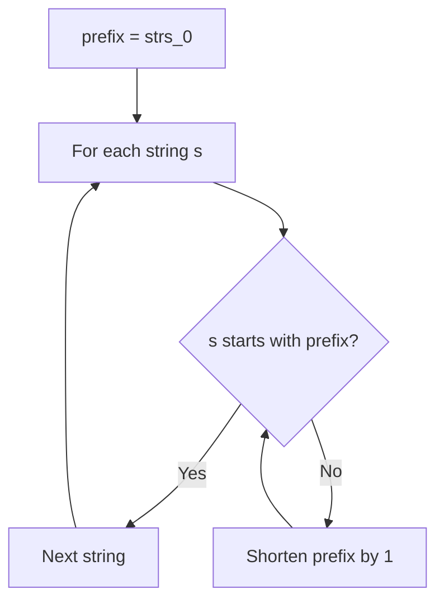
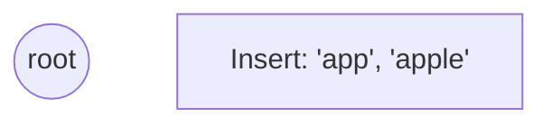
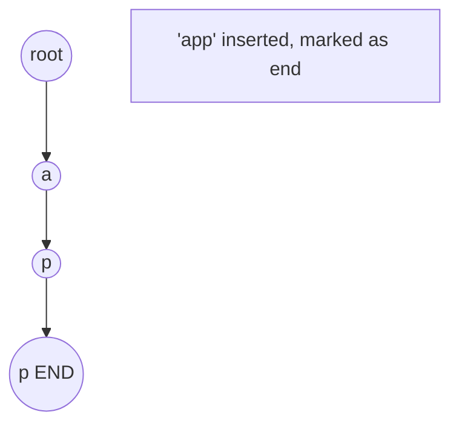
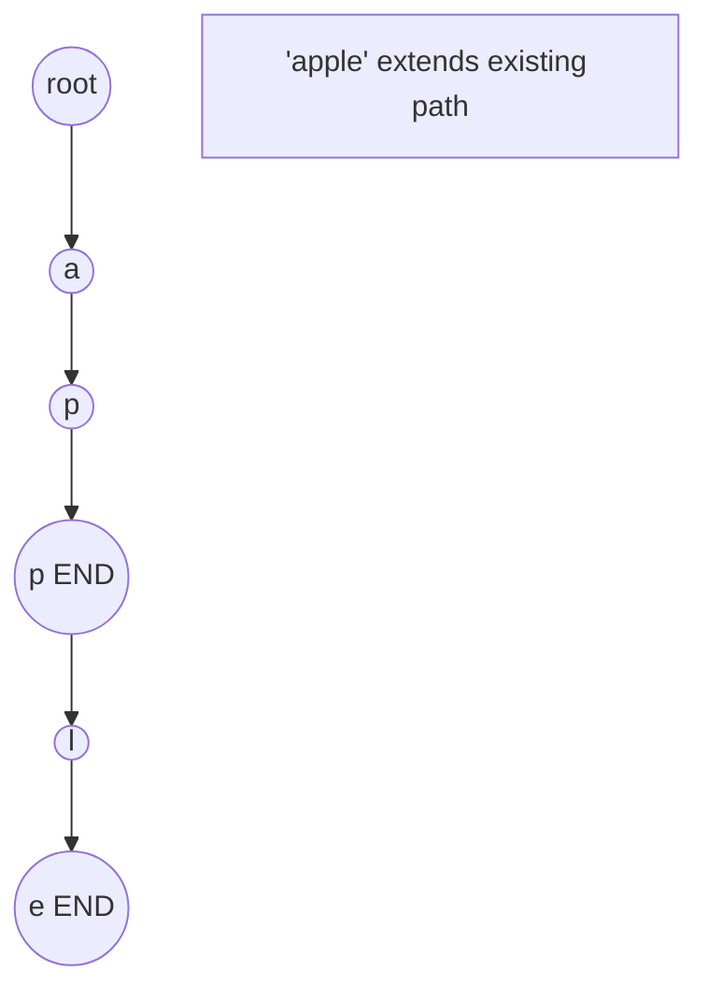
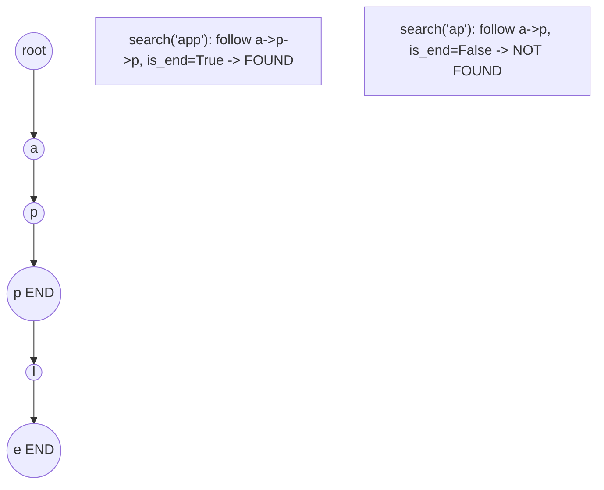

# Problem 14: Longest Common Prefix

**Difficulty:** Easy  
**Tags:** Array, String, Trie  
**Pattern:** String  
**Link:** [leetcode.com/problems/longest-common-prefix](https://leetcode.com/problems/longest-common-prefix/)

## Description

Write a function to find the longest common prefix string amongst an array of strings.

If there is no common prefix, return an empty string `""`.

 

Example 1:

```

**Input:** strs = ["flower","flow","flight"]
**Output:** "fl"

```

Example 2:

```

**Input:** strs = ["dog","racecar","car"]
**Output:** ""
**Explanation:** There is no common prefix among the input strings.

```

 

**Constraints:**

	- `1 <= strs.length <= 200`
	- `0 <= strs[i].length <= 200`
	- `strs[i]` consists of only lowercase English letters if it is non-empty.

## Approach: String

Start with first string as prefix. Shrink it until every other string starts with it.

## Pseudocode

```
1. prefix = strs[0]
2. For each other string s:
   While s doesn't start with prefix: remove last char
3. Return prefix
```

## Algorithm Flow



## Visual State Transitions

**Trie Insert and Search:**

**Frame 1: Empty trie**


**Frame 2: Insert 'app'**


**Frame 3: Insert 'apple'**


**Frame 4: Search 'app' = True, 'ap' = False**



## Complexity Analysis

- **Time:** O(S) where S = sum of all chars
- **Space:** O(1)

## Solution (Python3)

```python
class Solution:
    def longestCommonPrefix(self, strs: list[str]) -> str:
        if not strs:
            return ""
        prefix = strs[0]
        for s in strs[1:]:
            while not s.startswith(prefix):
                prefix = prefix[:-1]
                if not prefix:
                    return ""
        return prefix
```

## Solution (C++)

```cpp
#include <string>
#include <vector>
using namespace std;

class Solution {
public:
    string longestCommonPrefix(vector<string>& strs) {
        // Trie-based approach
        struct TrieNode {
            TrieNode* children[26] = {};
            bool isEnd = false;
        };
        TrieNode* root = new TrieNode();
        // Build trie
        for (auto& word : strs) {
            TrieNode* node = root;
            for (char ch : word) {
                int idx = ch - 'a';
                if (!node->children[idx])
                    node->children[idx] = new TrieNode();
                node = node->children[idx];
            }
            node->isEnd = true;
        }
        return "";
    }
};
```
