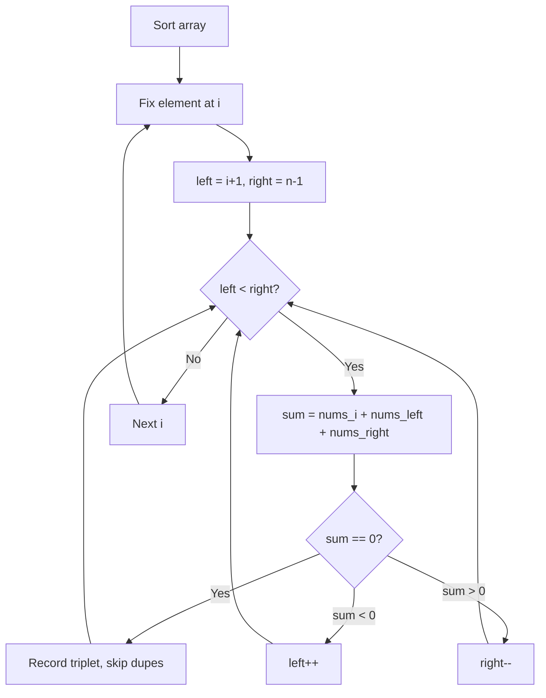

# Problem 15: 3Sum

**Difficulty:** Medium  
**Tags:** Array, Two Pointers, Sorting  
**Pattern:** Two Pointers  
**Link:** [leetcode.com/problems/3sum](https://leetcode.com/problems/3sum/)

## Description

Given an integer array nums, return all the triplets `[nums[i], nums[j], nums[k]]` such that `i != j`, `i != k`, and `j != k`, and `nums[i] + nums[j] + nums[k] == 0`.

Notice that the solution set must not contain duplicate triplets.

 

Example 1:

```

**Input:** nums = [-1,0,1,2,-1,-4]
**Output:** [[-1,-1,2],[-1,0,1]]
**Explanation:** 
nums[0] + nums[1] + nums[2] = (-1) + 0 + 1 = 0.
nums[1] + nums[2] + nums[4] = 0 + 1 + (-1) = 0.
nums[0] + nums[3] + nums[4] = (-1) + 2 + (-1) = 0.
The distinct triplets are [-1,0,1] and [-1,-1,2].
Notice that the order of the output and the order of the triplets does not matter.

```

Example 2:

```

**Input:** nums = [0,1,1]
**Output:** []
**Explanation:** The only possible triplet does not sum up to 0.

```

Example 3:

```

**Input:** nums = [0,0,0]
**Output:** [[0,0,0]]
**Explanation:** The only possible triplet sums up to 0.

```

 

**Constraints:**

	- `3 <= nums.length <= 3000`
	- `-10^5 <= nums[i] <= 10^5`

## Approach: Two Pointers

**Key Insight:** Sort the array. Fix one element, then use two pointers on the remainder to find pairs summing to its negative.

Skip duplicates at all levels to avoid duplicate triplets.

## Pseudocode

```
1. Sort nums
2. For each i (skip duplicates):
   left = i+1, right = n-1
   While left < right:
     If sum < 0: left++
     If sum > 0: right--
     If sum == 0: record, skip duplicates
```

## Algorithm Flow



## Complexity Analysis

- **Time:** O(n^2)
- **Space:** O(1) extra

## Solution (Python3)

```python
class Solution:
    def threeSum(self, nums: list[int]) -> list[list[int]]:
        nums.sort()
        result = []
        for i in range(len(nums) - 2):
            if i > 0 and nums[i] == nums[i - 1]:
                continue
            left, right = i + 1, len(nums) - 1
            while left < right:
                total = nums[i] + nums[left] + nums[right]
                if total < 0:
                    left += 1
                elif total > 0:
                    right -= 1
                else:
                    result.append([nums[i], nums[left], nums[right]])
                    while left < right and nums[left] == nums[left + 1]:
                        left += 1
                    while left < right and nums[right] == nums[right - 1]:
                        right -= 1
                    left += 1
                    right -= 1
        return result
```

## Solution (C++)

```cpp
#include <algorithm>
#include <string>
#include <vector>
using namespace std;

class Solution {
public:
    vector<vector<int>> threeSum(vector<int>& nums) {
        // Sort + two pointers - O(n log n) time
        sort(nums.begin(), nums.end());
        int left = 0, right = nums.size() - 1;
        while (left < right) {
            int curr = nums[left] + nums[right];
            if (curr < nums) {
                left++;
            } else {
                right--;
            }
        }
        return {};
    }
};
```
