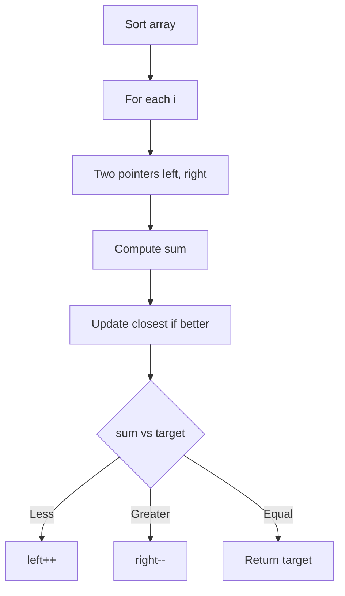

# Problem 16: 3Sum Closest

**Difficulty:** Medium  
**Tags:** Array, Two Pointers, Sorting  
**Pattern:** Two Pointers  
**Link:** [leetcode.com/problems/3sum-closest](https://leetcode.com/problems/3sum-closest/)

## Description

Given an integer array `nums` of length `n` and an integer `target`, find three integers at **distinct indices** in `nums` such that the sum is closest to `target`.

Return *the sum of the three integers*.

You may assume that each input would have exactly one solution.

 

Example 1:

```

**Input:** nums = [-1,2,1,-4], target = 1
**Output:** 2
**Explanation:** The sum that is closest to the target is 2. (-1 + 2 + 1 = 2).

```

Example 2:

```

**Input:** nums = [0,0,0], target = 1
**Output:** 0
**Explanation:** The sum that is closest to the target is 0. (0 + 0 + 0 = 0).

```

 

**Constraints:**

	- `3 <= nums.length <= 500`
	- `-1000 <= nums[i] <= 1000`
	- `-10^4 <= target <= 10^4`

## Approach: Two Pointers

Sort + two pointers. Track the closest sum seen so far. Adjust pointers based on comparison with target.

## Pseudocode

```
1. Sort nums, closest = inf
2. Fix i, two pointers left/right
3. Track closest sum, adjust pointers
4. Return closest
```

## Algorithm Flow



## Complexity Analysis

- **Time:** O(n^2)
- **Space:** O(1)

## Solution (Python3)

```python
class Solution:
    def threeSumClosest(self, nums: list[int], target: int) -> int:
        nums.sort()
        closest = float('inf')
        for i in range(len(nums) - 2):
            left, right = i + 1, len(nums) - 1
            while left < right:
                total = nums[i] + nums[left] + nums[right]
                if abs(total - target) < abs(closest - target):
                    closest = total
                if total < target:
                    left += 1
                elif total > target:
                    right -= 1
                else:
                    return total
        return closest
```

## Solution (C++)

```cpp
#include <algorithm>
#include <string>
#include <vector>
using namespace std;

class Solution {
public:
    int threeSumClosest(vector<int>& nums, int target) {
        // Sort + two pointers - O(n log n) time
        sort(nums.begin(), nums.end());
        int left = 0, right = nums.size() - 1;
        while (left < right) {
            int curr = nums[left] + nums[right];
            if (curr < target) {
                left++;
            } else {
                right--;
            }
        }
        return 0;
    }
};
```
