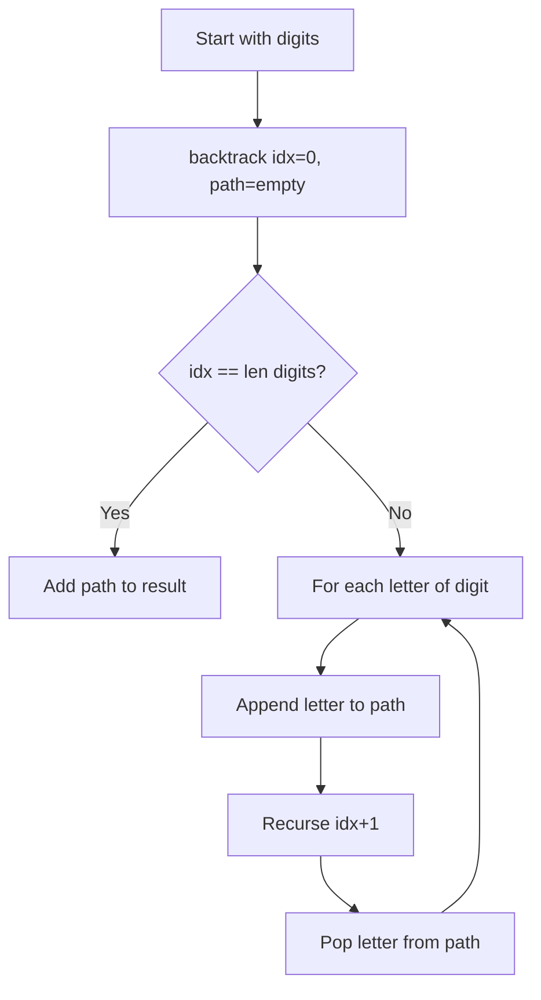
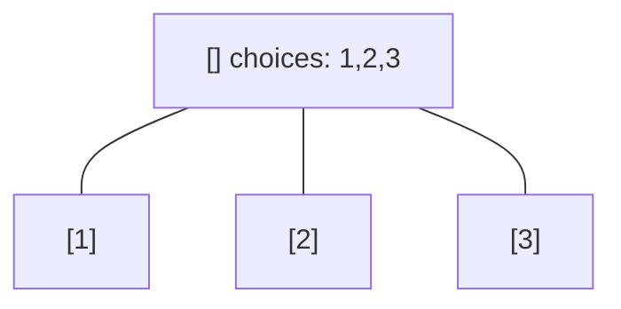
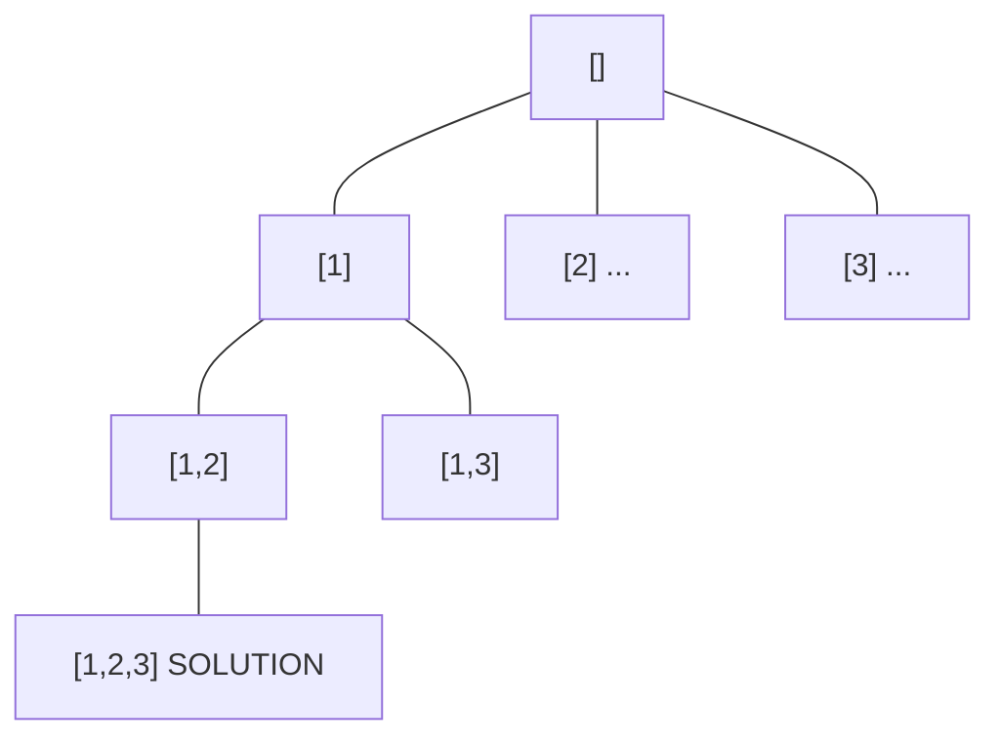
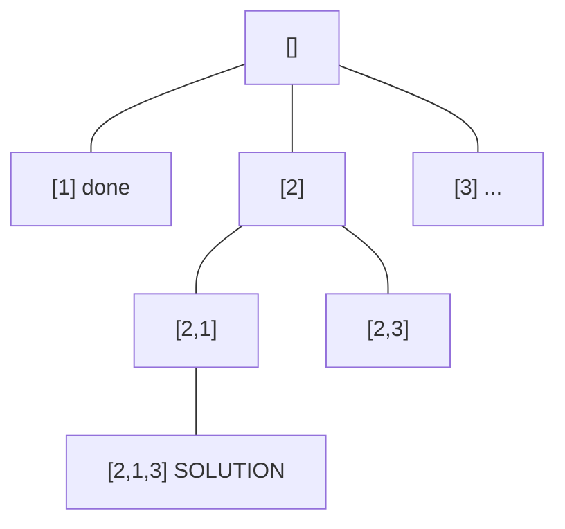
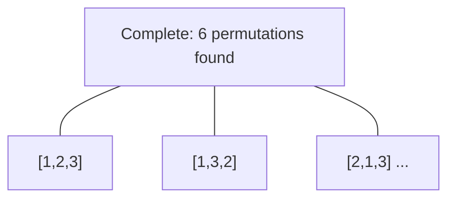

# Problem 17: Letter Combinations of a Phone Number

**Difficulty:** Medium  
**Tags:** Hash Table, String, Backtracking  
**Pattern:** Backtracking  
**Link:** [leetcode.com/problems/letter-combinations-of-a-phone-number](https://leetcode.com/problems/letter-combinations-of-a-phone-number/)

## Description

Given a string containing digits from `2-9` inclusive, return all possible letter combinations that the number could represent. Return the answer in **any order**.

A mapping of digits to letters (just like on the telephone buttons) is given below. Note that 1 does not map to any letters.

 

Example 1:

```

**Input:** digits = "23"
**Output:** ["ad","ae","af","bd","be","bf","cd","ce","cf"]

```

Example 2:

```

**Input:** digits = "2"
**Output:** ["a","b","c"]

```

 

**Constraints:**

	- `1 <= digits.length <= 4`
	- `digits[i]` is a digit in the range `['2', '9']`.

## Approach: Backtracking

Classic backtracking: for each digit, try all mapped letters and recurse to the next digit.

## Pseudocode

```
1. Map digits to letters
2. Backtrack(idx, path):
   If idx == len(digits): record path
   For each letter of digits[idx]: append, recurse, pop
```

## Algorithm Flow



## Visual State Transitions

**Backtracking Decision Tree:**

**Frame 1: Root - start with empty path**


**Frame 2: Explore branch [1]**


**Frame 3: Backtrack, explore [2]**


**Frame 4: All solutions found**



## Complexity Analysis

- **Time:** O(4^n) where n = len(digits)
- **Space:** O(n)

## Solution (Python3)

```python
class Solution:
    def letterCombinations(self, digits: str) -> list[str]:
        if not digits:
            return []
        phone = {'2':'abc','3':'def','4':'ghi','5':'jkl',
                 '6':'mno','7':'pqrs','8':'tuv','9':'wxyz'}
        result = []
        def backtrack(idx, path):
            if idx == len(digits):
                result.append(''.join(path))
                return
            for ch in phone[digits[idx]]:
                path.append(ch)
                backtrack(idx + 1, path)
                path.pop()
        backtrack(0, [])
        return result
```

## Solution (C++)

```cpp
#include <functional>
#include <string>
#include <vector>
using namespace std;

class Solution {
public:
    vector<string> letterCombinations(string& digits) {
        // Backtracking - O(2^n) or O(n!) time
        vector<vector<int>> result;
        vector<int> path;
        function<void(int)> backtrack = [&](int start) {
            result.push_back(path);
            for (int i = start; i < (int)digits.size(); i++) {
                path.push_back(digits[i]);
                backtrack(i + 1);
                path.pop_back();
            }
        };
        backtrack(0);
        return result;
    }
};
```
