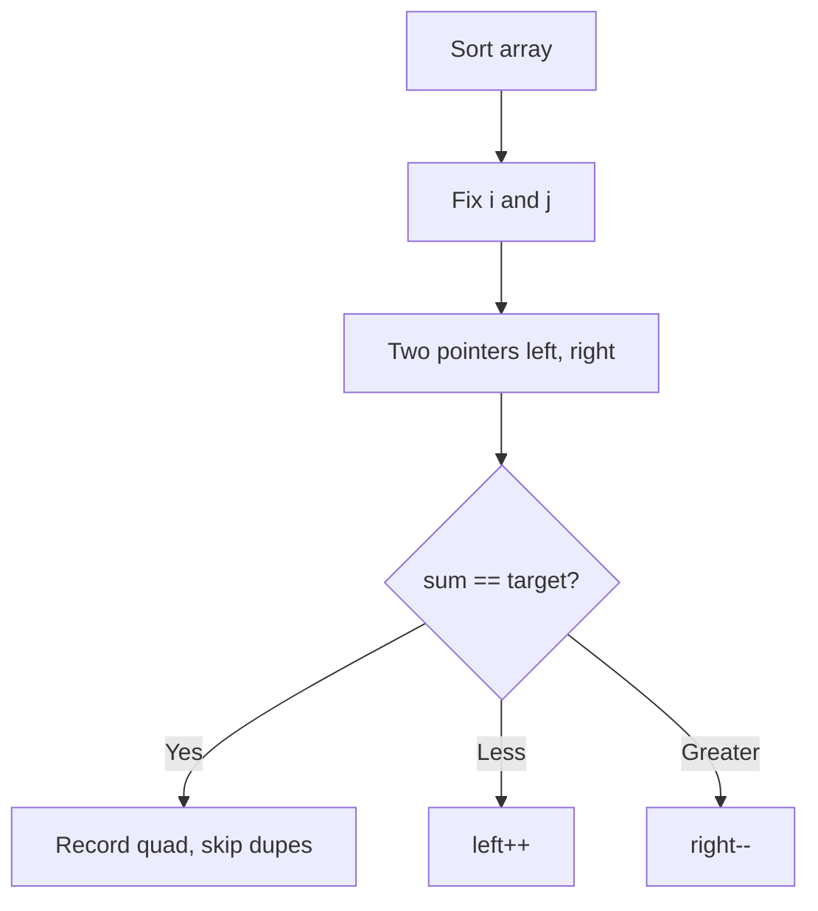

# Problem 18: 4Sum

**Difficulty:** Medium  
**Tags:** Array, Two Pointers, Sorting  
**Pattern:** Two Pointers  
**Link:** [leetcode.com/problems/4sum](https://leetcode.com/problems/4sum/)

## Description

Given an array `nums` of `n` integers, return *an array of all the **unique** quadruplets* `[nums[a], nums[b], nums[c], nums[d]]` such that:

	- `0 <= a, b, c, d < n`
	- `a`, `b`, `c`, and `d` are **distinct**.
	- `nums[a] + nums[b] + nums[c] + nums[d] == target`

You may return the answer in **any order**.

 

Example 1:

```

**Input:** nums = [1,0,-1,0,-2,2], target = 0
**Output:** [[-2,-1,1,2],[-2,0,0,2],[-1,0,0,1]]

```

Example 2:

```

**Input:** nums = [2,2,2,2,2], target = 8
**Output:** [[2,2,2,2]]

```

 

**Constraints:**

	- `1 <= nums.length <= 200`
	- `-10^9 <= nums[i] <= 10^9`
	- `-10^9 <= target <= 10^9`

## Approach: Two Pointers

Extension of 3Sum: fix two elements, use two pointers for the remaining two. Skip duplicates at all levels.

## Pseudocode

```
1. Sort nums
2. Fix i, fix j > i
3. Two pointers left=j+1, right=n-1
4. Find quads summing to target, skip dupes
```

## Algorithm Flow



## Complexity Analysis

- **Time:** O(n^3)
- **Space:** O(1) extra

## Solution (Python3)

```python
class Solution:
    def fourSum(self, nums: list[int], target: int) -> list[list[int]]:
        nums.sort()
        result = []
        n = len(nums)
        for i in range(n - 3):
            if i > 0 and nums[i] == nums[i - 1]:
                continue
            for j in range(i + 1, n - 2):
                if j > i + 1 and nums[j] == nums[j - 1]:
                    continue
                left, right = j + 1, n - 1
                while left < right:
                    total = nums[i] + nums[j] + nums[left] + nums[right]
                    if total < target:
                        left += 1
                    elif total > target:
                        right -= 1
                    else:
                        result.append([nums[i], nums[j], nums[left], nums[right]])
                        while left < right and nums[left] == nums[left + 1]:
                            left += 1
                        while left < right and nums[right] == nums[right - 1]:
                            right -= 1
                        left += 1
                        right -= 1
        return result
```

## Solution (C++)

```cpp
#include <algorithm>
#include <string>
#include <vector>
using namespace std;

class Solution {
public:
    vector<vector<int>> fourSum(vector<int>& nums, int target) {
        // Sort + two pointers - O(n log n) time
        sort(nums.begin(), nums.end());
        int left = 0, right = nums.size() - 1;
        while (left < right) {
            int curr = nums[left] + nums[right];
            if (curr < target) {
                left++;
            } else {
                right--;
            }
        }
        return {};
    }
};
```
