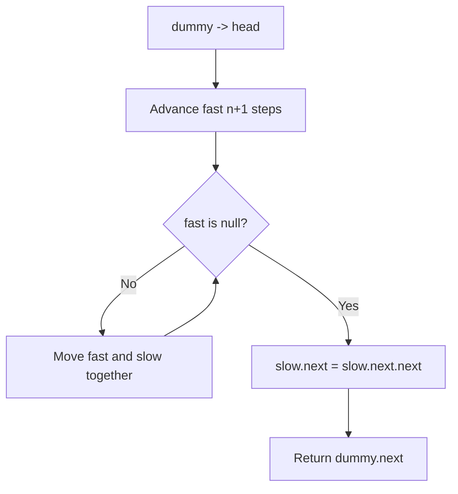
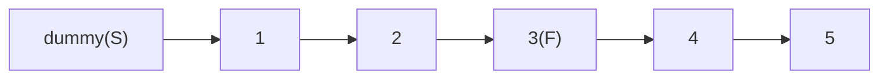
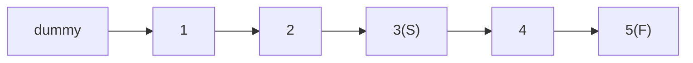
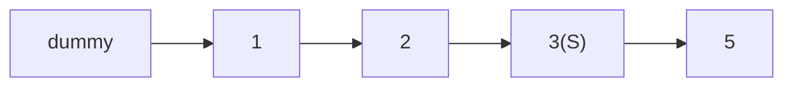

# Problem 19: Remove Nth Node From End of List

**Difficulty:** Medium  
**Tags:** Linked List, Two Pointers  
**Pattern:** Fast and Slow Pointers  
**Link:** [leetcode.com/problems/remove-nth-node-from-end-of-list](https://leetcode.com/problems/remove-nth-node-from-end-of-list/)

## Description

Given the `head` of a linked list, remove the `n^th` node from the end of the list and return its head.

 

Example 1:

```

**Input:** head = [1,2,3,4,5], n = 2
**Output:** [1,2,3,5]

```

Example 2:

```

**Input:** head = [1], n = 1
**Output:** []

```

Example 3:

```

**Input:** head = [1,2], n = 1
**Output:** [1]

```

 

**Constraints:**

	- The number of nodes in the list is `sz`.
	- `1 <= sz <= 30`
	- `0 <= Node.val <= 100`
	- `1 <= n <= sz`

 

**Follow up:** Could you do this in one pass?

## Approach: Fast and Slow Pointers

**Key Insight:** Use two pointers with a gap of n+1. When fast reaches end, slow is just before the node to remove.

Dummy head handles edge case of removing the first node.

## Pseudocode

```
1. dummy -> head, fast = slow = dummy
2. Advance fast by n+1 steps
3. Move both until fast is null
4. slow.next = slow.next.next
5. Return dummy.next
```

## Algorithm Flow



## Visual State Transitions

**Two-Pointer Gap Animation for n=2, list=[1,2,3,4,5]:**

**Step 1:** Advance fast 3 steps ahead of slow



**Step 2:** Move both until fast reaches end



**Step 3:** Remove slow.next (node 4)



## Complexity Analysis

- **Time:** O(L) where L = list length
- **Space:** O(1)

## Solution (Python3)

```python
class Solution:
    def removeNthFromEnd(self, head, n):
        dummy = ListNode(0, head)
        fast = slow = dummy
        for _ in range(n + 1):
            fast = fast.next
        while fast:
            fast = fast.next
            slow = slow.next
        slow.next = slow.next.next
        return dummy.next
```

## Solution (C++)

```cpp
#include <string>
#include <vector>
using namespace std;

class Solution {
public:
    ListNode* removeNthFromEnd(ListNode* head, int n) {
        // Linked list traversal/manipulation
        ListNode dummy(0);
        dummy.next = head;
        ListNode* prev = &dummy;
        ListNode* curr = head;
        while (curr) {
            ListNode* nxt = curr->next;
            // Process current node
            prev = curr;
            curr = nxt;
        }
        return dummy.next;
    }
};
```
