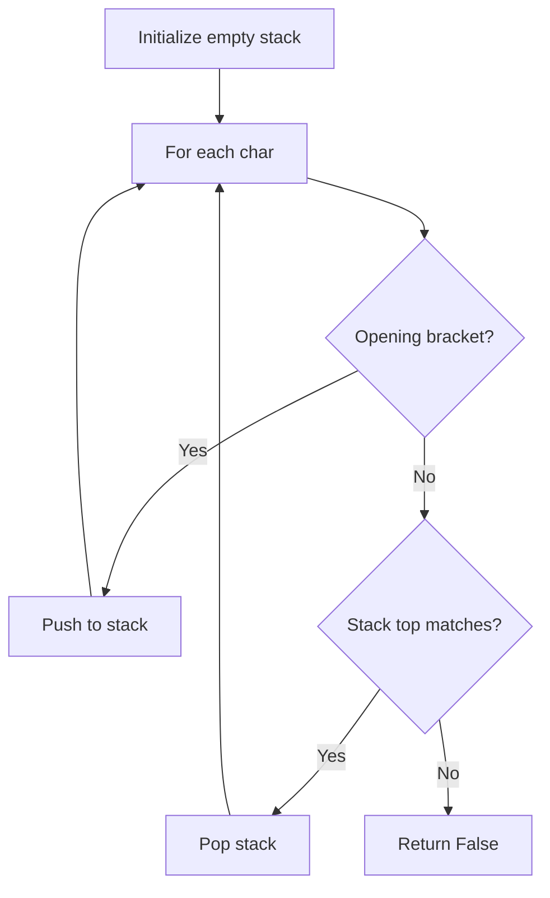

# Problem 20: Valid Parentheses

**Difficulty:** Easy  
**Tags:** String, Stack  
**Pattern:** Stack  
**Link:** [leetcode.com/problems/valid-parentheses](https://leetcode.com/problems/valid-parentheses/)

## Description

Given a string `s` containing just the characters `'('`, `')'`, `'{'`, `'}'`, `'['` and `']'`, determine if the input string is valid.

An input string is valid if:

	- Open brackets must be closed by the same type of brackets.
	- Open brackets must be closed in the correct order.
	- Every close bracket has a corresponding open bracket of the same type.

 

Example 1:

**Input:** s = "()"

**Output:** true

Example 2:

**Input:** s = "()[]{}"

**Output:** true

Example 3:

**Input:** s = "(]"

**Output:** false

Example 4:

**Input:** s = "([])"

**Output:** true

Example 5:

**Input:** s = "([)]"

**Output:** false

 

**Constraints:**

	- `1 <= s.length <= 10^4`
	- `s` consists of parentheses only `'()[]{}'`.

## Approach: Stack

Use a stack. Push opening brackets, pop on matching closing brackets. Invalid if mismatch or stack not empty at end.

## Pseudocode

```
1. For each char:
   If closing: check stack top matches, pop
   If opening: push
2. Return stack is empty
```

## Algorithm Flow



## Complexity Analysis

- **Time:** O(n)
- **Space:** O(n)

## Solution (Python3)

```python
class Solution:
    def isValid(self, s: str) -> bool:
        stack = []
        pairs = {')': '(', '}': '{', ']': '['}
        for ch in s:
            if ch in pairs:
                if not stack or stack[-1] != pairs[ch]:
                    return False
                stack.pop()
            else:
                stack.append(ch)
        return not stack
```

## Solution (C++)

```cpp
#include <stack>
#include <string>
#include <unordered_map>
#include <vector>
using namespace std;

class Solution {
public:
    bool isValid(string& s) {
        // Stack-based approach - O(n) time
        stack<char> st;
        unordered_map<char, char> pairs = {{'(', ')'}, {'[', ']'}, {'{', '}'}};
        for (char ch : s) {
            if (!st.empty() && pairs.count(st.top()) && pairs[st.top()] == ch) {
                st.pop();
            } else {
                st.push(ch);
            }
        }
        return st.empty();
    }
};
```
