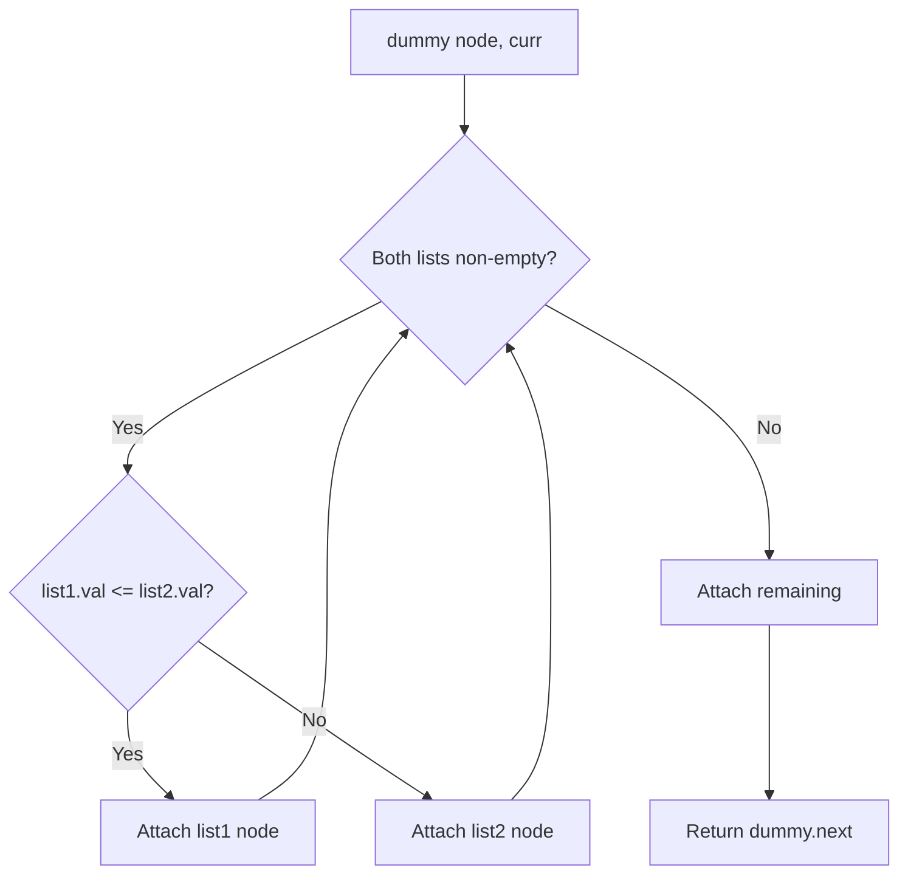
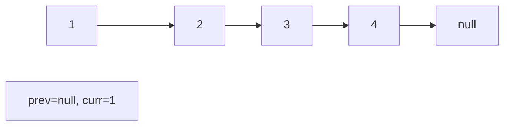
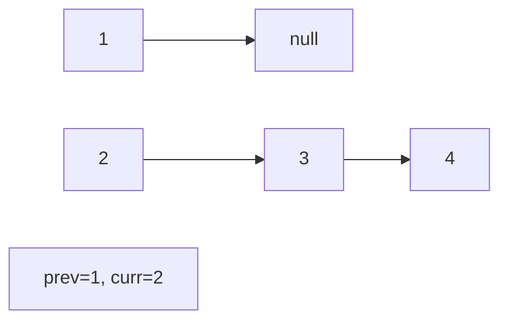
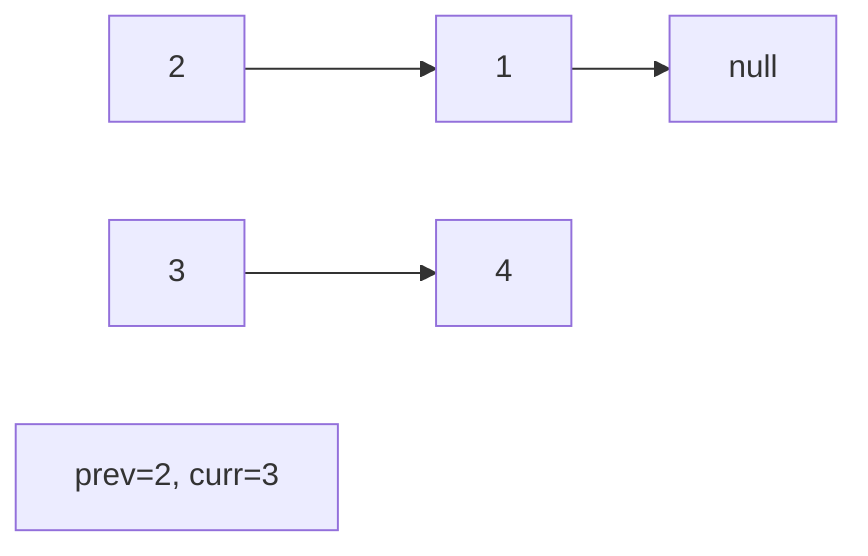
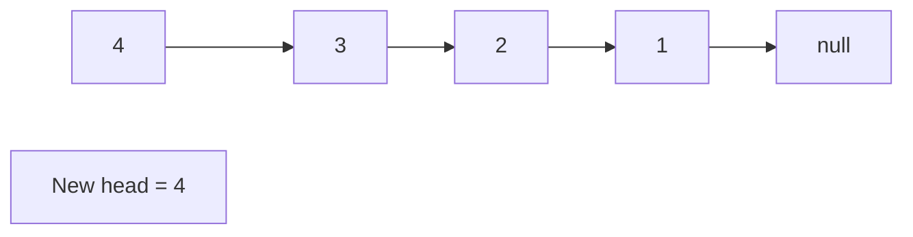

# Problem 21: Merge Two Sorted Lists

**Difficulty:** Easy  
**Tags:** Linked List, Recursion  
**Pattern:** Two Pointers / Merge  
**Link:** [leetcode.com/problems/merge-two-sorted-lists](https://leetcode.com/problems/merge-two-sorted-lists/)

## Description

You are given the heads of two sorted linked lists `list1` and `list2`.

Merge the two lists into one **sorted** list. The list should be made by splicing together the nodes of the first two lists.

Return *the head of the merged linked list*.

 

Example 1:

```

**Input:** list1 = [1,2,4], list2 = [1,3,4]
**Output:** [1,1,2,3,4,4]

```

Example 2:

```

**Input:** list1 = [], list2 = []
**Output:** []

```

Example 3:

```

**Input:** list1 = [], list2 = [0]
**Output:** [0]

```

 

**Constraints:**

	- The number of nodes in both lists is in the range `[0, 50]`.
	- `-100 <= Node.val <= 100`
	- Both `list1` and `list2` are sorted in **non-decreasing** order.

## Approach: Two Pointers / Merge

Compare heads of both lists, attach the smaller one. When one list is exhausted, attach the remainder.

## Pseudocode

```
1. dummy node, curr pointer
2. While both lists: attach smaller, advance
3. Attach remaining list
4. Return dummy.next
```

## Algorithm Flow



## Visual State Transitions

**Linked List Operation (Reverse):**

**Frame 1: Initial list**


**Frame 2: Reverse first link**


**Frame 3: Reverse second link**


**Frame 4: Fully reversed**



## Complexity Analysis

- **Time:** O(m+n)
- **Space:** O(1)

## Solution (Python3)

```python
class Solution:
    def mergeTwoLists(self, list1, list2):
        dummy = ListNode(0)
        curr = dummy
        while list1 and list2:
            if list1.val <= list2.val:
                curr.next = list1
                list1 = list1.next
            else:
                curr.next = list2
                list2 = list2.next
            curr = curr.next
        curr.next = list1 or list2
        return dummy.next
```

## Solution (C++)

```cpp
#include <string>
#include <vector>
using namespace std;

class Solution {
public:
    ListNode* mergeTwoLists(ListNode* list1, ListNode* list2) {
        // Linked list traversal/manipulation
        ListNode dummy(0);
        dummy.next = list1;
        ListNode* prev = &dummy;
        ListNode* curr = list1;
        while (curr) {
            ListNode* nxt = curr->next;
            // Process current node
            prev = curr;
            curr = nxt;
        }
        return dummy.next;
    }
};
```
