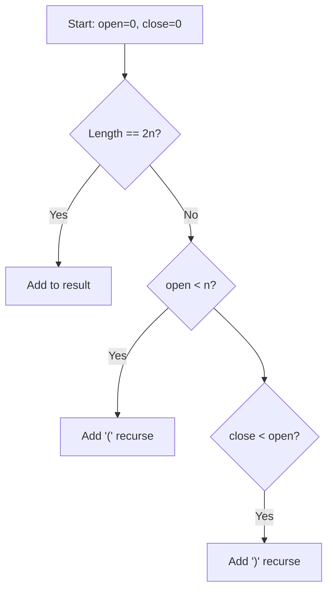
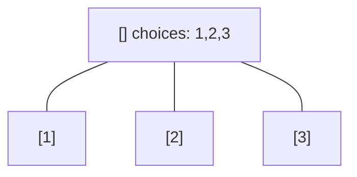
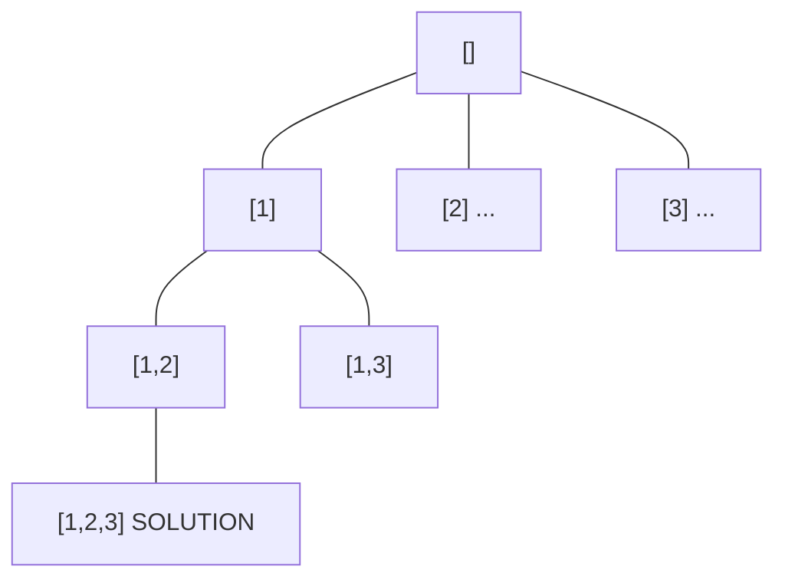
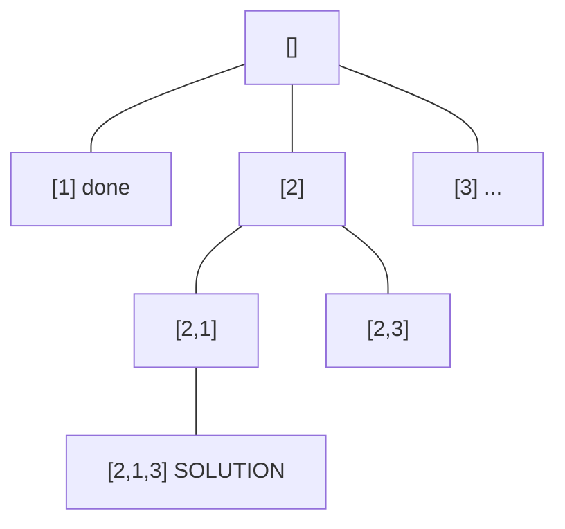
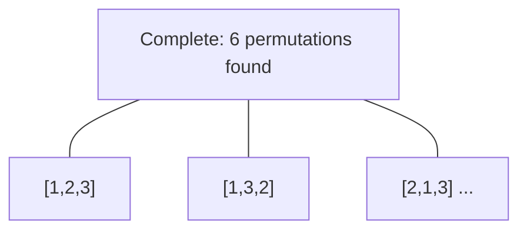

# Problem 22: Generate Parentheses

**Difficulty:** Medium  
**Tags:** String, Dynamic Programming, Backtracking  
**Pattern:** Backtracking  
**Link:** [leetcode.com/problems/generate-parentheses](https://leetcode.com/problems/generate-parentheses/)

## Description

Given `n` pairs of parentheses, write a function to *generate all combinations of well-formed parentheses*.

 

Example 1:

```
**Input:** n = 3
**Output:** ["((()))","(()())","(())()","()(())","()()()"]

```
Example 2:

```
**Input:** n = 1
**Output:** ["()"]

```

 

**Constraints:**

	- `1 <= n <= 8`

## Approach: Backtracking

Backtrack with two counters: open and close. Add '(' if open < n. Add ')' if close < open.

## Pseudocode

```
1. backtrack(path, open, close):
   If len==2n: add to result
   If open < n: try '('
   If close < open: try ')'
```

## Algorithm Flow



## Visual State Transitions

**Backtracking Decision Tree:**

**Frame 1: Root - start with empty path**


**Frame 2: Explore branch [1]**


**Frame 3: Backtrack, explore [2]**


**Frame 4: All solutions found**



## Complexity Analysis

- **Time:** O(4^n / sqrt(n))
- **Space:** O(n)

## Solution (Python3)

```python
class Solution:
    def generateParenthesis(self, n: int) -> list[str]:
        result = []
        def backtrack(path, open_count, close_count):
            if len(path) == 2 * n:
                result.append(''.join(path))
                return
            if open_count < n:
                path.append('(')
                backtrack(path, open_count + 1, close_count)
                path.pop()
            if close_count < open_count:
                path.append(')')
                backtrack(path, open_count, close_count + 1)
                path.pop()
        backtrack([], 0, 0)
        return result
```

## Solution (C++)

```cpp
#include <functional>
#include <string>
#include <vector>
using namespace std;

class Solution {
public:
    vector<string> generateParenthesis(int n) {
        // Backtracking - O(2^n) or O(n!) time
        vector<vector<int>> result;
        vector<int> path;
        function<void(int)> backtrack = [&](int start) {
            result.push_back(path);
            for (int i = start; i < (int)n.size(); i++) {
                path.push_back(n[i]);
                backtrack(i + 1);
                path.pop_back();
            }
        };
        backtrack(0);
        return result;
    }
};
```
