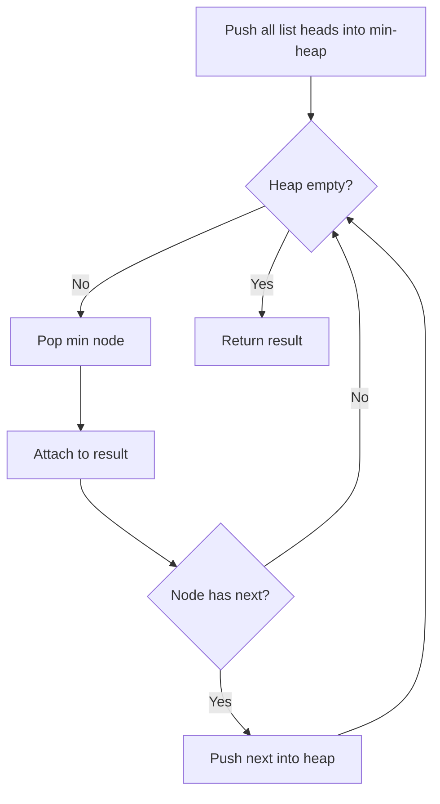

# Problem 23: Merge k Sorted Lists

**Difficulty:** Hard  
**Tags:** Linked List, Divide and Conquer, Heap (Priority Queue), Merge Sort  
**Pattern:** Heap / Priority Queue  
**Link:** [leetcode.com/problems/merge-k-sorted-lists](https://leetcode.com/problems/merge-k-sorted-lists/)

## Description

You are given an array of `k` linked-lists `lists`, each linked-list is sorted in ascending order.

*Merge all the linked-lists into one sorted linked-list and return it.*

 

Example 1:

```

**Input:** lists = [[1,4,5],[1,3,4],[2,6]]
**Output:** [1,1,2,3,4,4,5,6]
**Explanation:** The linked-lists are:
[
  1->4->5,
  1->3->4,
  2->6
]
merging them into one sorted linked list:
1->1->2->3->4->4->5->6

```

Example 2:

```

**Input:** lists = []
**Output:** []

```

Example 3:

```

**Input:** lists = [[]]
**Output:** []

```

 

**Constraints:**

	- `k == lists.length`
	- `0 <= k <= 10^4`
	- `0 <= lists[i].length <= 500`
	- `-10^4 <= lists[i][j] <= 10^4`
	- `lists[i]` is sorted in **ascending order**.
	- The sum of `lists[i].length` will not exceed `10^4`.

## Approach: Heap / Priority Queue

**Key Insight:** Use a min-heap of size k. Always extract the smallest head, advance that list, and push the next node.

N = total number of nodes across all lists.

## Pseudocode

```
1. Push head of each list into min-heap
2. While heap not empty:
   Pop smallest, attach to result
   If popped node has next, push it
3. Return dummy.next
```

## Algorithm Flow



## Complexity Analysis

- **Time:** O(N log k)
- **Space:** O(k)

## Solution (Python3)

```python
import heapq

class Solution:
    def mergeKLists(self, lists):
        heap = []
        for i, node in enumerate(lists):
            if node:
                heapq.heappush(heap, (node.val, i, node))
        dummy = ListNode(0)
        curr = dummy
        while heap:
            val, i, node = heapq.heappop(heap)
            curr.next = node
            curr = curr.next
            if node.next:
                heapq.heappush(heap, (node.next.val, i, node.next))
        return dummy.next
```

## Solution (C++)

```cpp
#include <functional>
#include <string>
#include <vector>
using namespace std;

class Solution {
public:
    ListNode* mergeKLists(vector<ListNode*>& lists) {
        // Merge sort - O(n log n)
        function<void(int, int)> mergeSort = [&](int l, int r) {
            if (l >= r) return;
            int mid = (l + r) / 2;
            mergeSort(l, mid);
            mergeSort(mid + 1, r);
            vector<int> temp;
            int i = l, j = mid + 1;
            while (i <= mid && j <= r) {
                if (lists[i] <= lists[j]) temp.push_back(lists[i++]);
                else temp.push_back(lists[j++]);
            }
            while (i <= mid) temp.push_back(lists[i++]);
            while (j <= r) temp.push_back(lists[j++]);
            for (int k = l; k <= r; k++) lists[k] = temp[k - l];
        };
        mergeSort(0, lists.size() - 1);
        return lists;
    }
};
```
