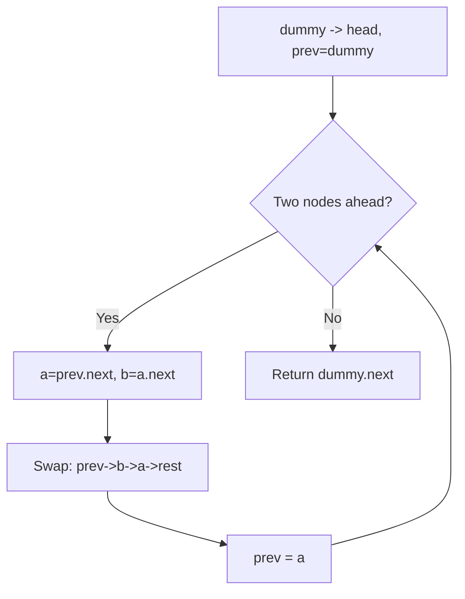
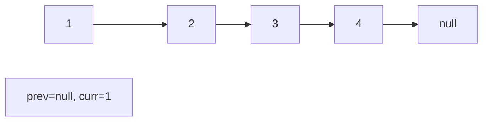
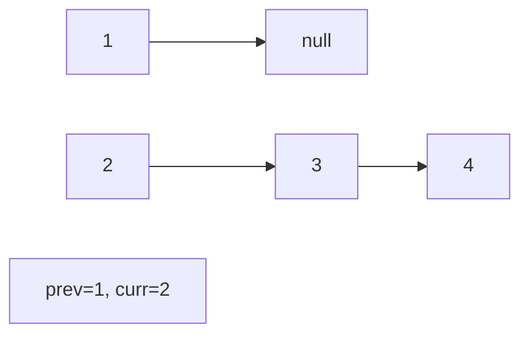
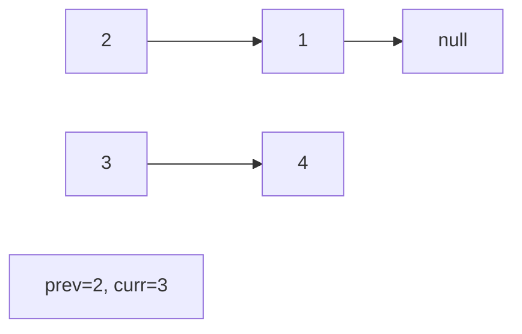
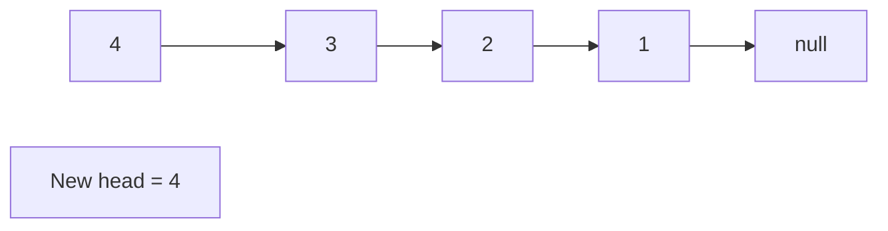

# Problem 24: Swap Nodes in Pairs

**Difficulty:** Medium  
**Tags:** Linked List, Recursion  
**Pattern:** Linked List  
**Link:** [leetcode.com/problems/swap-nodes-in-pairs](https://leetcode.com/problems/swap-nodes-in-pairs/)

## Description

Given a linked list, swap every two adjacent nodes and return its head. You must solve the problem without modifying the values in the list's nodes (i.e., only nodes themselves may be changed.)

 

Example 1:

**Input:** head = [1,2,3,4]

**Output:** [2,1,4,3]

**Explanation:**

Example 2:

**Input:** head = []

**Output:** []

Example 3:

**Input:** head = [1]

**Output:** [1]

Example 4:

**Input:** head = [1,2,3]

**Output:** [2,1,3]

 

**Constraints:**

	- The number of nodes in the list is in the range `[0, 100]`.
	- `0 <= Node.val <= 100`

## Approach: Linked List

Iteratively swap adjacent pairs using pointer manipulation. Use a dummy node to handle the head swap.

## Pseudocode

```
1. dummy -> head, prev = dummy
2. While two nodes ahead exist:
   a, b = prev.next, prev.next.next
   Rewire: prev->b->a->b.next
   prev = a
3. Return dummy.next
```

## Algorithm Flow



## Visual State Transitions

**Linked List Operation (Reverse):**

**Frame 1: Initial list**


**Frame 2: Reverse first link**


**Frame 3: Reverse second link**


**Frame 4: Fully reversed**



## Complexity Analysis

- **Time:** O(n)
- **Space:** O(1)

## Solution (Python3)

```python
class Solution:
    def swapPairs(self, head):
        dummy = ListNode(0, head)
        prev = dummy
        while prev.next and prev.next.next:
            a, b = prev.next, prev.next.next
            prev.next, a.next, b.next = b, b.next, a
            prev = a
        return dummy.next
```

## Solution (C++)

```cpp
#include <string>
#include <vector>
using namespace std;

class Solution {
public:
    ListNode* swapPairs(ListNode* head) {
        // Linked list traversal/manipulation
        ListNode dummy(0);
        dummy.next = head;
        ListNode* prev = &dummy;
        ListNode* curr = head;
        while (curr) {
            ListNode* nxt = curr->next;
            // Process current node
            prev = curr;
            curr = nxt;
        }
        return dummy.next;
    }
};
```
