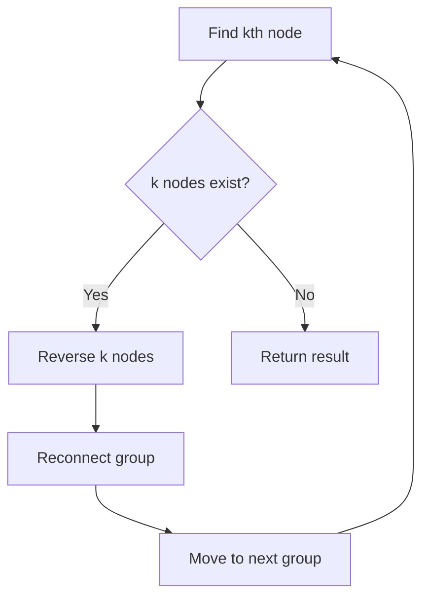
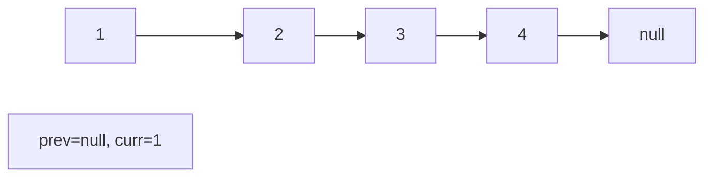
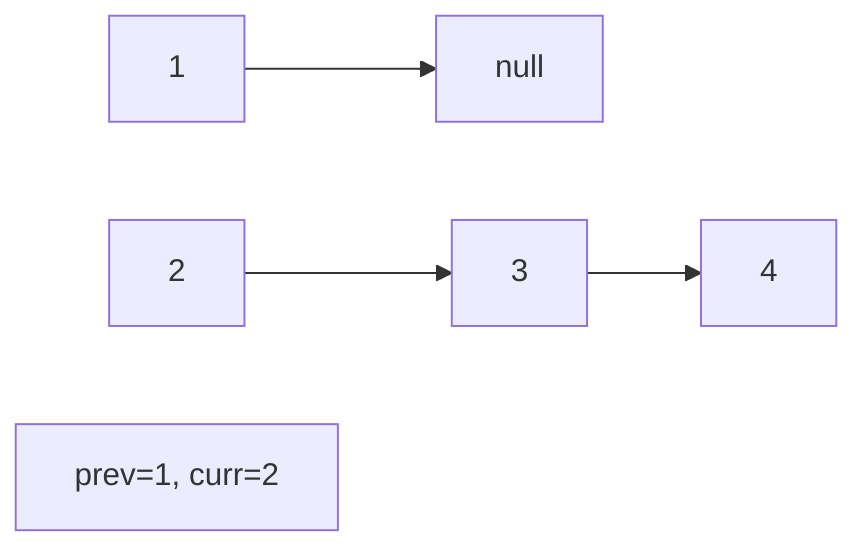
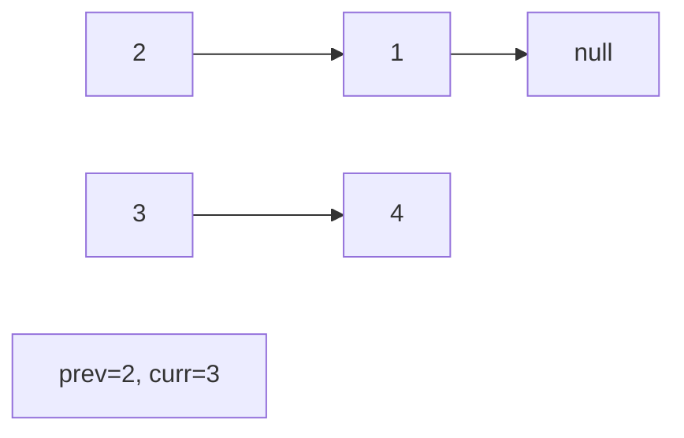
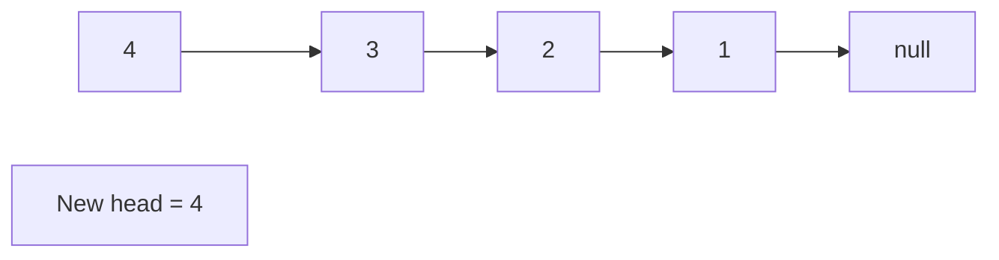

# Problem 25: Reverse Nodes in k-Group

**Difficulty:** Hard  
**Tags:** Linked List, Recursion  
**Pattern:** Linked List  
**Link:** [leetcode.com/problems/reverse-nodes-in-k-group](https://leetcode.com/problems/reverse-nodes-in-k-group/)

## Description

Given the `head` of a linked list, reverse the nodes of the list `k` at a time, and return *the modified list*.

`k` is a positive integer and is less than or equal to the length of the linked list. If the number of nodes is not a multiple of `k` then left-out nodes, in the end, should remain as it is.

You may not alter the values in the list's nodes, only nodes themselves may be changed.

 

Example 1:

```

**Input:** head = [1,2,3,4,5], k = 2
**Output:** [2,1,4,3,5]

```

Example 2:

```

**Input:** head = [1,2,3,4,5], k = 3
**Output:** [3,2,1,4,5]

```

 

**Constraints:**

	- The number of nodes in the list is `n`.
	- `1 <= k <= n <= 5000`
	- `0 <= Node.val <= 1000`

 

**Follow-up:** Can you solve the problem in `O(1)` extra memory space?

## Approach: Linked List

Find the kth node, reverse that segment, reconnect. Repeat until fewer than k nodes remain.

## Pseudocode

```
1. For each group of k nodes:
   Find kth node (if < k remain, stop)
   Reverse k nodes
   Reconnect with previous group
   Move to next group
```

## Algorithm Flow



## Visual State Transitions

**Linked List Operation (Reverse):**

**Frame 1: Initial list**


**Frame 2: Reverse first link**


**Frame 3: Reverse second link**


**Frame 4: Fully reversed**



## Complexity Analysis

- **Time:** O(n)
- **Space:** O(1)

## Solution (Python3)

```python
class Solution:
    def reverseKGroup(self, head, k):
        def reverse(head, k):
            prev, curr = None, head
            for _ in range(k):
                nxt = curr.next
                curr.next = prev
                prev = curr
                curr = nxt
            return prev

        dummy = ListNode(0, head)
        prev_group = dummy
        while True:
            kth = prev_group
            for _ in range(k):
                kth = kth.next
                if not kth:
                    return dummy.next
            next_group = kth.next
            new_head = reverse(prev_group.next, k)
            tail = prev_group.next
            tail.next = next_group
            prev_group.next = new_head
            prev_group = tail
        return dummy.next
```

## Solution (C++)

```cpp
#include <string>
#include <vector>
using namespace std;

class Solution {
public:
    ListNode* reverseKGroup(ListNode* head, int k) {
        // Linked list traversal/manipulation
        ListNode dummy(0);
        dummy.next = head;
        ListNode* prev = &dummy;
        ListNode* curr = head;
        while (curr) {
            ListNode* nxt = curr->next;
            // Process current node
            prev = curr;
            curr = nxt;
        }
        return dummy.next;
    }
};
```
