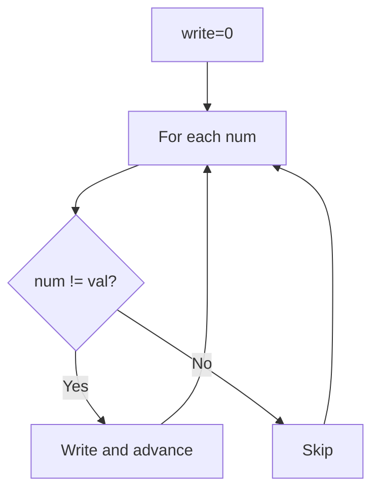
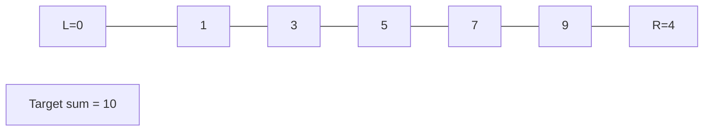
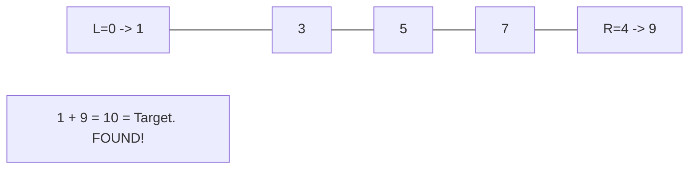

# Problem 27: Remove Element

**Difficulty:** Easy  
**Tags:** Array, Two Pointers  
**Pattern:** Two Pointers  
**Link:** [leetcode.com/problems/remove-element](https://leetcode.com/problems/remove-element/)

## Description

Given an integer array `nums` and an integer `val`, remove all occurrences of `val` in `nums` **in-place**. The order of the elements may be changed. Then return *the number of elements in *`nums`* which are not equal to *`val`.

Consider the number of elements in `nums` which are not equal to `val` be `k`, to get accepted, you need to do the following things:

	- Change the array `nums` such that the first `k` elements of `nums` contain the elements which are not equal to `val`. The remaining elements of `nums` are not important as well as the size of `nums`.
	- Return `k`.

**Custom Judge:**

The judge will test your solution with the following code:

```

int[] nums = [...]; // Input array
int val = ...; // Value to remove
int[] expectedNums = [...]; // The expected answer with correct length.
                            // It is sorted with no values equaling val.

int k = removeElement(nums, val); // Calls your implementation

assert k == expectedNums.length;
sort(nums, 0, k); // Sort the first k elements of nums
for (int i = 0; i < actualLength; i++) {
    assert nums[i] == expectedNums[i];
}

```

If all assertions pass, then your solution will be **accepted**.

 

Example 1:

```

**Input:** nums = [3,2,2,3], val = 3
**Output:** 2, nums = [2,2,_,_]
**Explanation:** Your function should return k = 2, with the first two elements of nums being 2.
It does not matter what you leave beyond the returned k (hence they are underscores).

```

Example 2:

```

**Input:** nums = [0,1,2,2,3,0,4,2], val = 2
**Output:** 5, nums = [0,1,4,0,3,_,_,_]
**Explanation:** Your function should return k = 5, with the first five elements of nums containing 0, 0, 1, 3, and 4.
Note that the five elements can be returned in any order.
It does not matter what you leave beyond the returned k (hence they are underscores).

```

 

**Constraints:**

	- `0 <= nums.length <= 100`
	- `0 <= nums[i] <= 50`
	- `0 <= val <= 100`

## Approach: Two Pointers

Write pointer overwrites values != val in place.

## Pseudocode

```
1. write = 0
2. For each num: if num != val: nums[write] = num, write++
3. Return write
```

## Algorithm Flow



## Visual State Transitions

**Two Pointer Convergence:**

**Frame 1: Initialize pointers**


**Frame 2: Sum = 1+9 = 10, found!**



## Complexity Analysis

- **Time:** O(n)
- **Space:** O(1)

## Solution (Python3)

```python
class Solution:
    def removeElement(self, nums: list[int], val: int) -> int:
        write = 0
        for num in nums:
            if num != val:
                nums[write] = num
                write += 1
        return write
```

## Solution (C++)

```cpp
#include <string>
#include <vector>
using namespace std;

class Solution {
public:
    int removeElement(vector<int>& nums, int val) {
        // Two pointer approach - O(n) time, O(1) space
        int left = 0, right = nums.size() - 1;
        while (left < right) {
            int curr = nums[left] + nums[right];
            if (curr == val) {
                return {left, right};
            } else if (curr < val) {
                left++;
            } else {
                right--;
            }
        }
        return 0;
    }
};
```
