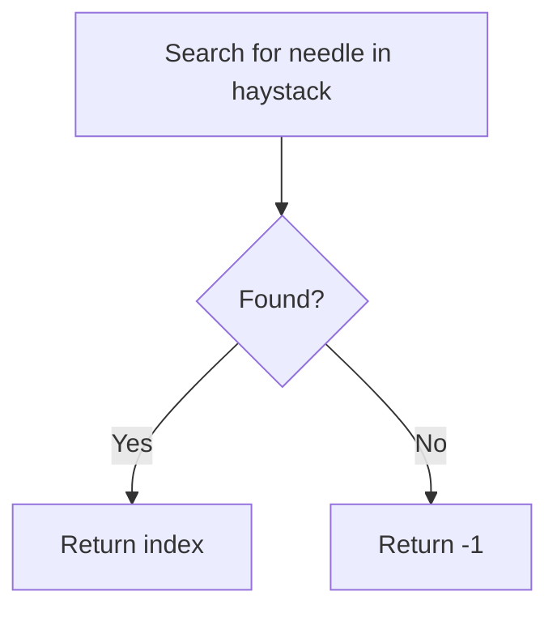
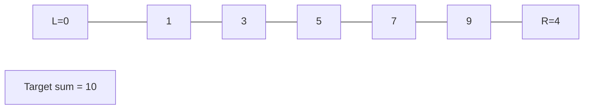
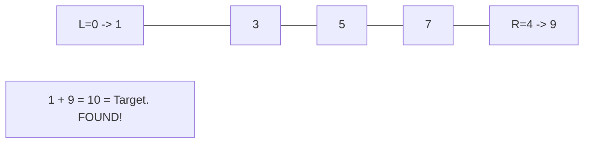

# Problem 28: Find the Index of the First Occurrence in a String

**Difficulty:** Easy  
**Tags:** Two Pointers, String, String Matching  
**Pattern:** String Matching  
**Link:** [leetcode.com/problems/find-the-index-of-the-first-occurrence-in-a-string](https://leetcode.com/problems/find-the-index-of-the-first-occurrence-in-a-string/)

## Description

Given two strings `needle` and `haystack`, return the index of the first occurrence of `needle` in `haystack`, or `-1` if `needle` is not part of `haystack`.

 

Example 1:

```

**Input:** haystack = "sadbutsad", needle = "sad"
**Output:** 0
**Explanation:** "sad" occurs at index 0 and 6.
The first occurrence is at index 0, so we return 0.

```

Example 2:

```

**Input:** haystack = "leetcode", needle = "leeto"
**Output:** -1
**Explanation:** "leeto" did not occur in "leetcode", so we return -1.

```

 

**Constraints:**

	- `1 <= haystack.length, needle.length <= 10^4`
	- `haystack` and `needle` consist of only lowercase English characters.

## Approach: String Matching

Use built-in string find or implement KMP. The simplest approach uses the built-in method.

## Pseudocode

```
1. Return haystack.find(needle)
```

## Algorithm Flow



## Visual State Transitions

**Two Pointer Convergence:**

**Frame 1: Initialize pointers**


**Frame 2: Sum = 1+9 = 10, found!**



## Complexity Analysis

- **Time:** O(m*n)
- **Space:** O(1)

## Solution (Python3)

```python
class Solution:
    def strStr(self, haystack: str, needle: str) -> int:
        return haystack.find(needle)
```

## Solution (C++)

```cpp
#include <string>
#include <vector>
using namespace std;

class Solution {
public:
    int strStr(string& haystack, string& needle) {
        // Two pointer approach - O(n) time, O(1) space
        int left = 0, right = haystack.size() - 1;
        while (left < right) {
            int curr = haystack[left] + haystack[right];
            if (curr == needle) {
                return {left, right};
            } else if (curr < needle) {
                left++;
            } else {
                right--;
            }
        }
        return 0;
    }
};
```
