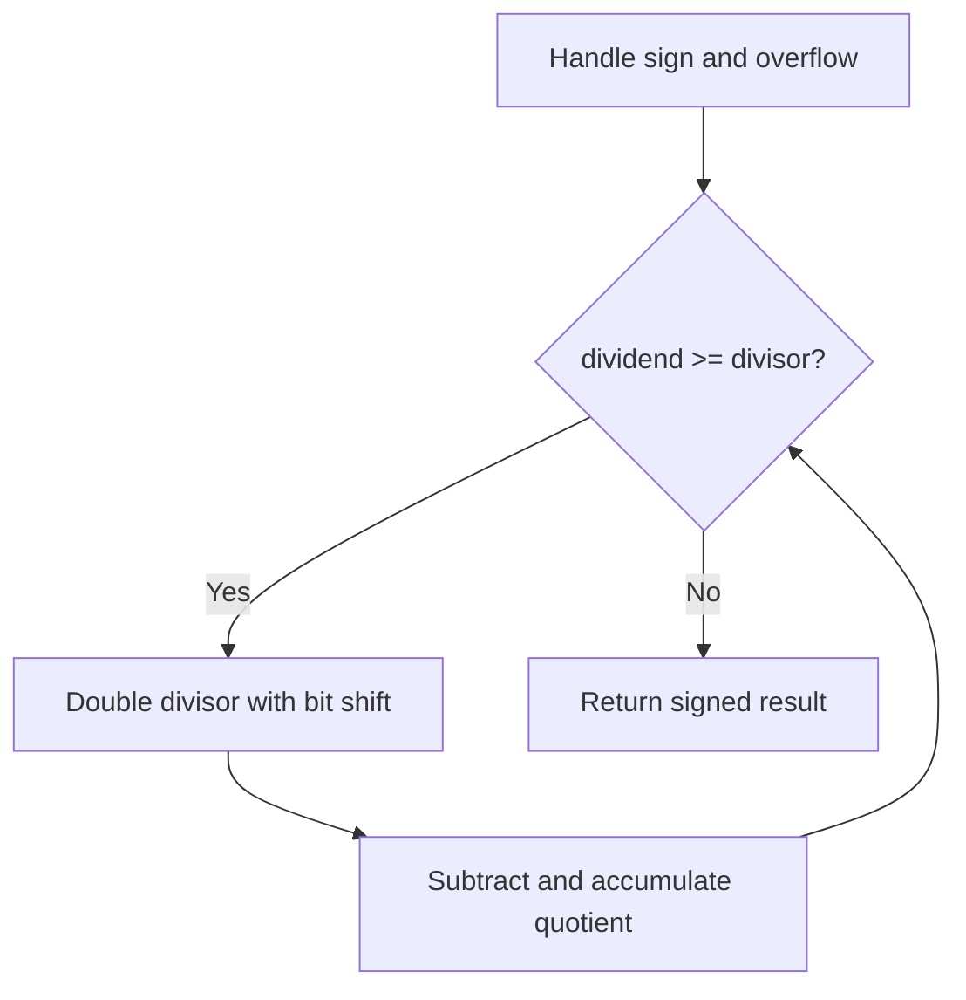

# Problem 29: Divide Two Integers

**Difficulty:** Medium  
**Tags:** Math, Bit Manipulation  
**Pattern:** Bit Manipulation / Math  
**Link:** [leetcode.com/problems/divide-two-integers](https://leetcode.com/problems/divide-two-integers/)

## Description

Given two integers `dividend` and `divisor`, divide two integers **without** using multiplication, division, and mod operator.

The integer division should truncate toward zero, which means losing its fractional part. For example, `8.345` would be truncated to `8`, and `-2.7335` would be truncated to `-2`.

Return *the **quotient** after dividing *`dividend`* by *`divisor`.

**Note: **Assume we are dealing with an environment that could only store integers within the **32-bit** signed integer range: `[−2^31, 2^31 − 1]`. For this problem, if the quotient is **strictly greater than** `2^31 - 1`, then return `2^31 - 1`, and if the quotient is **strictly less than** `-2^31`, then return `-2^31`.

 

Example 1:

```

**Input:** dividend = 10, divisor = 3
**Output:** 3
**Explanation:** 10/3 = 3.33333.. which is truncated to 3.

```

Example 2:

```

**Input:** dividend = 7, divisor = -3
**Output:** -2
**Explanation:** 7/-3 = -2.33333.. which is truncated to -2.

```

 

**Constraints:**

	- `-2^31 <= dividend, divisor <= 2^31 - 1`
	- `divisor != 0`

## Approach: Bit Manipulation / Math

Use bit shifting to double the divisor until it exceeds the dividend. Subtract and accumulate the quotient.

## Pseudocode

```
1. Handle overflow edge case
2. Work with absolute values
3. Repeatedly double divisor, subtract, accumulate
4. Restore sign
```

## Algorithm Flow



## Complexity Analysis

- **Time:** O(log^2 n)
- **Space:** O(1)

## Solution (Python3)

```python
class Solution:
    def divide(self, dividend: int, divisor: int) -> int:
        if dividend == -2**31 and divisor == -1:
            return 2**31 - 1
        sign = -1 if (dividend < 0) ^ (divisor < 0) else 1
        a, b = abs(dividend), abs(divisor)
        result = 0
        while a >= b:
            temp, multiple = b, 1
            while a >= temp << 1:
                temp <<= 1
                multiple <<= 1
            a -= temp
            result += multiple
        return sign * result
```

## Solution (C++)

```cpp
#include <string>
#include <vector>
using namespace std;

class Solution {
public:
    int divide(int dividend, int divisor) {
        // Bit manipulation - O(n) time, O(1) space
        int result = 0;
        for (int val : dividend) {
            result ^= val;
        }
        return result;
    }
};
```
