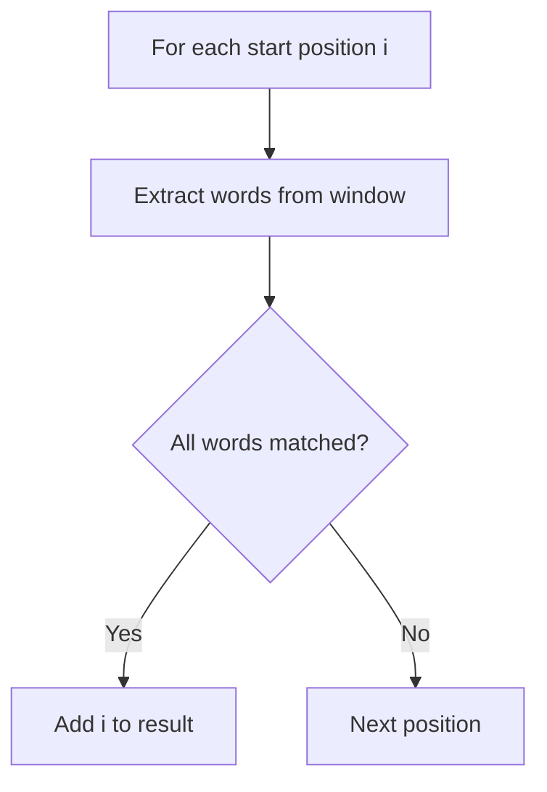
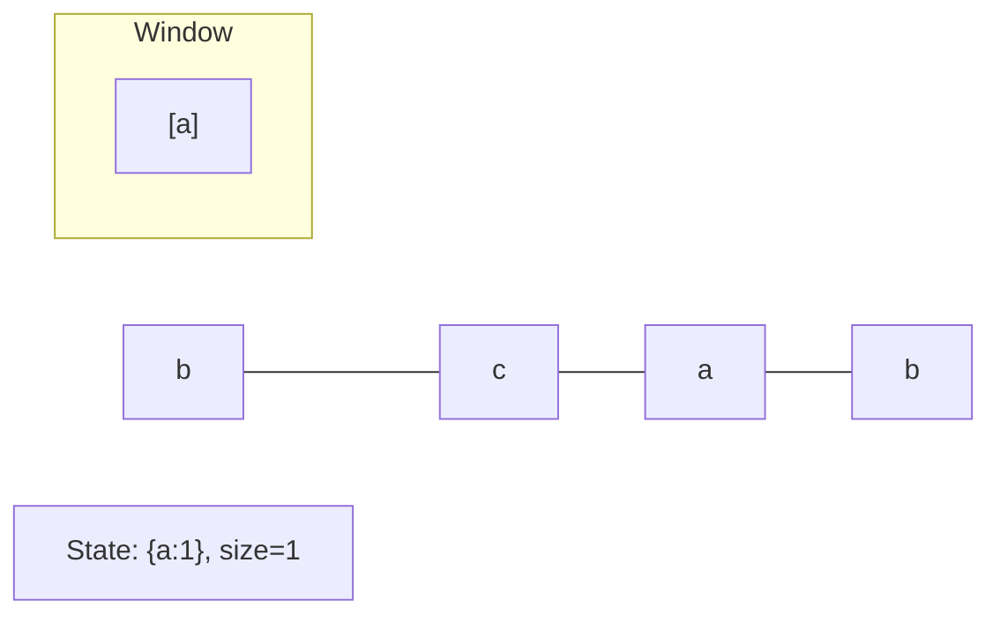
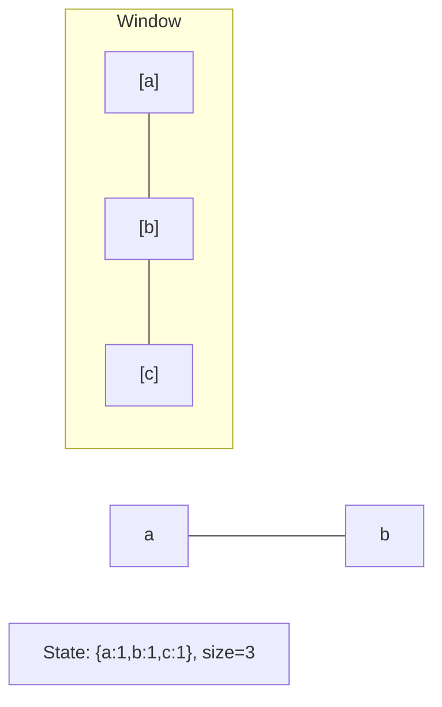
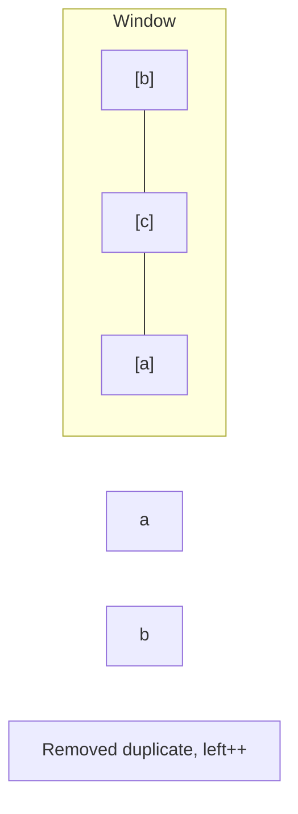
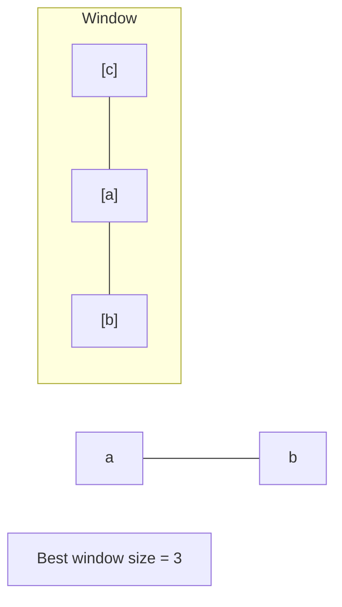

# Problem 30: Substring with Concatenation of All Words

**Difficulty:** Hard  
**Tags:** Hash Table, String, Sliding Window  
**Pattern:** Sliding Window / Hash Map  
**Link:** [leetcode.com/problems/substring-with-concatenation-of-all-words](https://leetcode.com/problems/substring-with-concatenation-of-all-words/)

## Description

You are given a string `s` and an array of strings `words`. All the strings of `words` are of **the same length**.

A **concatenated string** is a string that exactly contains all the strings of any permutation of `words` concatenated.

	- For example, if `words = ["ab","cd","ef"]`, then `"abcdef"`, `"abefcd"`, `"cdabef"`, `"cdefab"`, `"efabcd"`, and `"efcdab"` are all concatenated strings. `"acdbef"` is not a concatenated string because it is not the concatenation of any permutation of `words`.

Return an array of *the starting indices* of all the concatenated substrings in `s`. You can return the answer in **any order**.

 

Example 1:

**Input:** s = "barfoothefoobarman", words = ["foo","bar"]

**Output:** [0,9]

**Explanation:**

The substring starting at 0 is `"barfoo"`. It is the concatenation of `["bar","foo"]` which is a permutation of `words`.

The substring starting at 9 is `"foobar"`. It is the concatenation of `["foo","bar"]` which is a permutation of `words`.

Example 2:

**Input:** s = "wordgoodgoodgoodbestword", words = ["word","good","best","word"]

**Output:** []

**Explanation:**

There is no concatenated substring.

Example 3:

**Input:** s = "barfoofoobarthefoobarman", words = ["bar","foo","the"]

**Output:** [6,9,12]

**Explanation:**

The substring starting at 6 is `"foobarthe"`. It is the concatenation of `["foo","bar","the"]`.

The substring starting at 9 is `"barthefoo"`. It is the concatenation of `["bar","the","foo"]`.

The substring starting at 12 is `"thefoobar"`. It is the concatenation of `["the","foo","bar"]`.

 

**Constraints:**

	- `1 <= s.length <= 10^4`
	- `1 <= words.length <= 5000`
	- `1 <= words[i].length <= 30`
	- `s` and `words[i]` consist of lowercase English letters.

## Approach: Sliding Window / Hash Map

Check every starting position. For each, try to match all words using a counter map.

## Pseudocode

```
1. For each start position i:
   Count words in window
   Compare with target word counts
   If all match: add i to result
```

## Algorithm Flow



## Visual State Transitions

**Sliding Window Step-by-Step:**

**Frame 1: Initial window (left=0, right=0)**


**Frame 2: Expand right (right=2)**


**Frame 3: Violation - shrink left**


**Frame 4: Continue expanding**



## Complexity Analysis

- **Time:** O(n * m * w) where n=len(s), m=num words, w=word len
- **Space:** O(m)

## Solution (Python3)

```python
from collections import Counter

class Solution:
    def findSubstring(self, s, words):
        if not s or not words:
            return []
        word_len = len(words[0])
        total_len = word_len * len(words)
        word_count = Counter(words)
        result = []
        for i in range(len(s) - total_len + 1):
            seen = Counter()
            j = 0
            while j < len(words):
                word = s[i + j * word_len: i + (j + 1) * word_len]
                if word in word_count:
                    seen[word] += 1
                    if seen[word] > word_count[word]:
                        break
                else:
                    break
                j += 1
            if j == len(words):
                result.append(i)
        return result
```

## Solution (C++)

```cpp
#include <algorithm>
#include <string>
#include <unordered_map>
#include <vector>
using namespace std;

class Solution {
public:
    vector<int> findSubstring(string& s, vector<string>& words) {
        // Sliding window approach - O(n) time, O(k) space
        unordered_map<char, int> window;
        int left = 0, result = 0;
        for (int right = 0; right < s.size(); right++) {
            window[s[right]]++;
            while ((int)window.size() > words) {
                window[s[left]]--;
                if (window[s[left]] == 0)
                    window.erase(s[left]);
                left++;
            }
            result = max(result, right - left + 1);
        }
        return result;
    }
};
```
