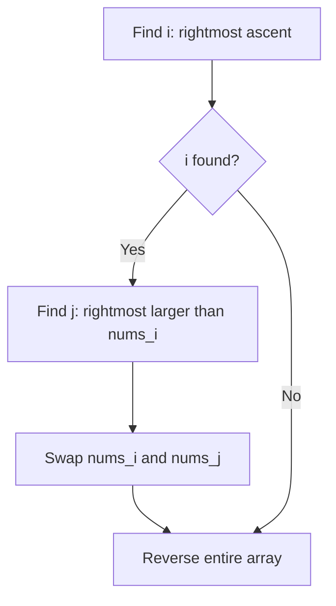
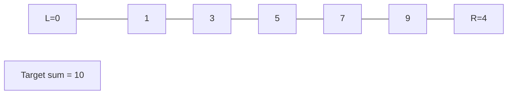
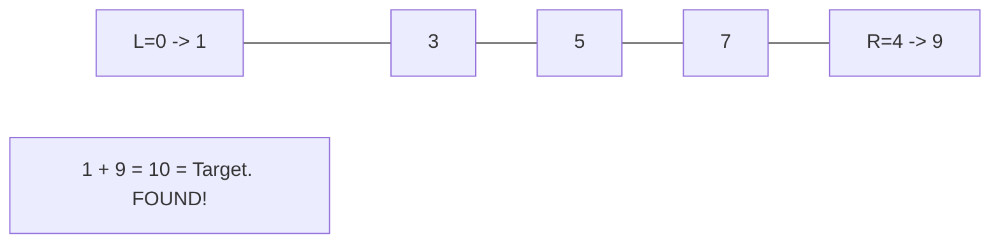

# Problem 31: Next Permutation

**Difficulty:** Medium  
**Tags:** Array, Two Pointers  
**Pattern:** Array Manipulation  
**Link:** [leetcode.com/problems/next-permutation](https://leetcode.com/problems/next-permutation/)

## Description

A **permutation** of an array of integers is an arrangement of its members into a sequence or linear order.

	- For example, for `arr = [1,2,3]`, the following are all the permutations of `arr`: `[1,2,3], [1,3,2], [2, 1, 3], [2, 3, 1], [3,1,2], [3,2,1]`.

The **next permutation** of an array of integers is the next lexicographically greater permutation of its integer. More formally, if all the permutations of the array are sorted in one container according to their lexicographical order, then the **next permutation** of that array is the permutation that follows it in the sorted container. If such arrangement is not possible, the array must be rearranged as the lowest possible order (i.e., sorted in ascending order).

	- For example, the next permutation of `arr = [1,2,3]` is `[1,3,2]`.
	- Similarly, the next permutation of `arr = [2,3,1]` is `[3,1,2]`.
	- While the next permutation of `arr = [3,2,1]` is `[1,2,3]` because `[3,2,1]` does not have a lexicographical larger rearrangement.

Given an array of integers `nums`, *find the next permutation of* `nums`.

The replacement must be **in place** and use only constant extra memory.

 

Example 1:

```

**Input:** nums = [1,2,3]
**Output:** [1,3,2]

```

Example 2:

```

**Input:** nums = [3,2,1]
**Output:** [1,2,3]

```

Example 3:

```

**Input:** nums = [1,1,5]
**Output:** [1,5,1]

```

 

**Constraints:**

	- `1 <= nums.length <= 100`
	- `0 <= nums[i] <= 100`

## Approach: Array Manipulation

1. Find rightmost element smaller than its successor (i). 2. Find rightmost element larger than nums[i] (j). 3. Swap i,j. 4. Reverse suffix after i.

## Pseudocode

```
1. Find i where nums[i] < nums[i+1] from right
2. Find j > i where nums[j] > nums[i] from right
3. Swap nums[i], nums[j]
4. Reverse nums[i+1:]
```

## Algorithm Flow



## Visual State Transitions

**Two Pointer Convergence:**

**Frame 1: Initialize pointers**


**Frame 2: Sum = 1+9 = 10, found!**



## Complexity Analysis

- **Time:** O(n)
- **Space:** O(1)

## Solution (Python3)

```python
class Solution:
    def nextPermutation(self, nums: list[int]) -> None:
        n = len(nums)
        i = n - 2
        while i >= 0 and nums[i] >= nums[i + 1]:
            i -= 1
        if i >= 0:
            j = n - 1
            while nums[j] <= nums[i]:
                j -= 1
            nums[i], nums[j] = nums[j], nums[i]
        nums[i + 1:] = reversed(nums[i + 1:])
```

## Solution (C++)

```cpp
#include <string>
#include <vector>
using namespace std;

class Solution {
public:
    void nextPermutation(vector<int>& nums) {
        // Two pointer approach - O(n) time, O(1) space
        int left = 0, right = nums.size() - 1;
        while (left < right) {
            int curr = nums[left] + nums[right];
            if (curr == nums) {
                return {left, right};
            } else if (curr < nums) {
                left++;
            } else {
                right--;
            }
        }
        return ;
    }
};
```
