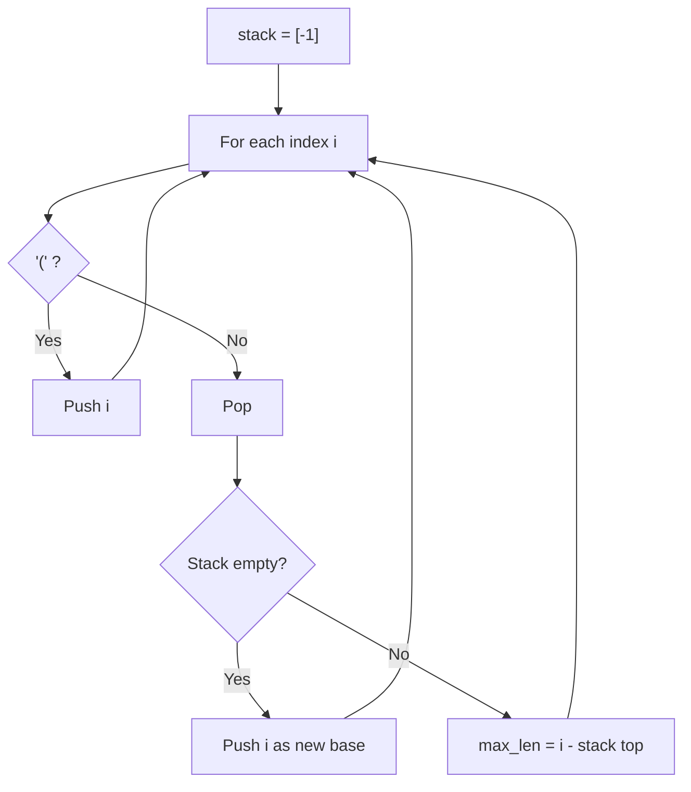

# Problem 32: Longest Valid Parentheses

**Difficulty:** Hard  
**Tags:** String, Dynamic Programming, Stack  
**Pattern:** Stack  
**Link:** [leetcode.com/problems/longest-valid-parentheses](https://leetcode.com/problems/longest-valid-parentheses/)

## Description

Given a string containing just the characters `'('` and `')'`, return *the length of the longest valid (well-formed) parentheses **substring*.

 

Example 1:

```

**Input:** s = "(()"
**Output:** 2
**Explanation:** The longest valid parentheses substring is "()".

```

Example 2:

```

**Input:** s = ")()())"
**Output:** 4
**Explanation:** The longest valid parentheses substring is "()()".

```

Example 3:

```

**Input:** s = ""
**Output:** 0

```

 

**Constraints:**

	- `0 <= s.length <= 3 * 10^4`
	- `s[i]` is `'('`, or `')'`.

## Approach: Stack

**Key Insight:** Stack stores indices. Push -1 as base. For ')', pop and compute length from new stack top.

If stack becomes empty after pop, push current index as new base.

## Pseudocode

```
1. stack = [-1]
2. For each i, ch:
   '(': push i
   ')': pop, if empty push i, else update max_len = i - stack[-1]
3. Return max_len
```

## Algorithm Flow



## Complexity Analysis

- **Time:** O(n)
- **Space:** O(n)

## Solution (Python3)

```python
class Solution:
    def longestValidParentheses(self, s: str) -> int:
        stack = [-1]
        max_len = 0
        for i, ch in enumerate(s):
            if ch == '(':
                stack.append(i)
            else:
                stack.pop()
                if not stack:
                    stack.append(i)
                else:
                    max_len = max(max_len, i - stack[-1])
        return max_len
```

## Solution (C++)

```cpp
#include <algorithm>
#include <string>
#include <vector>
using namespace std;

class Solution {
public:
    int longestValidParentheses(string& s) {
        // String DP - O(m*n) time and space
        int m = s.size(), n = s.size();
        vector<vector<int>> dp(m + 1, vector<int>(n + 1, 0));
        for (int i = 1; i <= m; i++) {
            for (int j = 1; j <= n; j++) {
                if (s[i-1] == s[j-1])
                    dp[i][j] = dp[i-1][j-1] + 1;
                else
                    dp[i][j] = max(dp[i-1][j], dp[i][j-1]);
            }
        }
        return dp[m][n];
    }
};
```
