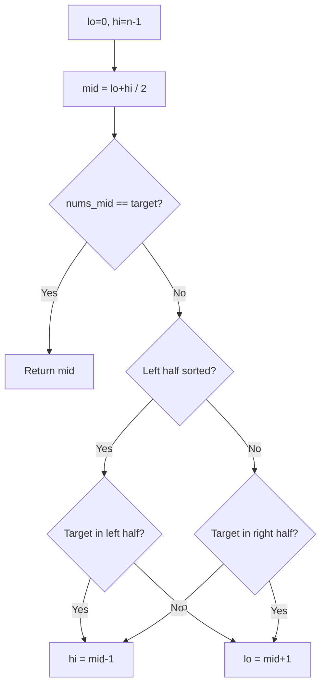
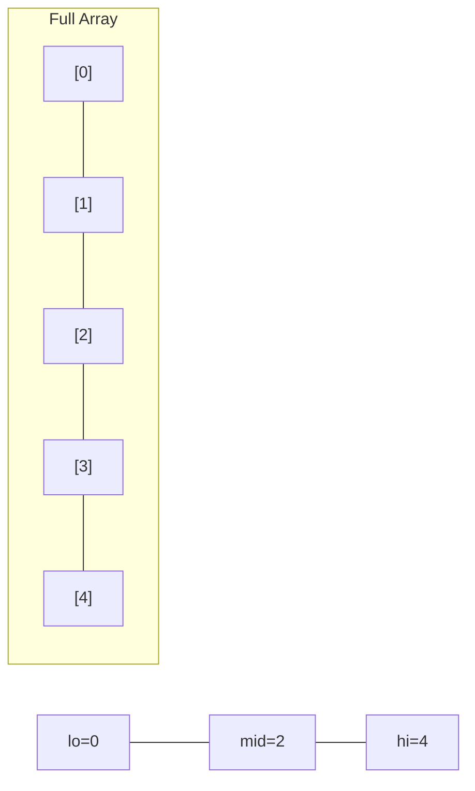
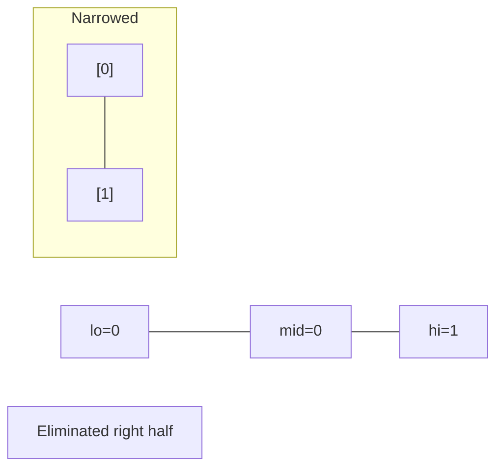
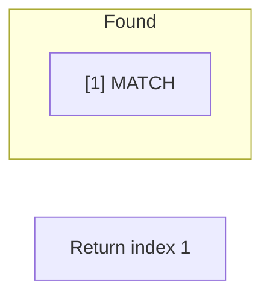

# Problem 33: Search in Rotated Sorted Array

**Difficulty:** Medium  
**Tags:** Array, Binary Search  
**Pattern:** Binary Search  
**Link:** [leetcode.com/problems/search-in-rotated-sorted-array](https://leetcode.com/problems/search-in-rotated-sorted-array/)

## Description

There is an integer array `nums` sorted in ascending order (with **distinct** values).

Prior to being passed to your function, `nums` is **possibly left rotated** at an unknown index `k` (`1 <= k < nums.length`) such that the resulting array is `[nums[k], nums[k+1], ..., nums[n-1], nums[0], nums[1], ..., nums[k-1]]` (**0-indexed**). For example, `[0,1,2,4,5,6,7]` might be left rotated by `3` indices and become `[4,5,6,7,0,1,2]`.

Given the array `nums` **after** the possible rotation and an integer `target`, return *the index of *`target`* if it is in *`nums`*, or *`-1`* if it is not in *`nums`.

You must write an algorithm with `O(log n)` runtime complexity.

 

Example 1:

```
**Input:** nums = [4,5,6,7,0,1,2], target = 0
**Output:** 4

```
Example 2:

```
**Input:** nums = [4,5,6,7,0,1,2], target = 3
**Output:** -1

```
Example 3:

```
**Input:** nums = [1], target = 0
**Output:** -1

```

 

**Constraints:**

	- `1 <= nums.length <= 5000`
	- `-10^4 <= nums[i] <= 10^4`
	- All values of `nums` are **unique**.
	- `nums` is an ascending array that is possibly rotated.
	- `-10^4 <= target <= 10^4`

## Approach: Binary Search

**Key Insight:** One half is always sorted. Determine which half is sorted, then check if target lies within that half.

## Pseudocode

```
1. lo=0, hi=n-1
2. mid = (lo+hi)//2
3. If left half sorted: check if target in left half
4. Else right half sorted: check if target in right half
5. Adjust lo/hi accordingly
```

## Algorithm Flow



## Visual State Transitions

**Binary Search Step-by-Step:**

**Frame 1: Initial search space**


**Frame 2: Compare mid, narrow search**


**Frame 3: Found target**



## Complexity Analysis

- **Time:** O(log n)
- **Space:** O(1)

## Solution (Python3)

```python
class Solution:
    def search(self, nums: list[int], target: int) -> int:
        lo, hi = 0, len(nums) - 1
        while lo <= hi:
            mid = (lo + hi) // 2
            if nums[mid] == target:
                return mid
            if nums[lo] <= nums[mid]:
                if nums[lo] <= target < nums[mid]:
                    hi = mid - 1
                else:
                    lo = mid + 1
            else:
                if nums[mid] < target <= nums[hi]:
                    lo = mid + 1
                else:
                    hi = mid - 1
        return -1
```

## Solution (C++)

```cpp
#include <string>
#include <vector>
using namespace std;

class Solution {
public:
    int search(vector<int>& nums, int target) {
        // Binary search - O(log n) time, O(1) space
        int lo = 0, hi = nums.size() - 1;
        while (lo <= hi) {
            int mid = lo + (hi - lo) / 2;
            if (nums[mid] == target) {
                return mid;
            } else if (nums[mid] < target) {
                lo = mid + 1;
            } else {
                hi = mid - 1;
            }
        }
        return 0;
    }
};
```
