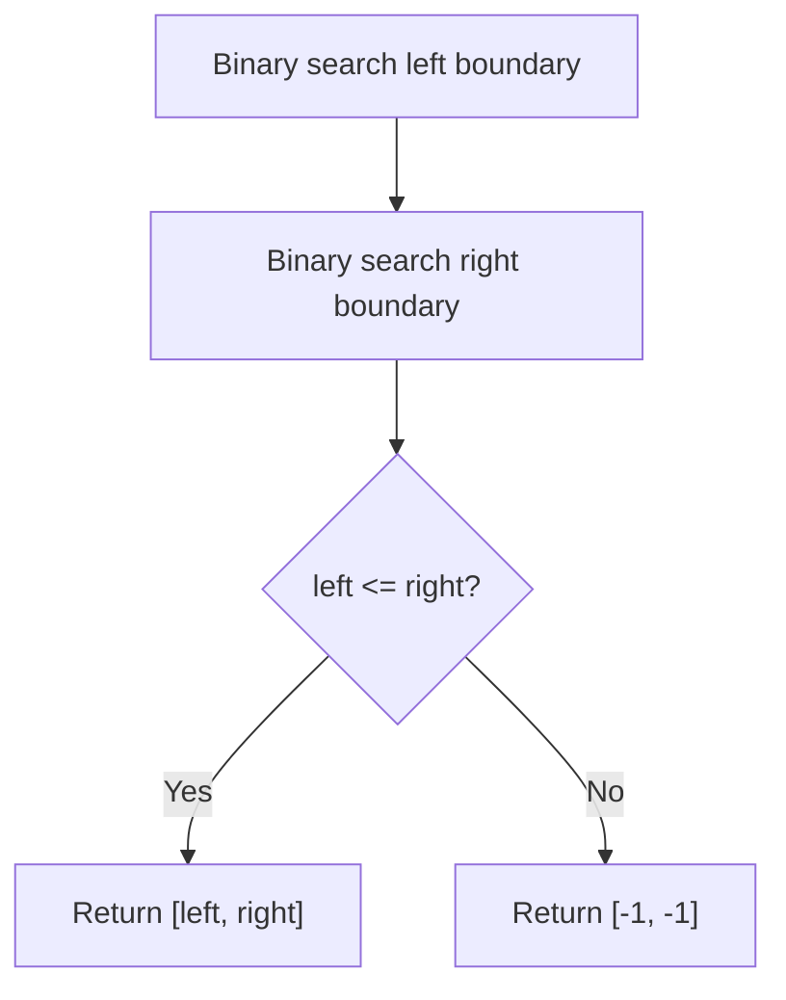
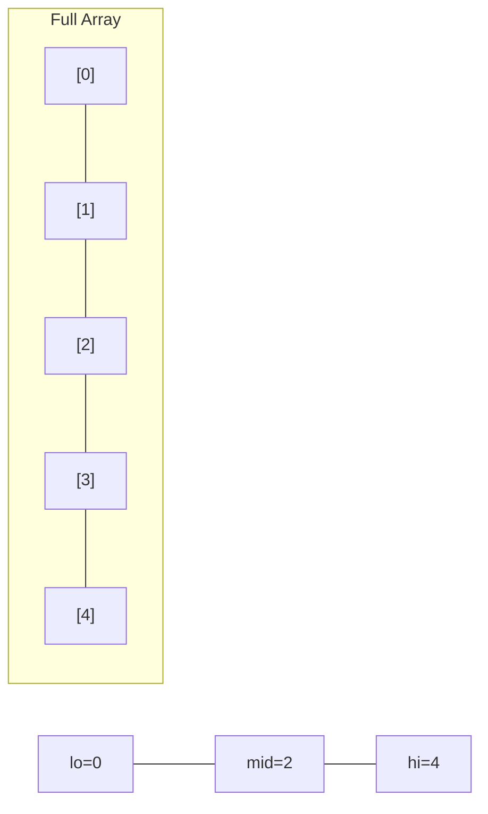
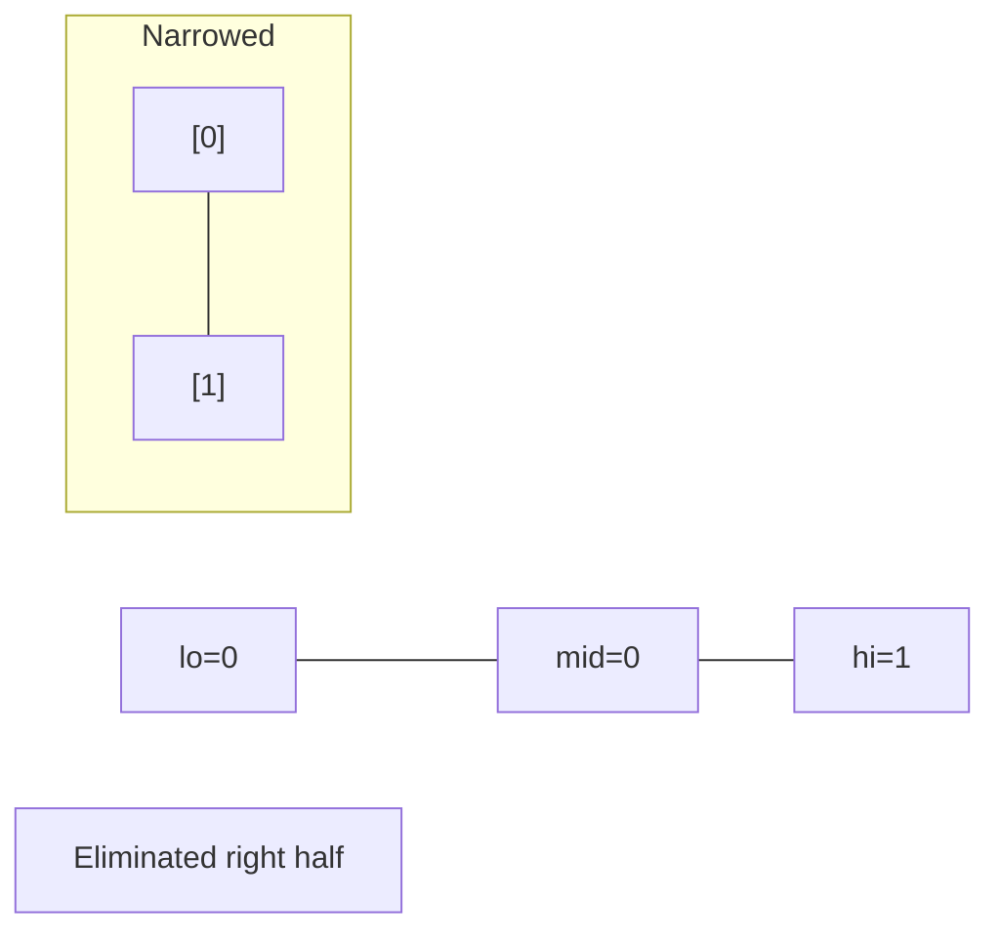
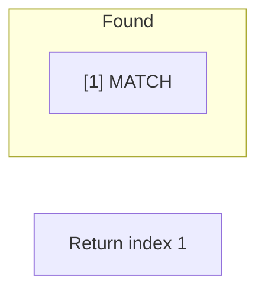

# Problem 34: Find First and Last Position of Element in Sorted Array

**Difficulty:** Medium  
**Tags:** Array, Binary Search  
**Pattern:** Binary Search  
**Link:** [leetcode.com/problems/find-first-and-last-position-of-element-in-sorted-array](https://leetcode.com/problems/find-first-and-last-position-of-element-in-sorted-array/)

## Description

Given an array of integers `nums` sorted in non-decreasing order, find the starting and ending position of a given `target` value.

If `target` is not found in the array, return `[-1, -1]`.

You must write an algorithm with `O(log n)` runtime complexity.

 

Example 1:

```
**Input:** nums = [5,7,7,8,8,10], target = 8
**Output:** [3,4]

```
Example 2:

```
**Input:** nums = [5,7,7,8,8,10], target = 6
**Output:** [-1,-1]

```
Example 3:

```
**Input:** nums = [], target = 0
**Output:** [-1,-1]

```

 

**Constraints:**

	- `0 <= nums.length <= 10^5`
	- `-10^9 <= nums[i] <= 10^9`
	- `nums` is a non-decreasing array.
	- `-10^9 <= target <= 10^9`

## Approach: Binary Search

Two binary searches: one for the leftmost occurrence, one for the rightmost.

## Pseudocode

```
1. Binary search for leftmost target index
2. Binary search for rightmost target index
3. If left <= right: return [left, right]
4. Else: return [-1, -1]
```

## Algorithm Flow



## Visual State Transitions

**Binary Search Step-by-Step:**

**Frame 1: Initial search space**


**Frame 2: Compare mid, narrow search**


**Frame 3: Found target**



## Complexity Analysis

- **Time:** O(log n)
- **Space:** O(1)

## Solution (Python3)

```python
class Solution:
    def searchRange(self, nums: list[int], target: int) -> list[int]:
        def find_left():
            lo, hi = 0, len(nums) - 1
            while lo <= hi:
                mid = (lo + hi) // 2
                if nums[mid] < target:
                    lo = mid + 1
                else:
                    hi = mid - 1
            return lo

        def find_right():
            lo, hi = 0, len(nums) - 1
            while lo <= hi:
                mid = (lo + hi) // 2
                if nums[mid] <= target:
                    lo = mid + 1
                else:
                    hi = mid - 1
            return hi

        left, right = find_left(), find_right()
        if left <= right:
            return [left, right]
        return [-1, -1]
```

## Solution (C++)

```cpp
#include <string>
#include <vector>
using namespace std;

class Solution {
public:
    vector<int> searchRange(vector<int>& nums, int target) {
        // Binary search - O(log n) time, O(1) space
        int lo = 0, hi = nums.size() - 1;
        while (lo <= hi) {
            int mid = lo + (hi - lo) / 2;
            if (nums[mid] == target) {
                return mid;
            } else if (nums[mid] < target) {
                lo = mid + 1;
            } else {
                hi = mid - 1;
            }
        }
        return {};
    }
};
```
