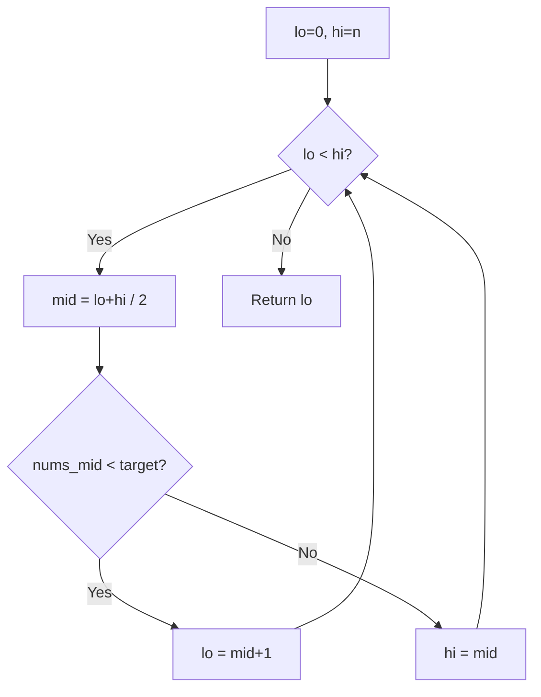
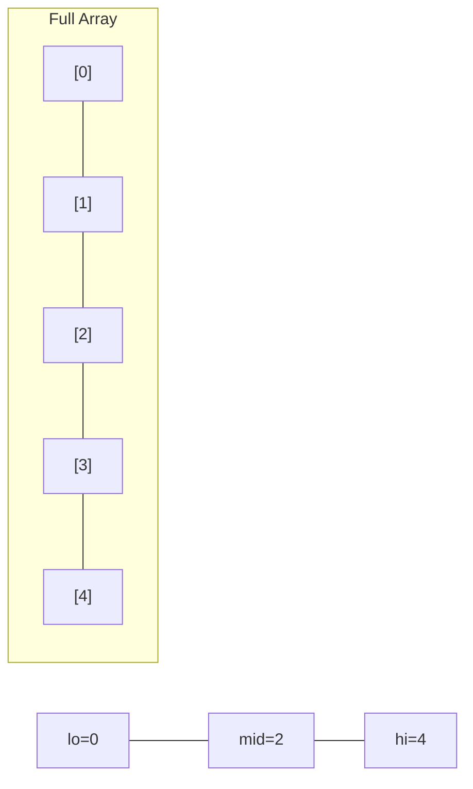
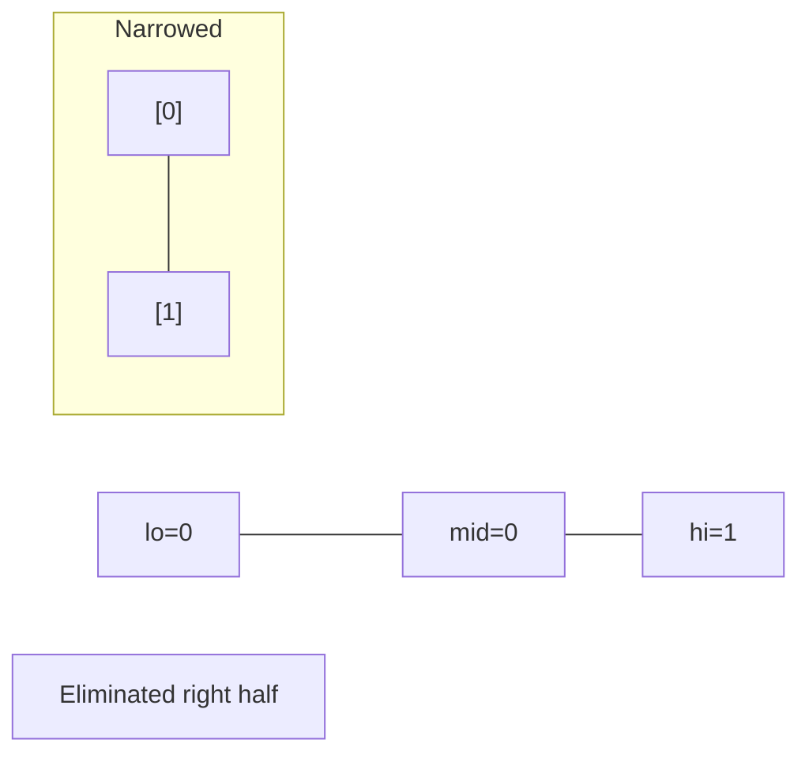
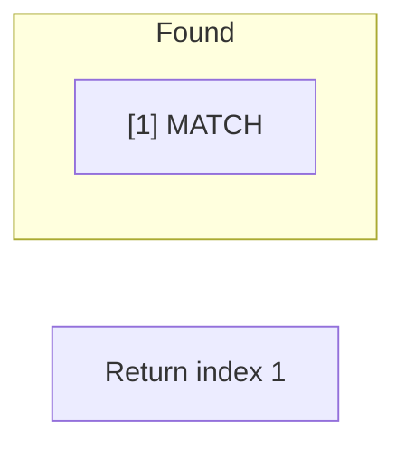

# Problem 35: Search Insert Position

**Difficulty:** Easy  
**Tags:** Array, Binary Search  
**Pattern:** Binary Search  
**Link:** [leetcode.com/problems/search-insert-position](https://leetcode.com/problems/search-insert-position/)

## Description

Given a sorted array of distinct integers and a target value, return the index if the target is found. If not, return the index where it would be if it were inserted in order.

You must write an algorithm with `O(log n)` runtime complexity.

 

Example 1:

```

**Input:** nums = [1,3,5,6], target = 5
**Output:** 2

```

Example 2:

```

**Input:** nums = [1,3,5,6], target = 2
**Output:** 1

```

Example 3:

```

**Input:** nums = [1,3,5,6], target = 7
**Output:** 4

```

 

**Constraints:**

	- `1 <= nums.length <= 10^4`
	- `-10^4 <= nums[i] <= 10^4`
	- `nums` contains **distinct** values sorted in **ascending** order.
	- `-10^4 <= target <= 10^4`

## Approach: Binary Search

Standard binary search. Return lo when the loop ends -- it's the insertion point.

## Pseudocode

```
1. lo=0, hi=n
2. While lo < hi: mid check
3. Return lo as insertion point
```

## Algorithm Flow



## Visual State Transitions

**Binary Search Step-by-Step:**

**Frame 1: Initial search space**


**Frame 2: Compare mid, narrow search**


**Frame 3: Found target**



## Complexity Analysis

- **Time:** O(log n)
- **Space:** O(1)

## Solution (Python3)

```python
class Solution:
    def searchInsert(self, nums: list[int], target: int) -> int:
        lo, hi = 0, len(nums)
        while lo < hi:
            mid = (lo + hi) // 2
            if nums[mid] < target:
                lo = mid + 1
            else:
                hi = mid
        return lo
```

## Solution (C++)

```cpp
#include <string>
#include <vector>
using namespace std;

class Solution {
public:
    int searchInsert(vector<int>& nums, int target) {
        // Binary search - O(log n) time, O(1) space
        int lo = 0, hi = nums.size() - 1;
        while (lo <= hi) {
            int mid = lo + (hi - lo) / 2;
            if (nums[mid] == target) {
                return mid;
            } else if (nums[mid] < target) {
                lo = mid + 1;
            } else {
                hi = mid - 1;
            }
        }
        return 0;
    }
};
```
