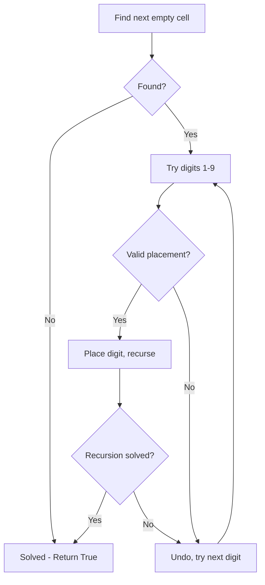
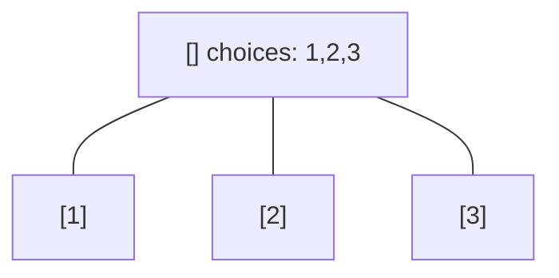
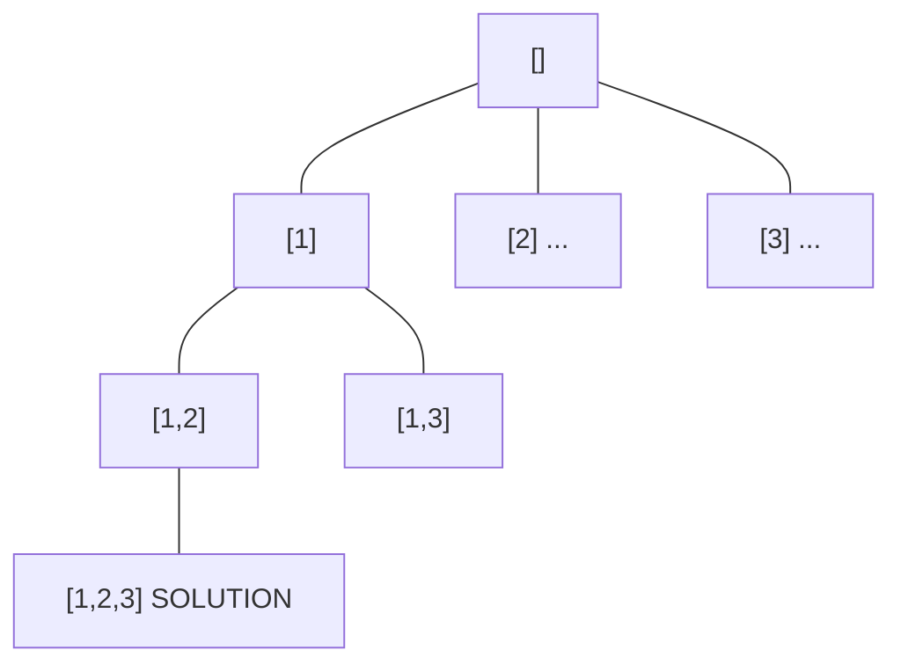
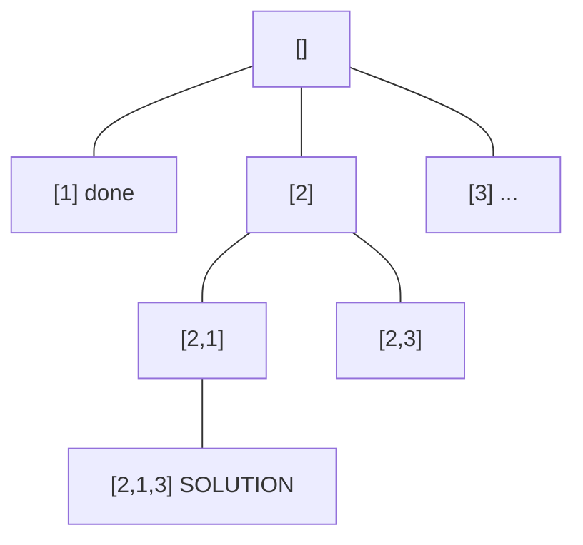
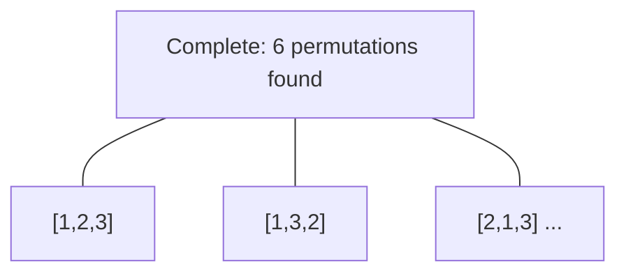

# Problem 37: Sudoku Solver

**Difficulty:** Hard  
**Tags:** Array, Hash Table, Backtracking, Matrix  
**Pattern:** Backtracking  
**Link:** [leetcode.com/problems/sudoku-solver](https://leetcode.com/problems/sudoku-solver/)

## Description

Write a program to solve a Sudoku puzzle by filling the empty cells.

A sudoku solution must satisfy **all of the following rules**:

	- Each of the digits `1-9` must occur exactly once in each row.
	- Each of the digits `1-9` must occur exactly once in each column.
	- Each of the digits `1-9` must occur exactly once in each of the 9 `3x3` sub-boxes of the grid.

The `'.'` character indicates empty cells.

 

Example 1:

```

**Input:** board = [["5","3",".",".","7",".",".",".","."],["6",".",".","1","9","5",".",".","."],[".","9","8",".",".",".",".","6","."],["8",".",".",".","6",".",".",".","3"],["4",".",".","8",".","3",".",".","1"],["7",".",".",".","2",".",".",".","6"],[".","6",".",".",".",".","2","8","."],[".",".",".","4","1","9",".",".","5"],[".",".",".",".","8",".",".","7","9"]]
**Output:** [["5","3","4","6","7","8","9","1","2"],["6","7","2","1","9","5","3","4","8"],["1","9","8","3","4","2","5","6","7"],["8","5","9","7","6","1","4","2","3"],["4","2","6","8","5","3","7","9","1"],["7","1","3","9","2","4","8","5","6"],["9","6","1","5","3","7","2","8","4"],["2","8","7","4","1","9","6","3","5"],["3","4","5","2","8","6","1","7","9"]]
**Explanation:** The input board is shown above and the only valid solution is shown below:

```

 

**Constraints:**

	- `board.length == 9`
	- `board[i].length == 9`
	- `board[i][j]` is a digit or `'.'`.
	- It is **guaranteed** that the input board has only one solution.

## Approach: Backtracking

Backtracking: try each digit 1-9 for each empty cell, validate, recurse.

## Pseudocode

```
1. Find next empty cell
2. Try digits 1-9:
   If valid: place and recurse
   If recurse fails: undo (backtrack)
3. If no digits work: return False
```

## Algorithm Flow



## Visual State Transitions

**Backtracking Decision Tree:**

**Frame 1: Root - start with empty path**


**Frame 2: Explore branch [1]**


**Frame 3: Backtrack, explore [2]**


**Frame 4: All solutions found**



## Complexity Analysis

- **Time:** O(9^(empty cells))
- **Space:** O(81)

## Solution (Python3)

```python
class Solution:
    def solveSudoku(self, board: list[list[str]]) -> None:
        def is_valid(row, col, num):
            for i in range(9):
                if board[row][i] == num or board[i][col] == num:
                    return False
                r, c = 3 * (row // 3) + i // 3, 3 * (col // 3) + i % 3
                if board[r][c] == num:
                    return False
            return True

        def solve():
            for i in range(9):
                for j in range(9):
                    if board[i][j] == '.':
                        for num in '123456789':
                            if is_valid(i, j, num):
                                board[i][j] = num
                                if solve():
                                    return True
                                board[i][j] = '.'
                        return False
            return True

        solve()
```

## Solution (C++)

```cpp
#include <functional>
#include <string>
#include <vector>
using namespace std;

class Solution {
public:
    void solveSudoku(vector<vector<string>>& board) {
        // Backtracking - O(2^n) or O(n!) time
        vector<vector<int>> result;
        vector<int> path;
        function<void(int)> backtrack = [&](int start) {
            result.push_back(path);
            for (int i = start; i < (int)board.size(); i++) {
                path.push_back(board[i]);
                backtrack(i + 1);
                path.pop_back();
            }
        };
        backtrack(0);
        return result;
    }
};
```
