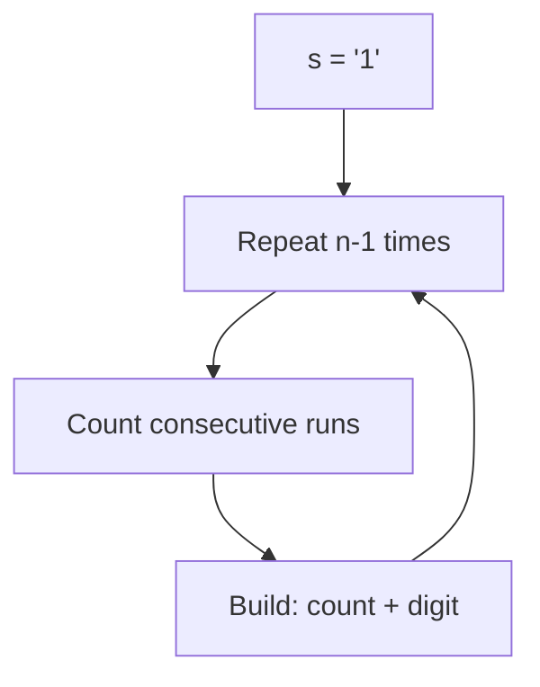

# Problem 38: Count and Say

**Difficulty:** Medium  
**Tags:** String  
**Pattern:** String Simulation  
**Link:** [leetcode.com/problems/count-and-say](https://leetcode.com/problems/count-and-say/)

## Description

The **count-and-say** sequence is a sequence of digit strings defined by the recursive formula:

	- `countAndSay(1) = "1"`
	- `countAndSay(n)` is the run-length encoding of `countAndSay(n - 1)`.

Run-length encoding (RLE) is a string compression method that works by replacing consecutive identical characters (repeated 2 or more times) with the concatenation of the character and the number marking the count of the characters (length of the run). For example, to compress the string `"3322251"` we replace `"33"` with `"23"`, replace `"222"` with `"32"`, replace `"5"` with `"15"` and replace `"1"` with `"11"`. Thus the compressed string becomes `"23321511"`.

Given a positive integer `n`, return *the *`n^th`* element of the **count-and-say** sequence*.

 

Example 1:

**Input:** n = 4

**Output:** "1211"

**Explanation:**

```

countAndSay(1) = "1"
countAndSay(2) = RLE of "1" = "11"
countAndSay(3) = RLE of "11" = "21"
countAndSay(4) = RLE of "21" = "1211"

```

Example 2:

**Input:** n = 1

**Output:** "1"

**Explanation:**

This is the base case.

 

**Constraints:**

	- `1 <= n <= 30`

 

**Follow up:** Could you solve it iteratively?

## Approach: String Simulation

Iteratively build each sequence by counting consecutive identical digits in the previous one.

## Pseudocode

```
1. Start with '1'
2. Repeat n-1 times:
   Count consecutive same digits
   Build new string: count + digit
3. Return result
```

## Algorithm Flow



## Complexity Analysis

- **Time:** O(2^n) worst case
- **Space:** O(2^n)

## Solution (Python3)

```python
class Solution:
    def countAndSay(self, n: int) -> str:
        s = '1'
        for _ in range(n - 1):
            result = []
            i = 0
            while i < len(s):
                count = 1
                while i + count < len(s) and s[i + count] == s[i]:
                    count += 1
                result.append(str(count) + s[i])
                i += count
            s = ''.join(result)
        return s
```

## Solution (C++)

```cpp
#include <algorithm>
#include <cctype>
#include <string>
#include <vector>
using namespace std;

class Solution {
public:
    string countAndSay(int n) {
        // String processing approach - O(n) time
        string processed;
        for (char ch : n) {
            if (isalnum(ch)) {
                processed += tolower(ch);
            }
        }
        string rev = processed;
        reverse(rev.begin(), rev.end());
        return processed == rev;
    }
};
```
