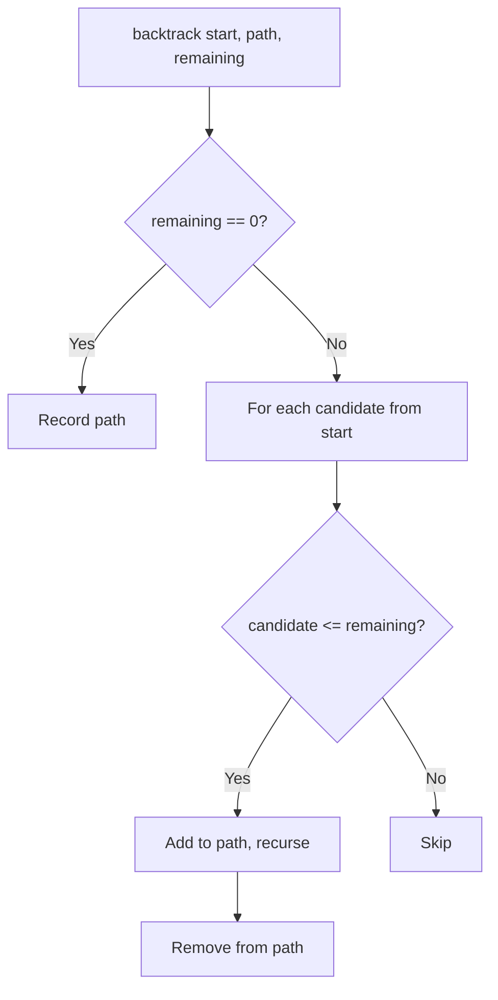
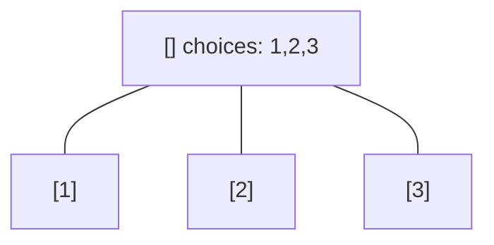
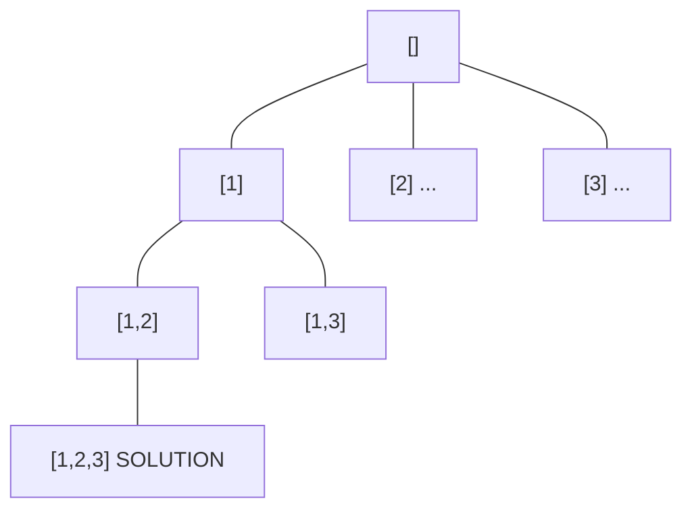
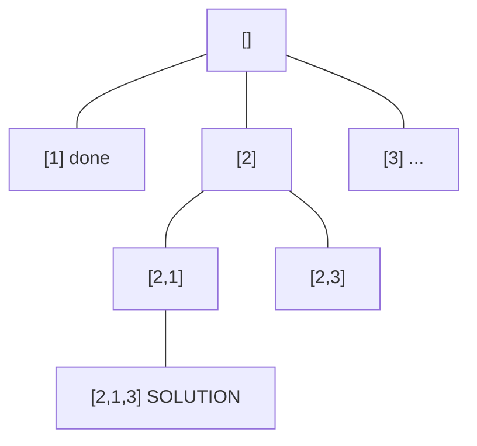
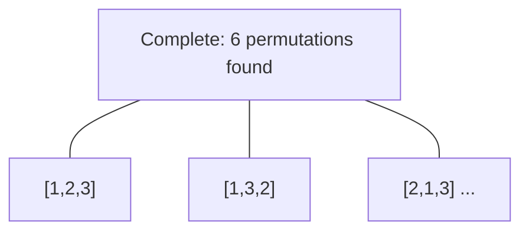

# Problem 39: Combination Sum

**Difficulty:** Medium  
**Tags:** Array, Backtracking  
**Pattern:** Backtracking  
**Link:** [leetcode.com/problems/combination-sum](https://leetcode.com/problems/combination-sum/)

## Description

Given an array of **distinct** integers `candidates` and a target integer `target`, return *a list of all **unique combinations** of *`candidates`* where the chosen numbers sum to *`target`*.* You may return the combinations in **any order**.

The **same** number may be chosen from `candidates` an **unlimited number of times**. Two combinations are unique if the frequency of at least one of the chosen numbers is different.

The test cases are generated such that the number of unique combinations that sum up to `target` is less than `150` combinations for the given input.

 

Example 1:

```

**Input:** candidates = [2,3,6,7], target = 7
**Output:** [[2,2,3],[7]]
**Explanation:**
2 and 3 are candidates, and 2 + 2 + 3 = 7. Note that 2 can be used multiple times.
7 is a candidate, and 7 = 7.
These are the only two combinations.

```

Example 2:

```

**Input:** candidates = [2,3,5], target = 8
**Output:** [[2,2,2,2],[2,3,3],[3,5]]

```

Example 3:

```

**Input:** candidates = [2], target = 1
**Output:** []

```

 

**Constraints:**

	- `1 <= candidates.length <= 30`
	- `2 <= candidates[i] <= 40`
	- All elements of `candidates` are **distinct**.
	- `1 <= target <= 40`

## Approach: Backtracking

Backtrack trying each candidate (reusable). Start index prevents duplicates.

## Pseudocode

```
1. backtrack(start, path, remaining):
   If remaining == 0: record path
   For i from start: try candidates[i], recurse with same i
```

## Algorithm Flow



## Visual State Transitions

**Backtracking Decision Tree:**

**Frame 1: Root - start with empty path**


**Frame 2: Explore branch [1]**


**Frame 3: Backtrack, explore [2]**


**Frame 4: All solutions found**



## Complexity Analysis

- **Time:** O(n^(target/min))
- **Space:** O(target/min)

## Solution (Python3)

```python
class Solution:
    def combinationSum(self, candidates: list[int], target: int) -> list[list[int]]:
        result = []
        def backtrack(start, path, remaining):
            if remaining == 0:
                result.append(path[:])
                return
            for i in range(start, len(candidates)):
                if candidates[i] > remaining:
                    continue
                path.append(candidates[i])
                backtrack(i, path, remaining - candidates[i])
                path.pop()
        backtrack(0, [], target)
        return result
```

## Solution (C++)

```cpp
#include <functional>
#include <string>
#include <vector>
using namespace std;

class Solution {
public:
    vector<vector<int>> combinationSum(vector<int>& candidates, int target) {
        // Backtracking - O(2^n) or O(n!) time
        vector<vector<int>> result;
        vector<int> path;
        function<void(int)> backtrack = [&](int start) {
            result.push_back(path);
            for (int i = start; i < (int)candidates.size(); i++) {
                path.push_back(candidates[i]);
                backtrack(i + 1);
                path.pop_back();
            }
        };
        backtrack(0);
        return result;
    }
};
```
