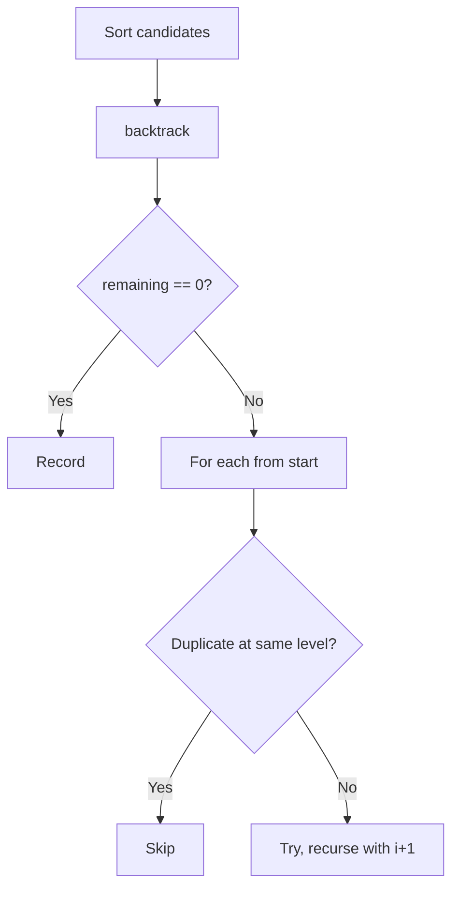
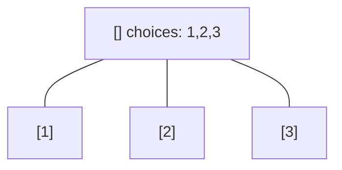
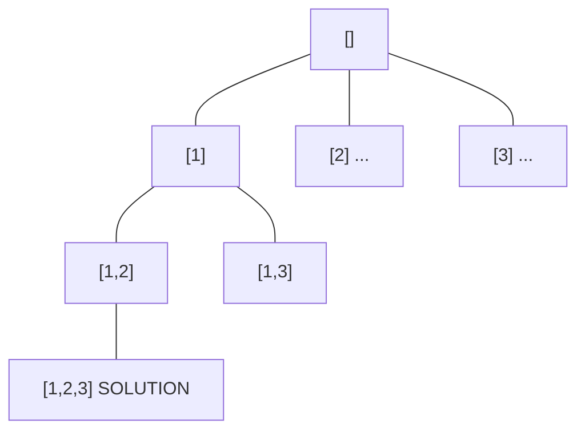
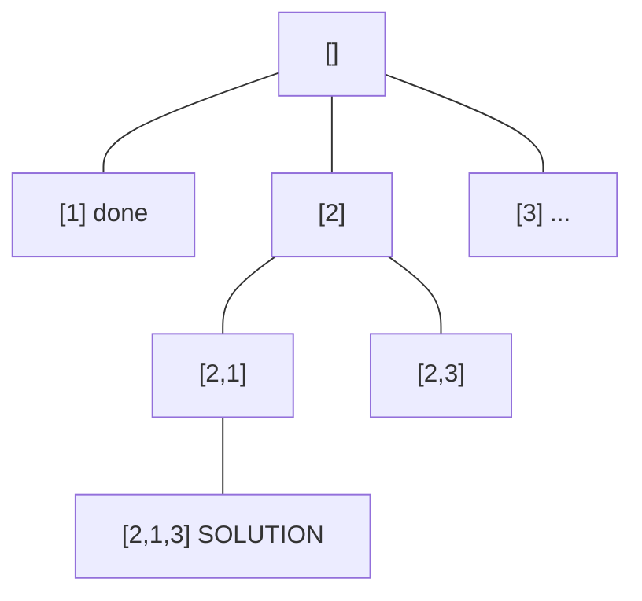
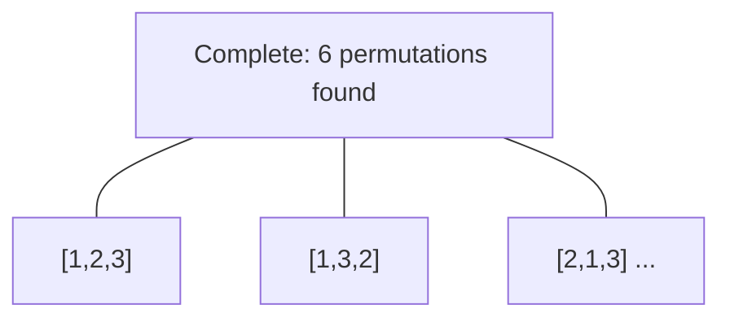

# Problem 40: Combination Sum II

**Difficulty:** Medium  
**Tags:** Array, Backtracking  
**Pattern:** Backtracking  
**Link:** [leetcode.com/problems/combination-sum-ii](https://leetcode.com/problems/combination-sum-ii/)

## Description

Given a collection of candidate numbers (`candidates`) and a target number (`target`), find all unique combinations in `candidates` where the candidate numbers sum to `target`.

Each number in `candidates` may only be used **once** in the combination.

**Note:** The solution set must not contain duplicate combinations.

 

Example 1:

```

**Input:** candidates = [10,1,2,7,6,1,5], target = 8
**Output:** 
[
[1,1,6],
[1,2,5],
[1,7],
[2,6]
]

```

Example 2:

```

**Input:** candidates = [2,5,2,1,2], target = 5
**Output:** 
[
[1,2,2],
[5]
]

```

 

**Constraints:**

	- `1 <= candidates.length <= 100`
	- `1 <= candidates[i] <= 50`
	- `1 <= target <= 30`

## Approach: Backtracking

Sort first. Backtrack with i+1 (no reuse). Skip duplicates at same level.

## Pseudocode

```
1. Sort candidates
2. backtrack(start, path, remaining):
   Skip if same as prev at same level
   Recurse with i+1
```

## Algorithm Flow



## Visual State Transitions

**Backtracking Decision Tree:**

**Frame 1: Root - start with empty path**


**Frame 2: Explore branch [1]**


**Frame 3: Backtrack, explore [2]**


**Frame 4: All solutions found**



## Complexity Analysis

- **Time:** O(2^n)
- **Space:** O(n)

## Solution (Python3)

```python
class Solution:
    def combinationSum2(self, candidates: list[int], target: int) -> list[list[int]]:
        candidates.sort()
        result = []
        def backtrack(start, path, remaining):
            if remaining == 0:
                result.append(path[:])
                return
            for i in range(start, len(candidates)):
                if candidates[i] > remaining:
                    break
                if i > start and candidates[i] == candidates[i - 1]:
                    continue
                path.append(candidates[i])
                backtrack(i + 1, path, remaining - candidates[i])
                path.pop()
        backtrack(0, [], target)
        return result
```

## Solution (C++)

```cpp
#include <functional>
#include <string>
#include <vector>
using namespace std;

class Solution {
public:
    vector<vector<int>> combinationSum2(vector<int>& candidates, int target) {
        // Backtracking - O(2^n) or O(n!) time
        vector<vector<int>> result;
        vector<int> path;
        function<void(int)> backtrack = [&](int start) {
            result.push_back(path);
            for (int i = start; i < (int)candidates.size(); i++) {
                path.push_back(candidates[i]);
                backtrack(i + 1);
                path.pop_back();
            }
        };
        backtrack(0);
        return result;
    }
};
```
