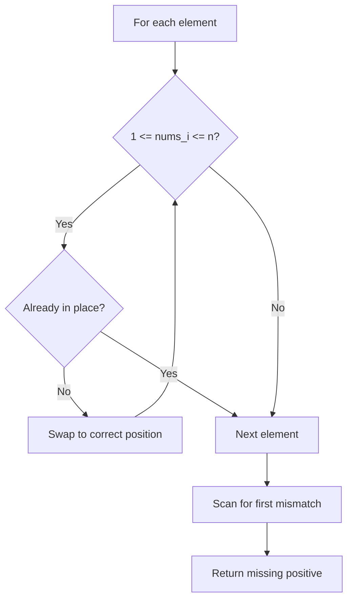

# Problem 41: First Missing Positive

**Difficulty:** Hard  
**Tags:** Array, Hash Table  
**Pattern:** Cyclic Sort  
**Link:** [leetcode.com/problems/first-missing-positive](https://leetcode.com/problems/first-missing-positive/)

## Description

Given an unsorted integer array `nums`. Return the *smallest positive integer* that is *not present* in `nums`.

You must implement an algorithm that runs in `O(n)` time and uses `O(1)` auxiliary space.

 

Example 1:

```

**Input:** nums = [1,2,0]
**Output:** 3
**Explanation:** The numbers in the range [1,2] are all in the array.

```

Example 2:

```

**Input:** nums = [3,4,-1,1]
**Output:** 2
**Explanation:** 1 is in the array but 2 is missing.

```

Example 3:

```

**Input:** nums = [7,8,9,11,12]
**Output:** 1
**Explanation:** The smallest positive integer 1 is missing.

```

 

**Constraints:**

	- `1 <= nums.length <= 10^5`
	- `-2^31 <= nums[i] <= 2^31 - 1`

## Approach: Cyclic Sort

**Key Insight:** Place each number at its correct index (nums[i] should be i+1). Then scan for the first mismatch.

## Pseudocode

```
1. For each i: swap nums[i] to its correct position
2. Scan for first i where nums[i] != i+1
3. Return i+1 (or n+1 if all correct)
```

## Algorithm Flow



## Complexity Analysis

- **Time:** O(n)
- **Space:** O(1)

## Solution (Python3)

```python
class Solution:
    def firstMissingPositive(self, nums: list[int]) -> int:
        n = len(nums)
        for i in range(n):
            while 1 <= nums[i] <= n and nums[nums[i] - 1] != nums[i]:
                nums[nums[i] - 1], nums[i] = nums[i], nums[nums[i] - 1]
        for i in range(n):
            if nums[i] != i + 1:
                return i + 1
        return n + 1
```

## Solution (C++)

```cpp
#include <string>
#include <unordered_map>
#include <vector>
using namespace std;

class Solution {
public:
    int firstMissingPositive(vector<int>& nums) {
        // Hash map approach - O(n) time, O(n) space
        unordered_map<int, int> seen;
        for (int i = 0; i < nums.size(); i++) {
            int complement = nums - nums[i];
            if (seen.count(complement)) {
                return {seen[complement], i};
            }
            seen[nums[i]] = i;
        }
        return 0;
    }
};
```
