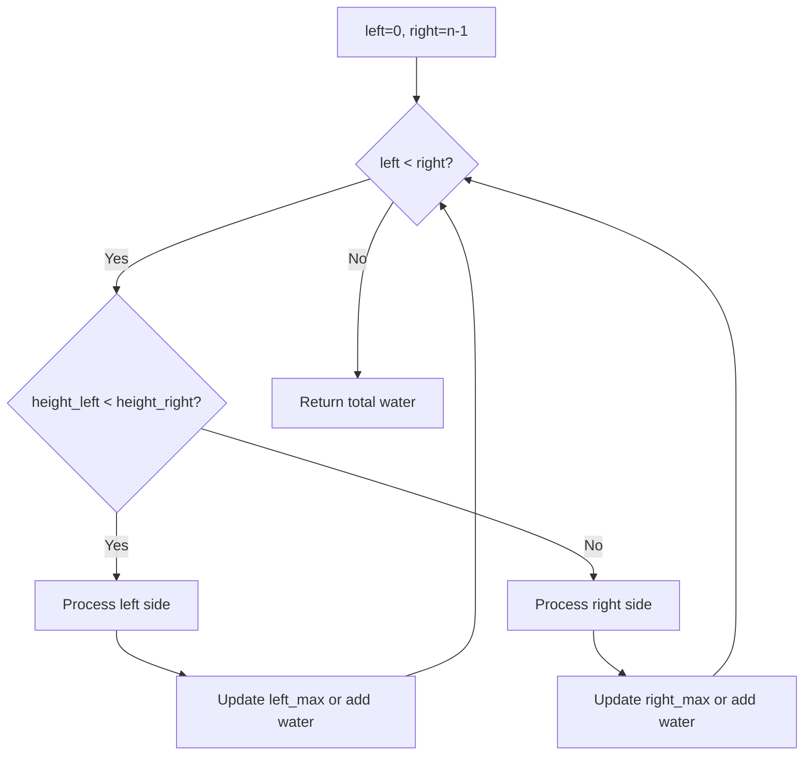
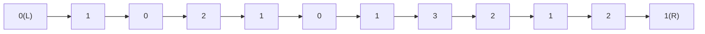
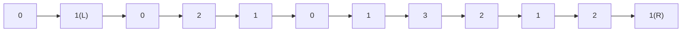
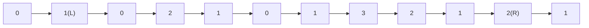

# Problem 42: Trapping Rain Water

**Difficulty:** Hard  
**Tags:** Array, Two Pointers, Dynamic Programming, Stack, Monotonic Stack  
**Pattern:** Two Pointers  
**Link:** [leetcode.com/problems/trapping-rain-water](https://leetcode.com/problems/trapping-rain-water/)

## Description

Given `n` non-negative integers representing an elevation map where the width of each bar is `1`, compute how much water it can trap after raining.

 

Example 1:

```

**Input:** height = [0,1,0,2,1,0,1,3,2,1,2,1]
**Output:** 6
**Explanation:** The above elevation map (black section) is represented by array [0,1,0,2,1,0,1,3,2,1,2,1]. In this case, 6 units of rain water (blue section) are being trapped.

```

Example 2:

```

**Input:** height = [4,2,0,3,2,5]
**Output:** 9

```

 

**Constraints:**

	- `n == height.length`
	- `1 <= n <= 2 * 10^4`
	- `0 <= height[i] <= 10^5`

## Approach: Two Pointers

**Key Insight:** Water at each position = min(left_max, right_max) - height. Use two pointers moving inward, tracking max heights from each side.

## Pseudocode

```
1. left=0, right=n-1, left_max=0, right_max=0
2. While left < right:
   Process shorter side
   Update max or add trapped water
3. Return total water
```

## Algorithm Flow



## Visual State Transitions

**Two Pointer Water Trapping for height=[0,1,0,2,1,0,1,3,2,1,2,1]:**

**Step 1:** Initialize pointers at edges



left_max=0, right_max=0, water=0

**Step 2:** Process left (h=0 < h=1), left_max=0, water stays 0



left_max=0, right_max=0, water=0

**Step 3:** Both equal, process right (h=1), right_max=1



left_max=1, right_max=1, water=0

## Complexity Analysis

- **Time:** O(n)
- **Space:** O(1)

## Solution (Python3)

```python
class Solution:
    def trap(self, height: list[int]) -> int:
        left, right = 0, len(height) - 1
        left_max = right_max = 0
        water = 0
        while left < right:
            if height[left] < height[right]:
                if height[left] >= left_max:
                    left_max = height[left]
                else:
                    water += left_max - height[left]
                left += 1
            else:
                if height[right] >= right_max:
                    right_max = height[right]
                else:
                    water += right_max - height[right]
                right -= 1
        return water
```

## Solution (C++)

```cpp
#include <stack>
#include <string>
#include <vector>
using namespace std;

class Solution {
public:
    int trap(vector<int>& height) {
        // Monotonic stack - O(n) time, O(n) space
        int n = height.size();
        vector<int> result(n, 0);
        stack<int> st;
        for (int i = 0; i < n; i++) {
            while (!st.empty() && height[i] > height[st.top()]) {
                int idx = st.top(); st.pop();
                result[idx] = i - idx;
            }
            st.push(i);
        }
        return result;
    }
};
```
