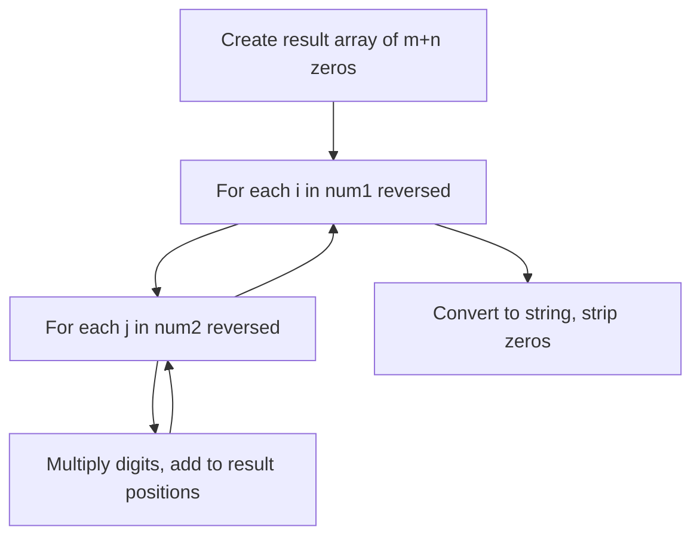

# Problem 43: Multiply Strings

**Difficulty:** Medium  
**Tags:** Math, String, Simulation  
**Pattern:** Math / String  
**Link:** [leetcode.com/problems/multiply-strings](https://leetcode.com/problems/multiply-strings/)

## Description

Given two non-negative integers `num1` and `num2` represented as strings, return the product of `num1` and `num2`, also represented as a string.

**Note:** You must not use any built-in BigInteger library or convert the inputs to integer directly.

 

Example 1:

```
**Input:** num1 = "2", num2 = "3"
**Output:** "6"

```
Example 2:

```
**Input:** num1 = "123", num2 = "456"
**Output:** "56088"

```

 

**Constraints:**

	- `1 <= num1.length, num2.length <= 200`
	- `num1` and `num2` consist of digits only.
	- Both `num1` and `num2` do not contain any leading zero, except the number `0` itself.

## Approach: Math / String

Grade-school multiplication: multiply each digit pair, accumulate at correct position in result array.

## Pseudocode

```
1. result = [0] * (m+n)
2. For each digit pair: multiply, add to position i+j and i+j+1
3. Convert array to string, strip leading zeros
```

## Algorithm Flow



## Complexity Analysis

- **Time:** O(m*n)
- **Space:** O(m+n)

## Solution (Python3)

```python
class Solution:
    def multiply(self, num1: str, num2: str) -> str:
        m, n = len(num1), len(num2)
        result = [0] * (m + n)
        for i in range(m - 1, -1, -1):
            for j in range(n - 1, -1, -1):
                mul = (ord(num1[i]) - 48) * (ord(num2[j]) - 48)
                p1, p2 = i + j, i + j + 1
                total = mul + result[p2]
                result[p2] = total % 10
                result[p1] += total // 10
        result_str = ''.join(map(str, result)).lstrip('0')
        return result_str or '0'
```

## Solution (C++)

```cpp
#include <string>
#include <vector>
using namespace std;

class Solution {
public:
    string multiply(string& num1, string& num2) {
        // Simulation approach
        int n = num1.size();
        for (int i = 0; i < n; i++) {
            // Simulate each step
        }
        return "";
    }
};
```
