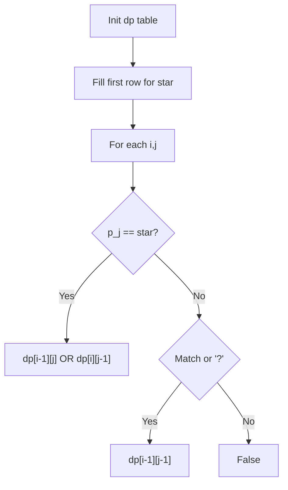

# Problem 44: Wildcard Matching

**Difficulty:** Hard  
**Tags:** String, Dynamic Programming, Greedy, Recursion  
**Pattern:** Dynamic Programming  
**Link:** [leetcode.com/problems/wildcard-matching](https://leetcode.com/problems/wildcard-matching/)

## Description

Given an input string (`s`) and a pattern (`p`), implement wildcard pattern matching with support for `'?'` and `'*'` where:

	- `'?'` Matches any single character.
	- `'*'` Matches any sequence of characters (including the empty sequence).

The matching should cover the **entire** input string (not partial).

 

Example 1:

```

**Input:** s = "aa", p = "a"
**Output:** false
**Explanation:** "a" does not match the entire string "aa".

```

Example 2:

```

**Input:** s = "aa", p = "*"
**Output:** true
**Explanation:** '*' matches any sequence.

```

Example 3:

```

**Input:** s = "cb", p = "?a"
**Output:** false
**Explanation:** '?' matches 'c', but the second letter is 'a', which does not match 'b'.

```

 

**Constraints:**

	- `0 <= s.length, p.length <= 2000`
	- `s` contains only lowercase English letters.
	- `p` contains only lowercase English letters, `'?'` or `'*'`.

## Approach: Dynamic Programming

2D DP: dp[i][j] = s[:i] matches p[:j]. '*' can match empty (dp[i][j-1]) or extend (dp[i-1][j]).

## Pseudocode

```
1. dp[0][0] = True
2. First row: '*' matches empty
3. For each (i,j): handle '*', '?', exact match
4. Return dp[m][n]
```

## Algorithm Flow



## Complexity Analysis

- **Time:** O(m*n)
- **Space:** O(m*n)

## Solution (Python3)

```python
class Solution:
    def isMatch(self, s: str, p: str) -> bool:
        m, n = len(s), len(p)
        dp = [[False] * (n + 1) for _ in range(m + 1)]
        dp[0][0] = True
        for j in range(1, n + 1):
            if p[j - 1] == '*':
                dp[0][j] = dp[0][j - 1]
        for i in range(1, m + 1):
            for j in range(1, n + 1):
                if p[j - 1] == '*':
                    dp[i][j] = dp[i - 1][j] or dp[i][j - 1]
                elif p[j - 1] == '?' or p[j - 1] == s[i - 1]:
                    dp[i][j] = dp[i - 1][j - 1]
        return dp[m][n]
```

## Solution (C++)

```cpp
#include <algorithm>
#include <string>
#include <vector>
using namespace std;

class Solution {
public:
    bool isMatch(string& s, string& p) {
        // String DP - O(m*n) time and space
        int m = s.size(), n = p.size();
        vector<vector<int>> dp(m + 1, vector<int>(n + 1, 0));
        for (int i = 1; i <= m; i++) {
            for (int j = 1; j <= n; j++) {
                if (s[i-1] == p[j-1])
                    dp[i][j] = dp[i-1][j-1] + 1;
                else
                    dp[i][j] = max(dp[i-1][j], dp[i][j-1]);
            }
        }
        return dp[m][n];
    }
};
```
