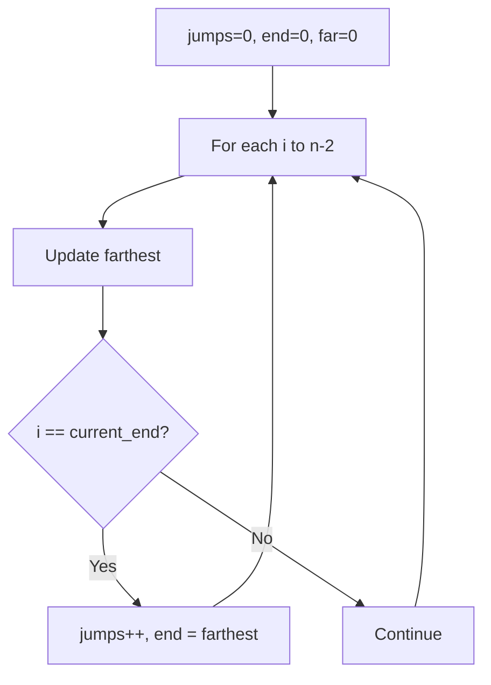
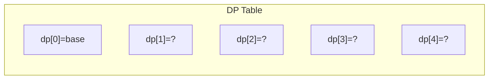
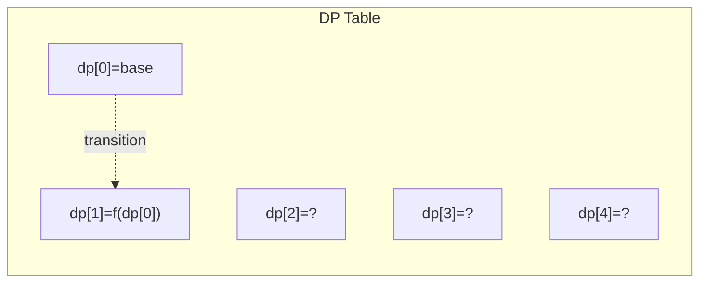
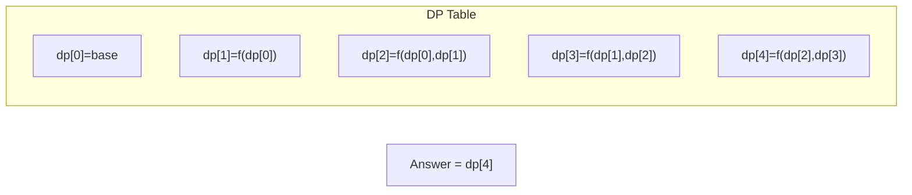

# Problem 45: Jump Game II

**Difficulty:** Medium  
**Tags:** Array, Dynamic Programming, Greedy  
**Pattern:** Greedy  
**Link:** [leetcode.com/problems/jump-game-ii](https://leetcode.com/problems/jump-game-ii/)

## Description

You are given a **0-indexed** array of integers `nums` of length `n`. You are initially positioned at index 0.

Each element `nums[i]` represents the maximum length of a forward jump from index `i`. In other words, if you are at index `i`, you can jump to any index `(i + j)` where:

	- `0 <= j <= nums[i]` and
	- `i + j < n`

Return *the minimum number of jumps to reach index *`n - 1`. The test cases are generated such that you can reach index `n - 1`.

 

Example 1:

```

**Input:** nums = [2,3,1,1,4]
**Output:** 2
**Explanation:** The minimum number of jumps to reach the last index is 2. Jump 1 step from index 0 to 1, then 3 steps to the last index.

```

Example 2:

```

**Input:** nums = [2,3,0,1,4]
**Output:** 2

```

 

**Constraints:**

	- `1 <= nums.length <= 10^4`
	- `0 <= nums[i] <= 1000`
	- It's guaranteed that you can reach `nums[n - 1]`.

## Approach: Greedy

**Greedy BFS:** Track the farthest reachable position. When we reach the current jump boundary, take a jump.

## Pseudocode

```
1. jumps=0, current_end=0, farthest=0
2. For i in [0, n-2]:
   farthest = max(farthest, i + nums[i])
   If i == current_end: jumps++, current_end = farthest
3. Return jumps
```

## Algorithm Flow



## Visual State Transitions

**1D Dynamic Programming Table Build:**

**Frame 1: Initialize base cases**


**Frame 2: Fill dp[1] from dp[0]**


**Frame 3: Fill remaining cells**



## Complexity Analysis

- **Time:** O(n)
- **Space:** O(1)

## Solution (Python3)

```python
class Solution:
    def jump(self, nums: list[int]) -> int:
        jumps = current_end = farthest = 0
        for i in range(len(nums) - 1):
            farthest = max(farthest, i + nums[i])
            if i == current_end:
                jumps += 1
                current_end = farthest
        return jumps
```

## Solution (C++)

```cpp
#include <string>
#include <vector>
using namespace std;

class Solution {
public:
    int jump(vector<int>& nums) {
        // Dynamic programming (1D) - O(n) time, O(n) space
        int n = nums;
        if (n <= 0) return 0;
        vector<int> dp(n + 1, 0);
        dp[0] = 1;
        for (int i = 1; i <= n; i++) {
            dp[i] = dp[i-1];
            if (i >= 2) dp[i] += dp[i-2];
        }
        return dp[n];
    }
};
```
