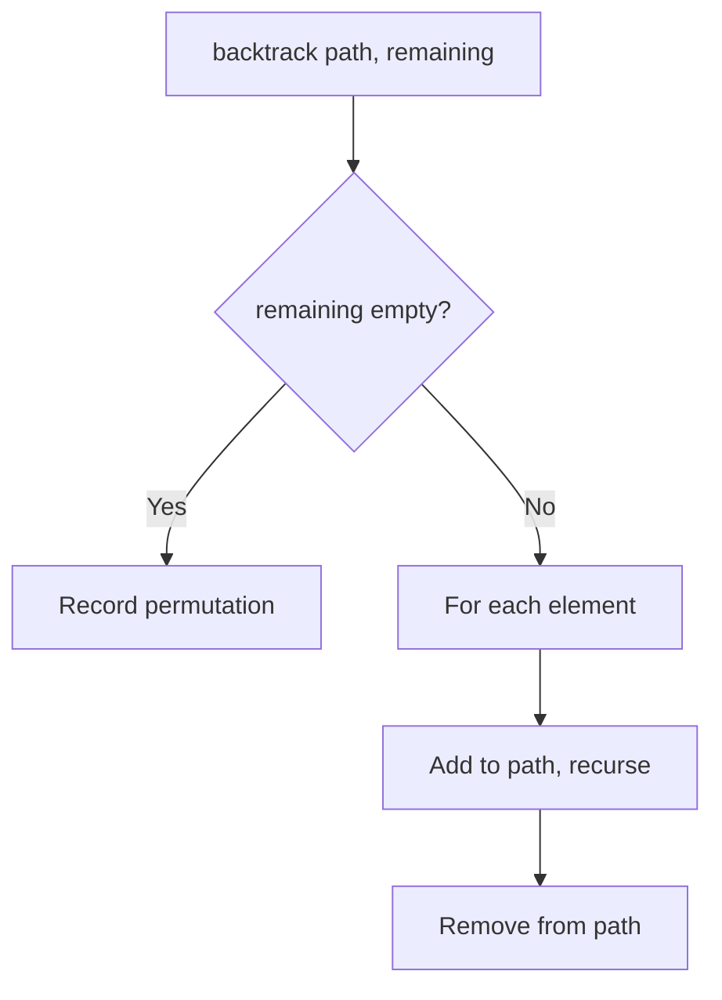
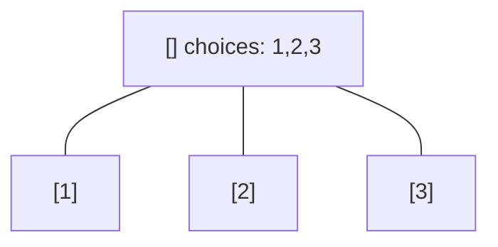
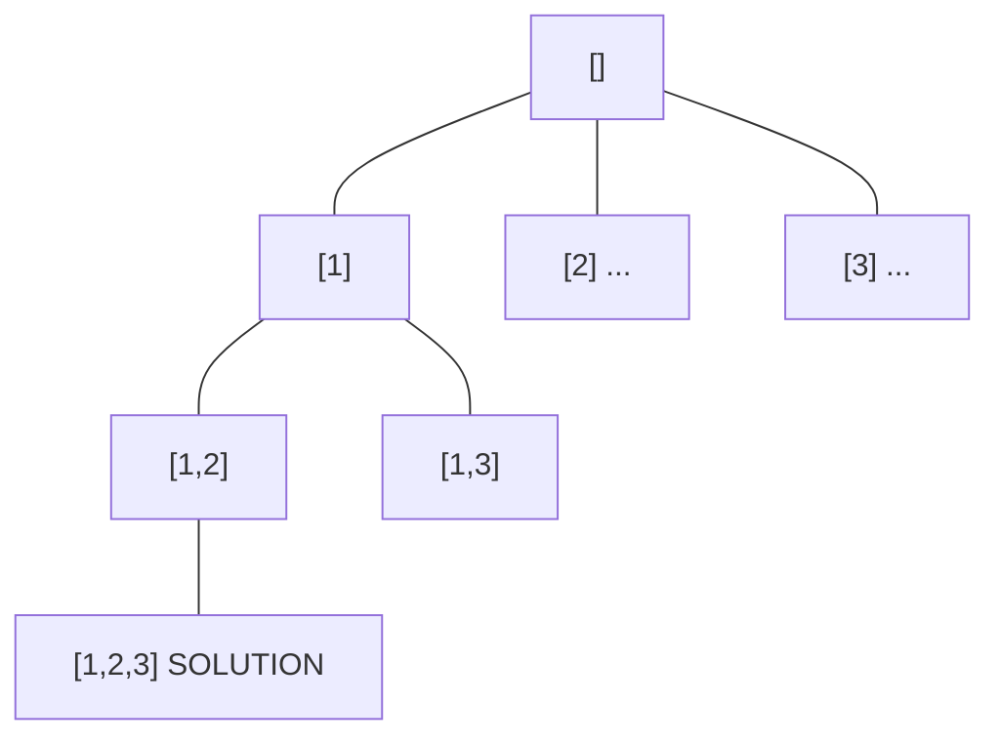
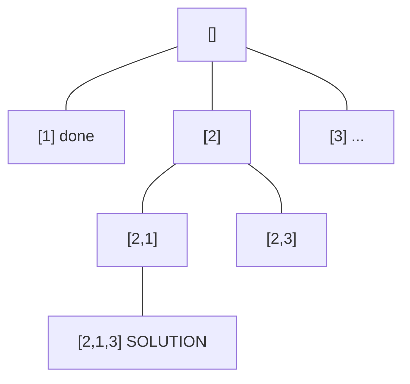
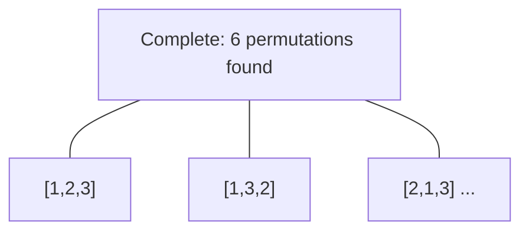

# Problem 46: Permutations

**Difficulty:** Medium  
**Tags:** Array, Backtracking  
**Pattern:** Backtracking  
**Link:** [leetcode.com/problems/permutations](https://leetcode.com/problems/permutations/)

## Description

Given an array `nums` of distinct integers, return all the possible permutations. You can return the answer in **any order**.

 

Example 1:

```
**Input:** nums = [1,2,3]
**Output:** [[1,2,3],[1,3,2],[2,1,3],[2,3,1],[3,1,2],[3,2,1]]

```
Example 2:

```
**Input:** nums = [0,1]
**Output:** [[0,1],[1,0]]

```
Example 3:

```
**Input:** nums = [1]
**Output:** [[1]]

```

 

**Constraints:**

	- `1 <= nums.length <= 6`
	- `-10 <= nums[i] <= 10`
	- All the integers of `nums` are **unique**.

## Approach: Backtracking

Classic backtracking: try each remaining element, recurse with it removed.

## Pseudocode

```
1. backtrack(path, remaining):
   If empty: record path
   For each in remaining: add, recurse without it, remove
```

## Algorithm Flow



## Visual State Transitions

**Backtracking Decision Tree:**

**Frame 1: Root - start with empty path**


**Frame 2: Explore branch [1]**


**Frame 3: Backtrack, explore [2]**


**Frame 4: All solutions found**



## Complexity Analysis

- **Time:** O(n!)
- **Space:** O(n)

## Solution (Python3)

```python
class Solution:
    def permute(self, nums: list[int]) -> list[list[int]]:
        result = []
        def backtrack(path, remaining):
            if not remaining:
                result.append(path[:])
                return
            for i in range(len(remaining)):
                path.append(remaining[i])
                backtrack(path, remaining[:i] + remaining[i+1:])
                path.pop()
        backtrack([], nums)
        return result
```

## Solution (C++)

```cpp
#include <functional>
#include <string>
#include <vector>
using namespace std;

class Solution {
public:
    vector<vector<int>> permute(vector<int>& nums) {
        // Backtracking - O(2^n) or O(n!) time
        vector<vector<int>> result;
        vector<int> path;
        function<void(int)> backtrack = [&](int start) {
            result.push_back(path);
            for (int i = start; i < (int)nums.size(); i++) {
                path.push_back(nums[i]);
                backtrack(i + 1);
                path.pop_back();
            }
        };
        backtrack(0);
        return result;
    }
};
```
