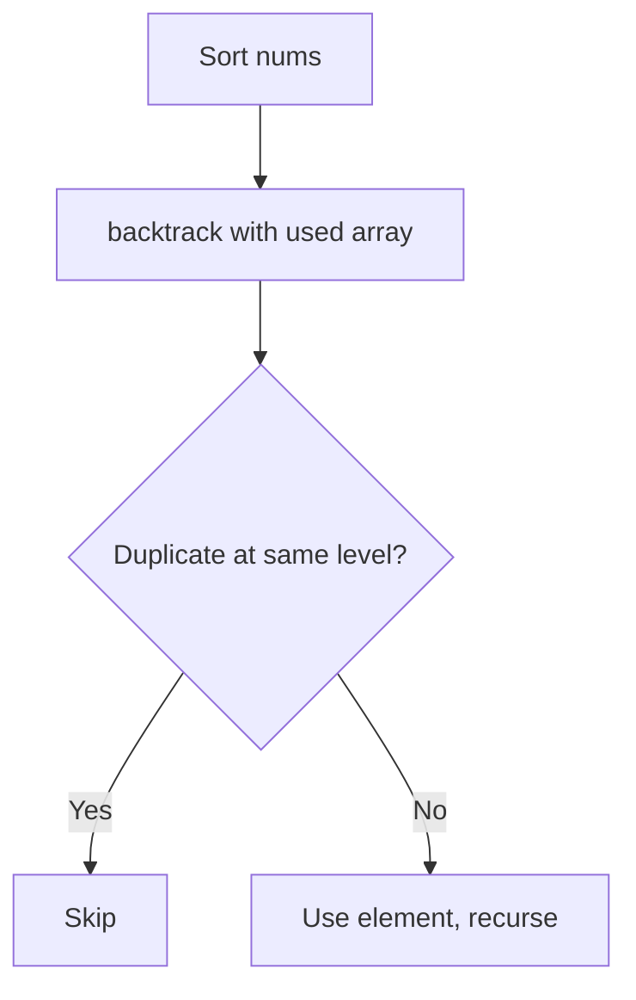
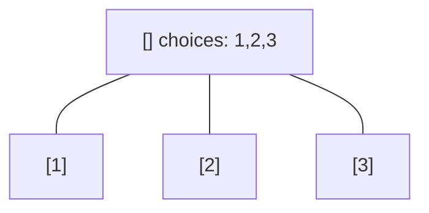
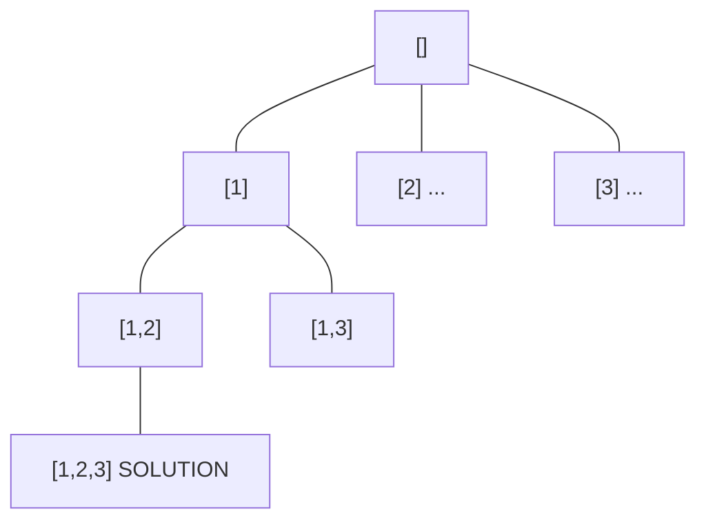
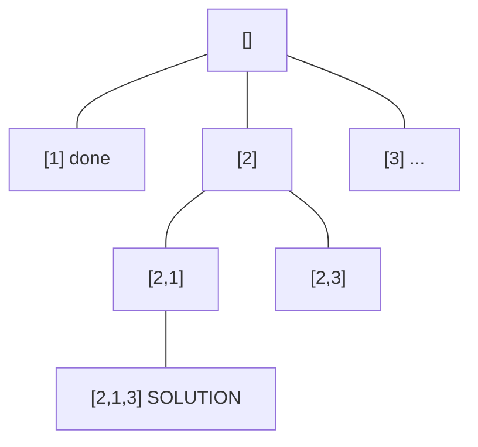
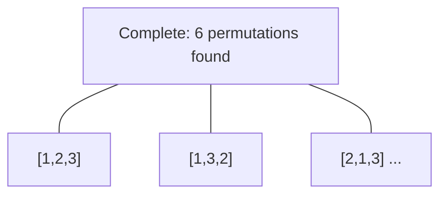

# Problem 47: Permutations II

**Difficulty:** Medium  
**Tags:** Array, Backtracking, Sorting  
**Pattern:** Backtracking  
**Link:** [leetcode.com/problems/permutations-ii](https://leetcode.com/problems/permutations-ii/)

## Description

Given a collection of numbers, `nums`, that might contain duplicates, return *all possible unique permutations **in any order**.*

 

Example 1:

```

**Input:** nums = [1,1,2]
**Output:**
[[1,1,2],
 [1,2,1],
 [2,1,1]]

```

Example 2:

```

**Input:** nums = [1,2,3]
**Output:** [[1,2,3],[1,3,2],[2,1,3],[2,3,1],[3,1,2],[3,2,1]]

```

 

**Constraints:**

	- `1 <= nums.length <= 8`
	- `-10 <= nums[i] <= 10`

## Approach: Backtracking

Sort + backtrack with used array. Skip duplicate elements at the same level.

## Pseudocode

```
1. Sort nums, used = [False]*n
2. backtrack(path):
   Skip used or same-level duplicates
   Mark used, recurse, unmark
```

## Algorithm Flow



## Visual State Transitions

**Backtracking Decision Tree:**

**Frame 1: Root - start with empty path**


**Frame 2: Explore branch [1]**


**Frame 3: Backtrack, explore [2]**


**Frame 4: All solutions found**



## Complexity Analysis

- **Time:** O(n!)
- **Space:** O(n)

## Solution (Python3)

```python
class Solution:
    def permuteUnique(self, nums: list[int]) -> list[list[int]]:
        nums.sort()
        result = []
        used = [False] * len(nums)
        def backtrack(path):
            if len(path) == len(nums):
                result.append(path[:])
                return
            for i in range(len(nums)):
                if used[i]:
                    continue
                if i > 0 and nums[i] == nums[i-1] and not used[i-1]:
                    continue
                used[i] = True
                path.append(nums[i])
                backtrack(path)
                path.pop()
                used[i] = False
        backtrack([])
        return result
```

## Solution (C++)

```cpp
#include <functional>
#include <string>
#include <vector>
using namespace std;

class Solution {
public:
    vector<vector<int>> permuteUnique(vector<int>& nums) {
        // Backtracking - O(2^n) or O(n!) time
        vector<vector<int>> result;
        vector<int> path;
        function<void(int)> backtrack = [&](int start) {
            result.push_back(path);
            for (int i = start; i < (int)nums.size(); i++) {
                path.push_back(nums[i]);
                backtrack(i + 1);
                path.pop_back();
            }
        };
        backtrack(0);
        return result;
    }
};
```
