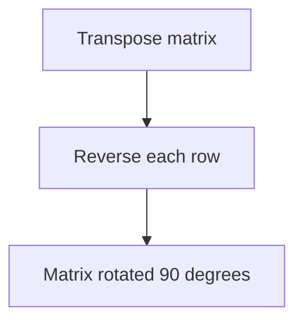

# Problem 48: Rotate Image

**Difficulty:** Medium  
**Tags:** Array, Math, Matrix  
**Pattern:** Matrix Manipulation  
**Link:** [leetcode.com/problems/rotate-image](https://leetcode.com/problems/rotate-image/)

## Description

You are given an `n x n` 2D `matrix` representing an image, rotate the image by **90** degrees (clockwise).

You have to rotate the image **in-place**, which means you have to modify the input 2D matrix directly. **DO NOT** allocate another 2D matrix and do the rotation.

 

Example 1:

```

**Input:** matrix = [[1,2,3],[4,5,6],[7,8,9]]
**Output:** [[7,4,1],[8,5,2],[9,6,3]]

```

Example 2:

```

**Input:** matrix = [[5,1,9,11],[2,4,8,10],[13,3,6,7],[15,14,12,16]]
**Output:** [[15,13,2,5],[14,3,4,1],[12,6,8,9],[16,7,10,11]]

```

 

**Constraints:**

	- `n == matrix.length == matrix[i].length`
	- `1 <= n <= 20`
	- `-1000 <= matrix[i][j] <= 1000`

## Approach: Matrix Manipulation

**Transpose then reverse each row.** This rotates the matrix 90 degrees clockwise in-place.

## Pseudocode

```
1. Transpose: swap matrix[i][j] with matrix[j][i]
2. Reverse each row
```

## Algorithm Flow



## Complexity Analysis

- **Time:** O(n^2)
- **Space:** O(1)

## Solution (Python3)

```python
class Solution:
    def rotate(self, matrix: list[list[int]]) -> None:
        n = len(matrix)
        for i in range(n):
            for j in range(i + 1, n):
                matrix[i][j], matrix[j][i] = matrix[j][i], matrix[i][j]
        for row in matrix:
            row.reverse()
```

## Solution (C++)

```cpp
#include <string>
#include <vector>
using namespace std;

class Solution {
public:
    void rotate(vector<vector<int>>& matrix) {
        // Matrix manipulation - O(m*n) time
        if (matrix.empty()) return ;
        int m = matrix.size(), n = matrix[0].size();
        for (int i = 0; i < m; i++) {
            for (int j = 0; j < n; j++) {
                // Process matrix[i][j]
            }
        }
        return ;
    }
};
```
