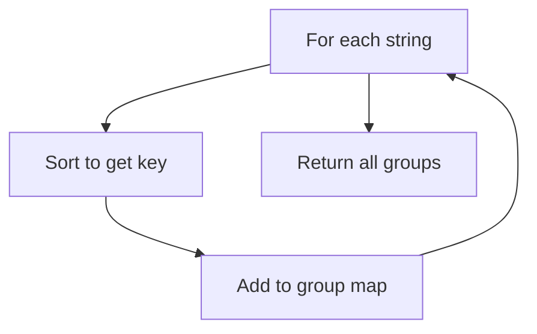

# Problem 49: Group Anagrams

**Difficulty:** Medium  
**Tags:** Array, Hash Table, String, Sorting  
**Pattern:** Hash Map / Sorting  
**Link:** [leetcode.com/problems/group-anagrams](https://leetcode.com/problems/group-anagrams/)

## Description

Given an array of strings `strs`, group the anagrams together. You can return the answer in **any order**.

 

Example 1:

**Input:** strs = ["eat","tea","tan","ate","nat","bat"]

**Output:** [["bat"],["nat","tan"],["ate","eat","tea"]]

**Explanation:**

	- There is no string in strs that can be rearranged to form `"bat"`.
	- The strings `"nat"` and `"tan"` are anagrams as they can be rearranged to form each other.
	- The strings `"ate"`, `"eat"`, and `"tea"` are anagrams as they can be rearranged to form each other.

Example 2:

**Input:** strs = [""]

**Output:** [[""]]

Example 3:

**Input:** strs = ["a"]

**Output:** [["a"]]

 

**Constraints:**

	- `1 <= strs.length <= 10^4`
	- `0 <= strs[i].length <= 100`
	- `strs[i]` consists of lowercase English letters.

## Approach: Hash Map / Sorting

Group strings by their sorted version as key. All anagrams share the same sorted form.

## Pseudocode

```
1. For each string: sort it to get key
2. Group strings by key in a dict
3. Return all groups
```

## Algorithm Flow



## Complexity Analysis

- **Time:** O(n * k log k)
- **Space:** O(n * k)

## Solution (Python3)

```python
from collections import defaultdict

class Solution:
    def groupAnagrams(self, strs: list[str]) -> list[list[str]]:
        groups = defaultdict(list)
        for s in strs:
            key = ''.join(sorted(s))
            groups[key].append(s)
        return list(groups.values())
```

## Solution (C++)

```cpp
#include <algorithm>
#include <string>
#include <vector>
using namespace std;

class Solution {
public:
    vector<vector<string>> groupAnagrams(vector<string>& strs) {
        // Sort-based approach - O(n log n) time
        sort(strs.begin(), strs.end());
        vector<vector<int>> result;
        result.push_back(strs[0]);
        for (int i = 1; i < (int)strs.size(); i++) {
            if (strs[i][0] <= result.back()[1]) {
                result.back()[1] = max(result.back()[1], strs[i][1]);
            } else {
                result.push_back(strs[i]);
            }
        }
        return result;
    }
};
```
