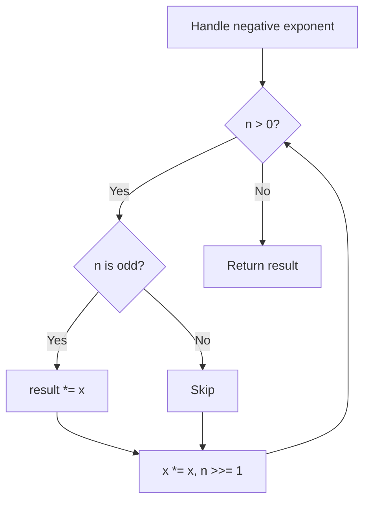

# Problem 50: Pow(x, n)

**Difficulty:** Medium  
**Tags:** Math, Recursion  
**Pattern:** Math / Binary Exponentiation  
**Link:** [leetcode.com/problems/powx-n](https://leetcode.com/problems/powx-n/)

## Description

Implement pow(x, n), which calculates `x` raised to the power `n` (i.e., `x^n`).

 

Example 1:

```

**Input:** x = 2.00000, n = 10
**Output:** 1024.00000

```

Example 2:

```

**Input:** x = 2.10000, n = 3
**Output:** 9.26100

```

Example 3:

```

**Input:** x = 2.00000, n = -2
**Output:** 0.25000
**Explanation:** 2-2 = 1/22 = 1/4 = 0.25

```

 

**Constraints:**

	- `-100.0 < x < 100.0`
	- `-2^31 <= n <= 2^31-1`
	- `n` is an integer.
	- Either `x` is not zero or `n > 0`.
	- `-10^4 <= x^n <= 10^4`

## Approach: Math / Binary Exponentiation

Fast power using binary exponentiation. Square x repeatedly, multiply into result when bit is set.

## Pseudocode

```
1. Handle negative n: x = 1/x
2. While n > 0:
   If n is odd: result *= x
   x *= x, n >>= 1
3. Return result
```

## Algorithm Flow



## Complexity Analysis

- **Time:** O(log n)
- **Space:** O(1)

## Solution (Python3)

```python
class Solution:
    def myPow(self, x: float, n: int) -> float:
        if n < 0:
            x = 1 / x
            n = -n
        result = 1
        while n:
            if n & 1:
                result *= x
            x *= x
            n >>= 1
        return result
```

## Solution (C++)

```cpp
#include <string>
#include <vector>
using namespace std;

class Solution {
public:
    double myPow(double x, int n) {
        // Mathematical approach
        long long result = 0;
        int x = x;
        while (x != 0) {
            result = result * 10 + x % 10;
            x /= 10;
        }
        return (int)result;
    }
};
```
