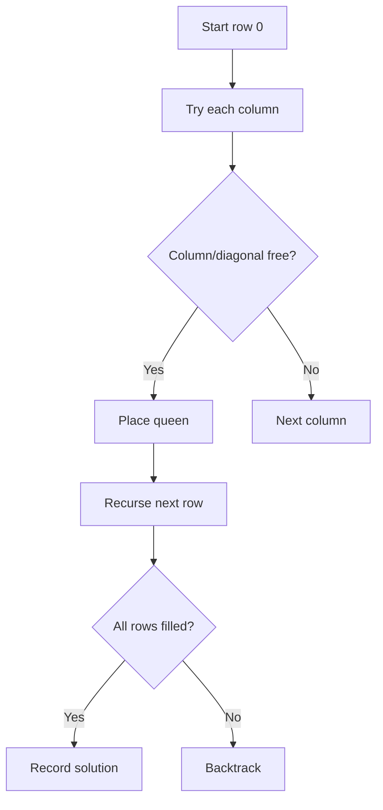
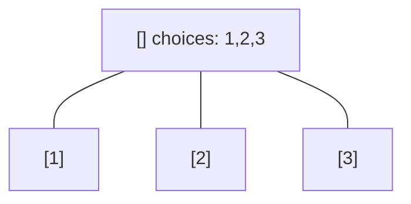
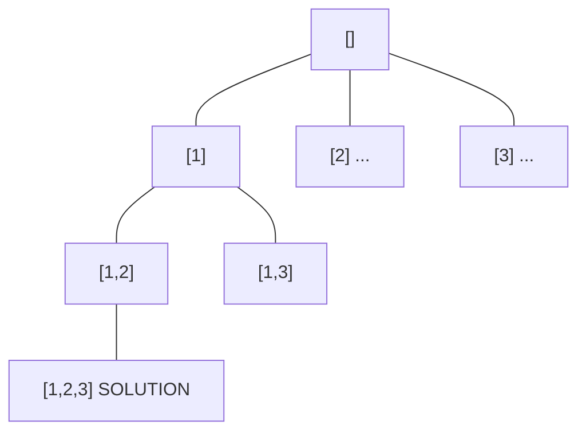
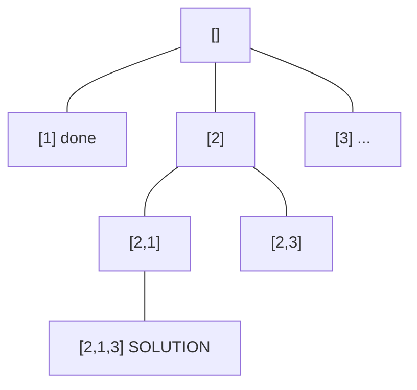
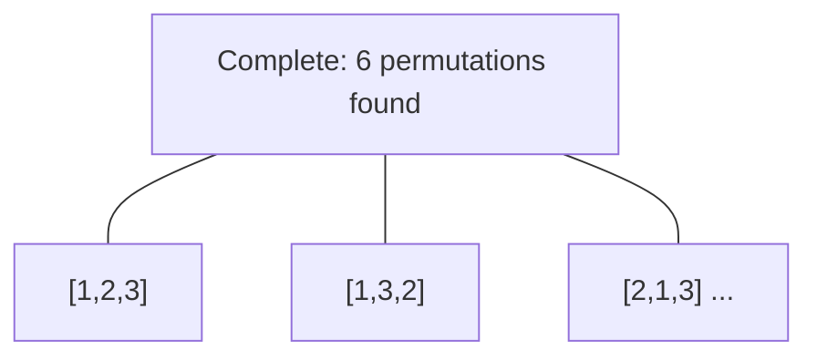

# Problem 51: N-Queens

**Difficulty:** Hard  
**Tags:** Array, Backtracking  
**Pattern:** Backtracking  
**Link:** [leetcode.com/problems/n-queens](https://leetcode.com/problems/n-queens/)

## Description

The **n-queens** puzzle is the problem of placing `n` queens on an `n x n` chessboard such that no two queens attack each other.

Given an integer `n`, return *all distinct solutions to the **n-queens puzzle***. You may return the answer in **any order**.

Each solution contains a distinct board configuration of the n-queens' placement, where `'Q'` and `'.'` both indicate a queen and an empty space, respectively.

 

Example 1:

```

**Input:** n = 4
**Output:** [[".Q..","...Q","Q...","..Q."],["..Q.","Q...","...Q",".Q.."]]
**Explanation:** There exist two distinct solutions to the 4-queens puzzle as shown above

```

Example 2:

```

**Input:** n = 1
**Output:** [["Q"]]

```

 

**Constraints:**

	- `1 <= n <= 9`

## Approach: Backtracking

Place queens row by row. Track attacked columns and diagonals with sets.

## Pseudocode

```
1. For each row: try each column
2. Skip if column/diagonal attacked
3. Place queen, recurse to next row
4. Backtrack if no solution
```

## Algorithm Flow



## Visual State Transitions

**Backtracking Decision Tree:**

**Frame 1: Root - start with empty path**


**Frame 2: Explore branch [1]**


**Frame 3: Backtrack, explore [2]**


**Frame 4: All solutions found**



## Complexity Analysis

- **Time:** O(n!)
- **Space:** O(n^2)

## Solution (Python3)

```python
class Solution:
    def solveNQueens(self, n: int) -> list[list[str]]:
        result = []
        cols = set()
        diag1 = set()
        diag2 = set()
        board = [['.' ] * n for _ in range(n)]

        def backtrack(row):
            if row == n:
                result.append([''.join(r) for r in board])
                return
            for col in range(n):
                if col in cols or (row - col) in diag1 or (row + col) in diag2:
                    continue
                cols.add(col)
                diag1.add(row - col)
                diag2.add(row + col)
                board[row][col] = 'Q'
                backtrack(row + 1)
                board[row][col] = '.'
                cols.discard(col)
                diag1.discard(row - col)
                diag2.discard(row + col)
        backtrack(0)
        return result
```

## Solution (C++)

```cpp
#include <functional>
#include <string>
#include <vector>
using namespace std;

class Solution {
public:
    vector<vector<string>> solveNQueens(int n) {
        // Backtracking - O(2^n) or O(n!) time
        vector<vector<int>> result;
        vector<int> path;
        function<void(int)> backtrack = [&](int start) {
            result.push_back(path);
            for (int i = start; i < (int)n.size(); i++) {
                path.push_back(n[i]);
                backtrack(i + 1);
                path.pop_back();
            }
        };
        backtrack(0);
        return result;
    }
};
```
